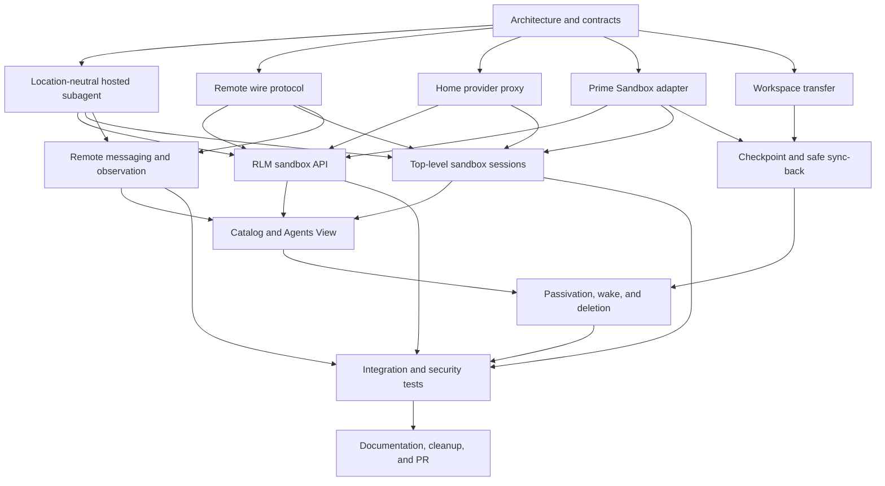

# Sandbox-backed Prime Agent sessions implementation plan

## Objective

Add `sandbox=False` by default to top-level session and RLM subagent creation. When enabled, Prime Agent creates a Prime Sandbox, runs the agent runtime and local tools there, keeps provider credentials on the home daemon, and preserves lifecycle, session discovery, observation, and direct agent-to-agent communication across the remote boundary.

## Fixed design decisions

- The home daemon owns identity, family authorization, provider authentication, session catalog state, sandbox billing, and durable archives.
- The sandbox owns the live agent loop, IPython kernel, workspace, and processes.
- Model calls use a typed streaming home-provider proxy. Provider keys and OAuth refresh tokens never enter the sandbox.
- Prime Sandboxes use an outbound authenticated relay transport. A later generic-host adapter may use OpenSSH `ControlMaster`; mosh is not a control transport.
- Agent activity (`running`, `idle`, `inactive`) is separate from connection state (`connecting`, `connected`, `reconnecting`, `unreachable`, `closed`).
- Direct agent-to-agent communication remains limited to parent, siblings, and children and is durable across reconnects.
- Every explicit `sandbox=True` creates a fresh sandbox. Descendants with `sandbox=False` remain on their current execution host.
- The home daemon checkpoints transcripts and workspace changes before it deletes an owned sandbox.

## Dependency graph

## Parallel work topology

Status values are `queued`, `in_progress`, `blocked`, `review`, and `done`.

### Wave 1: independent architecture audits

| ID | Status | Work package | Output |
|---|---|---|---|
| A01 | done | Current RLM child lifecycle and concrete `AgentSession` coupling | Refactor seam report recovered |
| A02 | done | Daemon protocol capability and compatibility requirements | Wire-change report recovered |
| A03 | done | Agent connection DTO and remote path assumptions | Remote DTO report received |
| A04 | done | Provider registry, streaming, cancellation, and auth flow | Provider-proxy report recovered |
| A05 | done | Prime Sandbox SDK, lifecycle, bootstrap, and image constraints | SDK v0.2.35 adapter report received |
| A06 | done | Direct agent-to-agent communication routing and delivery guarantees | Messaging report received |
| A07 | done | Observation, transcript, recap, and usage attribution | Observation report recovered |
| A08 | done | Session catalog, passivation, rehydration, and deletion | Lifecycle report received |
| A09 | done | Agents View status and connection-state presentation | UI report received |
| A10 | done | Workspace snapshot and conflict-safe sync-back | Workspace report recovered |
| A11 | done | Top-level session creation APIs and CLI integration | Integration points recovered from transcript |
| A12 | done | Python RLM bridge and public API compatibility | RLM API report received |
| A13 | done | Test harnesses and protocol compatibility coverage | Test topology report received |
| A14 | done | Security threat model and secret-exposure audit | Threat model received |
| A15 | done | Runtime packaging, exact-build bootstrap, and update behavior | Packaging report received |
| A16 | done | Failure injection, reconnect, idempotency, and recovery behavior | Recovery report received |

### Wave 2: implementation packages

Wave 2 begins after the related Wave 1 contracts are integrated. Each package uses an isolated worktree and produces a cherry-pickable commit.

| ID | Depends on | Status | Work package |
|---|---|---|---|
| B01 | A01, A03 | done | Add `ExecutionLocation` and opaque remote session DTOs |
| B02 | A01, A07 | done | Preserve the local runtime arm and add the accepted hosted port/controller plus the final exact runtime union |
| B03 | A02, A16 | done | Exact remote protocol, frame/journal codecs, delivery index, immutable publication, bounded recovery, and production Node backend |
| B04 | A02, A16 | done | Replace the initial relay with ordered durable receipt/delivery handling |
| B05 | A04, A14 | done | Add typed streaming home-provider proxy |
| B06 | A05, A15 | done | Add Prime Sandbox provisioner and background-job lifecycle |
| B07 | A10, A14 | in_progress | Replace the unwired legacy workspace prototype with PAWS-backed immutable publication, extraction, checkpoint evidence, and final sync-back |
| B08 | A12, B01, B02 | done | Add `sandbox` and `sandbox_options` to RLM APIs |
| B09 | A11, B01, B03 | done | Add top-level sandbox session creation APIs and CLI flags |
| B10 | A06, B03, B04 | in_progress | Durable target inbox, pre-admission authorization, transcript dispatch, permanent registry, remote dispatcher, and bidirectional relay entry are accepted; complete daemon routing and managed relay retry composition |
| B11 | A07, B03, B04 | done | Mirror observation, transcript, recap, and usage events; exact snapshots, durable application, and production Node backend are integrated |
| B12 | A08, B03, B06 | in_progress | Lifecycle deletion is integrated; opaque pre-admission and truthful no-platform-resource cleanup remain under review |
| B13 | A09, B01, B11 | done | Show execution location and connection health in Agents View |
| B14 | B05, B06, B08, B09 | in_progress | Wire end-to-end sandbox session orchestration; fixed FD3 child launch and hosted factory remain |
| B15 | A13, B03, B04 | done | Add protocol compatibility and reconnect tests |
| B16 | A13, B05, B10, B11 | blocked | Add auth, messaging, observation, and security integration tests after B10 and B14 production composition |

### Wave 3: integration and release readiness

| ID | Depends on | Status | Work package |
|---|---|---|---|
| C01 | B01-B16 | in_progress | Integrate source-reviewed commits in dependency order and resolve shared-file conflicts |
| C02 | C01 | in_progress | Run focused suites and `npm run check` after each accepted integration; final pass remains pending |
| C03 | C01 | queued | Run a real Prime Sandbox smoke test without paid model calls where possible |
| C04 | C02, C03 | queued | Audit secret handling, orphan cleanup, and final workspace sync |
| C05 | C04 | queued | Update README, API docs, changelog, and migration notes |
| C06 | C05 | queued | Independent PR cleanup and regression review |
| C07 | C06 | done | Push branch and open draft GitHub PR #2025 |
| C08 | C07 | in_progress | Verify PR diff, checks, and unresolved review threads; Node 22 coding-agent shards remain red |

## Active correction roster

| Track | Status | Current gate |
|---|---|---|
| Node 22 exact-Promise/ALS compatibility | in_progress | Context-shaped opaque marker implementation plus Node 22 shard reruns |
| Home provider coordinator | in_progress | v13b must prove genuine bytes and cleanup-uncertainty dominance |
| Sandbox provider relay | review | Candidate `6976c230d`; independent v8 audit running |
| PAWS streaming verifier | in_progress | v7 must unify checked erasure and pass native FileHandle tests |
| Relay application gate | review | Candidate `21d69176b`; independent v5 audit and Node 22 adaptation pending |
| Sandbox trusted-Home inbox application | in_progress | v4 must use real durable-inbox branding and remove wrapper/test assertions |
| Hosted child ledger | in_progress | v6 must remove direct external awaits/assertions while preserving real FileHandle behavior |
| Opaque sandbox pre-admission | in_progress | Durable pre-provider admission and truthful no-resource tombstone implementation |
| Workspace coordinator | in_progress | v13 rejected; source-valid v14 design correcting private API/path and extraction defects |
| B10/B14/hosted runtime composition | blocked | Waits on accepted gate, inbox, provider, workspace, ledger, and Node 22 foundations |

## Current integration baseline

- Branch: `feat/sandbox-backed-sessions` in `/Users/milkkarten/prime-agent-sandbox-sessions`.
- Draft PR: [#2025](https://github.com/PrimeIntellect-ai/prime-agent/pull/2025), linked to [RES-1264](https://linear.app/primeintellect/issue/RES-1264/complete-sandbox-backed-prime-agent-sessions).
- Pushed reviewed tip: `c27957bf7`. Local reviewed tip: `99dd8afe0`, including the current `origin/main` Agents View usage/cost merge and schema revision 27 conflict resolution. The Node 22 correction remains isolated.
- The last root `npm run check` passed after the `origin/main` merge. PR policy, build/check, agent-core, AI, TUI, process-smoke, kernel, runtime-Python, and CodeQL checks pass. Coding-agent shards 1/3 and 3/3 fail because Node 22 attaches `AsyncLocalStorage` runtime symbols to genuine Promises, while the current exact-Promise guards require zero symbols. The failure is reproduced locally and a context-shaped exact validator is under review; PR CI is not yet verified.
- The accepted command/event/provider durability baseline remains green under the normal local runtime. Restart-safe relay evidence plus the ordered application multiplexer add a 148/148 integrated relay/dispatcher/multiplexer matrix. Earlier focused matrices also cover lifecycle deletion, hosted port/controller/transport, the exact branded-local/hosted runtime union, permanent target registry/dispatcher/bidirectional entry, ordered target application, authorization, transcript scanning/dispatch, durable target inbox, and the remote frame codec.
- Accepted B03 foundations: exact frame codec `55b40d7f1`, journal-record codec `5551582bd`, delivery index `5e8e926b4`, direct-final immutable journal publication `8bd83db6c`, immutable delivery-marker publication `df846c08f`, and page-atomic bounded directory recovery `9df8a3da9`.
- Accepted B11 foundations: observation core `939a7baaf`, exact snapshots `62e8b073a`.
- Accepted B14 foundations: provider client `2195c7a23`, tunnel manager `a636f7d99`, PAB1 `d21f53c1a`, FD3 reader `723a8db52`, PAAR codec `a17f5588d`, stdin frame reader `4beeaa5da`, TypeScript correction `1d63a72c0`, SSH spawn specification `4dd8790db`, SSH specification tests `af83a786f`/`a7add61a4`, one-use upgrade authentication `a4976298c`, and Node stdin normalization `4a8962b54`.
- B03 and B04 are complete: the recovered-state durable store, production backend, and ordered relay are integrated. B10 has accepted durable target admission, authorization, transcript dispatch, ordered target application, permanent registry, remote dispatcher, and bidirectional entry; it now needs daemon routing and managed relay/retry composition.
- Accepted B14 SSH readiness/process cleanup monitor: integration commits `169c29526`, `7fd5770b5`, and `2da8baa52`; 133 focused tests verify synchronous registration backout, durable admission, independent exit/close evidence, no post-exit signal, shared cleanup, pending-admission uncertainty, and intrinsic Promise handling.
- Active B14 work: the listener ownership core, Node adapter, fixed numeric-FD3 launcher/adapter, wrapper composition, hosted runtime port, hosted ordered-relay transport, hosted initial-run controller, exact local/hosted runtime union, command/event/provider durable stores, restart-safe relay evidence, and ordered application multiplexer are integrated. The production Node journal backend, real AgentSession command-effect port, provider restart enumeration/coordinator, PAWS workspace stack, side-specific applications, and final hosted factory remain. Reserved modes and capability advertisement stay fail-closed until that composition is real.
- Accepted B02 boundary: `2da8b4357` uses the existing `RemoteHostFrameEnvelope`, `RemoteObservationSnapshotV1`, and provider-usage semantics; it snapshots capabilities, owns subscription cleanup, and preserves local runtime behavior.
- Rejected commits remain isolated and unmerged. This includes `a772e27a`, `f1f5cad9`, `35fb1c61`, `d7b56367`, `bce99cd9`, and `610c696c` plus their earlier rejected chains.
- No paid sandbox, tunnel, VM, GPU, or live provider resource has been created during the resource-free implementation stage.

## Integration rules

- Subagents never edit the shared integration worktree directly.
- Each implementation package receives its own Git worktree and branch.
- The integration owner cherry-picks reviewed commits in dependency order.
- Daemon protocol changes must be capability-gated and include old/new compatibility tests.
- Provider secrets must not appear in sandbox environment variables, files, logs, transcripts, or protocol payloads.
- Tests use faux providers. Live paid model requests are not part of automated validation.
- The integration branch must pass every modified test file, `npm run check`, and `git diff --check` before push.

## Progress log

- Created the clean integration worktree from `origin/main` on branch `feat/sandbox-backed-sessions`.
- Started the persistent goal and five-minute feature heartbeat.
- Started Wave 1 architecture audits in parallel.
- Completed A09. The existing three activity sections stay unchanged; execution location and link health will be added as orthogonal row metadata.
- Completed A15. Remote startup will bind to the exact daemon build identity and reject protocol skew before session admission.
- Completed A05 and A08. The installed sandbox SDK supports idempotent creation and background jobs; sandbox ownership will reuse daemon leases, recovery journals, and passivation semantics.
- Completed A01, A02, A10, and A14. Contracts cover the hosted-child seam, capability-gated protocol, safe workspace sync, and feature-specific secret isolation.
- Completed A03 and A12. Remote DTOs will use opaque IDs and ISO timestamps; the Python RLM layer can forward the new kwargs without a protocol change.
- Completed A16. Remote recovery will extend existing idempotency journals, ownership checks, reconnect cursors, and interrupted-operation records.
- Completed A04 and A07. The home proxy will implement the existing `StreamFn` contract; remote observation will mirror serializable event and usage records into the home catalog.

- Started B01, B03, B05, B06, and B07 in isolated worktrees after their architecture dependencies completed.
- Completed A06 and A13. Remote message delivery needs receiver-side ID deduplication; integration tests will extend the existing faux-provider and injectable subagent-host harnesses.
- Completed A11 from its retained transcript after the subagent failed to send a final summary. Top-level support enters through CLI create options and the capability-gated daemon create command.

- Integrated B01 as `68c8c5704`; its remote-safe DTOs passed 49 focused tests after credential-field and error-sanitization review.

- Started B02 after B01 integration; it will replace concrete child-session coupling with a local adapter while preserving current behavior.

- Integrated B03 as `d609d182f`; 57 focused tests verify exact-build admission, path-free frames, durable journals, directional replay, and cursor identity. Started B04 managed relay and B09 top-level API plumbing.

- Integrated B05 as `ce567a025`; 34 focused tests verify exact model authorization, typed streaming, cancellation, validation, and credential-safe errors.

- The integration branch passes full `npm run check` after B01, B03, and B05 integration.

- Integrated B07 as `7c193eb17`; 65 focused tests cover binary-safe snapshots, secret exclusion, traversal/symlink defenses, base-hash conflicts, and atomic sync-back.

- Integrated B09 as `42a914cba`; 62 focused tests cover default-local compatibility, strict sandbox options, protocol gates, and explicit unsupported-host failures.

- Integrated B06 as `d458e2308`; 80 focused tests cover Prime Sandbox CLI preflight/provisioning, strict DTO parsing, atomic background completion metadata, separate logs, and process-group termination with escalation. No sandbox resource was created.
  Exact-build packaging/bootstrap and admission remain part of B14; B03 already supplies the build/protocol/schema compatibility gate.

- Started B12 after B06 integration. Started transport-neutral B14a provider-client and B14b authenticated Prime Tunnel foundations early because they depend only on already-integrated contracts and touch separate files.

- Integrated the B14a sandbox-side provider client as `2195c7a23`; 67 client/home-proxy tests verify exact model admission, DTO-only requests, concurrent stream isolation, deep frame validation, usage/tool-call reconstruction, cancellation, disconnect cleanup, and credential-free payloads.

- Integrated B04 managed relay as `53e6b73fe` + `c9b1cabec` (cleanup `1eff5e4e6`); 151 B03/B04 tests cover strict peer/build/session admission, session-bound durable journals, replay/deduplication, send-failure teardown, reconnect, and bounded credential-free frames. Started B10 durable cross-host communication and B11 observation mirroring.

- Integrated the B14b Prime Tunnel manager as `a636f7d99`; it uses outbound `prime tunnel start`, validates and consumes the generated one-time grant, bounds injected CLI output, captures only validated tunnel IDs for cleanup, and provides bounded TERM/KILL plus exact-ID CLI cleanup without retaining output.

- Integrated B12 durable sandbox ownership and lifecycle as `16d844a1a`; 158 B06/B12 tests cover hashed fencing tokens, locked CAS transitions, atomic/fsynced records, corrupt-record fail-closed behavior, compensated provisioning, stale reclamation, passivation/wake, tombstones, and deletion without losing a possibly live sandbox handle.

- Integrated B15 protocol compatibility hardening as `3c80229aa` + `e5a22820f`; 226 B03/B04/B15 tests cover exact accepted-ACK build identity, unknown-field rejection, restart cursors, identity isolation, reconnect, corruption, gaps, and bounded replay. Started B14c loopback WebSocket relay and exact-build bootstrap foundations.

- Started B14d sandbox-side remote runtime host and command/event routing in parallel with B14c; both use resource-free fakes and defer final home orchestration until B02/B08 land.

- Reviewed the first complete B02/B10/B11/B14c/B14d candidates against committed source. None passed integration review: B02 still coupled the parent lifecycle to `AgentSession`; B10 lacked the claimed strict durable inbox fixes; B11 accepted non-exact events and snapshots; B14c lacked a real accepted-socket managed-relay path and executable runtime bootstrap contract; B14d lost ACKed commands across crash windows. Returned exact fixes and adversarial regression requirements without merging.

- Reviewed second-round candidates. Rejected them again because committed source still violated required invariants: B02 contained duplicated/corrupt lifecycle edits; B10 still accepted symlinks and v1/unbound inbox data and silently skipped malformed durable frames; B11 advanced state for unapplied event variants and could not produce cursor-accurate recap deltas; B14c used an unsupported CLI flag and did not hand off runtime admission data; B14d double-emitted events, reset event sequences after restart, and did not pass command idempotency keys to mutating runtime operations. The integration branch remains on the last fully verified baseline.

- Source review found repeated candidate reports did not match committed source or real command results. Rejected all unintegrated B02/B10/B11/B14c/B14d commits, deleted those subagents, reset every isolated worktree to verified integration commit `1ac3996b9`, and started five fresh DeepSeek V4 Flash subagents with source-specific invariants and required real `npm run check` exit evidence. No rejected implementation remains on the integration branch.

- Reviewed the first fresh B02/B10/B11/B14d commits after their reported checks passed. Source review still rejected them: B02 exposed host paths/open records and bypassed runtime-host cleanup for retained hosted children; B10 fabricated an incompatible agent-message frame and ran persistence only after B04 had ACKed; B11 lacked exact envelope/snapshot decoding and preserved raw remote errors; B14d had non-exact codecs, a non-atomic/unbound outcome store, incomplete recovery, no transport send, and unsafe command/event crash windows. Reassigned each worktree to a new DeepSeek V4 Flash correction pass with protocol-native types, pre-ACK durability, identity-bound recovery, exact outbox replay, closed DTOs, and cleanup-failure regression tests. No rejected source was merged.

- Rejected the next B11 correction because it still decoded a non-protocol event shape, lacked caller-bound exact snapshot restoration, and advanced or reconstructed unsafe observation state. Rejected B14c's uncommitted attempt because it reversed the transport topology by starting the listener inside the sandbox, dropped post-handshake text frames, ignored the relay URL, retained grants, and used unsafe post-extraction archive checks. Reset both worktrees and started clean protocol-native correction passes.

- Rejected B10's protocol-native correction after finding memory-before-persist inbox mutations, non-exact recovery, and underlying B03 journal replay that regenerated timestamps and silently skipped corruption. Reassigned B10 to harden the shared journal, exact-envelope relay replay, composable awaited admission, and durable inbox together. Rejected B14d's next runtime-host commit because its codecs only checked keys, its "digest" persisted plaintext command bodies, nested state was unchecked, and recovery did not correlate or resume journaled commands/events. Reassigned a focused correction with true SHA-256 digests, recursive exact state validation, backend rehydration, and crash-safe terminal/outbox rules.

- Rejected B02's tagged-union correction because it still lost retained hosted identity/status, bypassed host-owned cleanup, inferred RLM IDs from session IDs, and cast an incompatible usage DTO that would produce `NaN` totals. Rejected B11's concise rewrite because it explicitly tolerated unknown fields, mutated state before validation, discarded usage/pending/name state, and restored incomplete non-exact snapshots. Both remain isolated in targeted correction passes; no candidate code was merged.

- B10's combined correction remained too shallow: journal integrity fields were optional and unchecked, replay still regenerated timestamps, and uncertain inbox writes were not poisoned. Split the dependency into a focused B03 journal/B04 relay hardening pass first; durable message inbox/service work will restart only after that shared exact-envelope foundation is integrated and verified.

- B14c's second fresh attempt again ended without a commit and left a generated package tarball. Source review found a reusable grant, missing fixed-path admission, broken accepted-link ACK ordering, a nonfunctional outbound adapter, partial FD3 reads without erasure, post-extraction archive checks, and no callable process cleanup handle. Split B14c into a focused home listener/server-side accepted-link package first; outbound FD3/bootstrap/artifact/process work will resume after that transport boundary is verified.

- B14d correction `e8220bf07` was rejected. Its codecs still accepted wrong field types, its store was not recursively exact, journal/outbox correlation allowed gaps and unbound events, duplicate admission ignored frame identity, recovery skipped malformed commands, and transport failures terminalized replayable work. Split B14d into exact codecs/store first, followed by host/recovery/outbox.
- B11 correction `dff9168aa` was rejected. It mutated gap state before full decode, accepted non-protocol event shapes, mishandled evicted message indices and second bash runs, exposed mutable nested DTOs, and restored weak/unbounded snapshot fields including raw health errors. Split B11 into exact event/transition core first, followed by persistence/metadata/observer DTO.

- Shared B03/B04 hardening `35f4d182b` was rejected. The claimed strict validator left nested frame/body schemas unchecked; the journal skipped identity/corruption during reads and could report success after poisoned close; the relay processed async arrivals concurrently, admitted before handshake, journaled outbound ACKs as received, and emitted delivery when no ACK was sent. Re-sequenced foundation as: shared exact full-envelope codec, then strict journal, then ordered relay, then B10.

- B02 correction `69778a518` was rejected. Its hosted decoders defaulted malformed data instead of exact rejection, retained identity left `activeSessionId` blank, terminal error events could be overwritten as success, raw cleanup errors reached the parent, and disposal could invoke owner cleanup more than once. Split B02 into exact runtime boundary types/codecs first, then AgentSession orchestration.
- Resource-free bootstrap research confirmed container sandboxes can carry an opaque bootstrap payload without disk/env/argv persistence through `prime sandbox ssh` stdin. HOME spawns the Prime CLI with explicit argv and a pipe; SSH runs a fixed uploaded wrapper without a PTY; the wrapper will create a local pipe and spawn the actual runtime with the read end as FD3. This replaces B06's shell-script/file background-job path. VM sandboxes remain explicitly unsupported until Prime Sandbox exposes SSH there.
- Integrated reviewed B11-a exact observation event/transition core through `939a7baaf`. The six-key event decoder now rejects accessors, symbols, non-enumerables, unsafe/canonical-time violations, preserves bounded failure markers, blocks content after sequence or message-index gaps, supports cursor-0 replay recovery, and returns immutable observer DTOs. Snapshot restoration and final Agents View projection remain separate follow-up layers.
- Integrated the reviewed shared B03 exact full-envelope codec through `55b40d7f1`. It constructs fresh DTOs for all nine frame variants, enforces exact nested schemas, canonical timestamps, independent transport/semantic/command identities, cumulative node/depth/1 MiB canonical UTF-8 bounds, strict provider optionals, safe `__proto__` handling, and fixed fail-closed results even for hostile reflection traps. This unblocks the replacement durable journal and ordered relay.
- Rejected the first replacement strict-journal attempt before commit. It still used synchronous whole-directory/file APIs, advanced sequence state before persistence, silently skipped malformed disk records, persisted exact duplicates as new entries, and could acknowledge unknown frames. Split the work into an exact async immutable sequence store followed by a separate frame/ACK index layer.
- Rejected FD3 wrapper candidate `aadf1559`. It resolved the SSH input frame before EOF, used `/dev/fd/3` instead of the numeric inherited descriptor, never routed the reserved runtime mode from the CLI, retained arbitrary stdout as strings, and could exit before a detached child was killed. The replacement must confirm EOF, use numeric FD3, statically gate both hidden modes, and await one signal-escalation teardown chain.
- Integrated reviewed B11-b exact observation snapshots through `62e8b073a`. Snapshot restore now roundtrips every state accepted by B11-a, preserves independent counters and exact retained transcript/recap suffixes, binds identity, rejects aliases and hostile descriptors, uses the shared exact JSON byte preflight, and recursively freezes fresh DTOs. The integrated 482-test observation/codec/protocol suite and full root check pass.
- Rejected PAAR artifact candidates `2cc133910` and `093d18123`. Their builder and installer normalized unsafe paths, lacked an exact canonical manifest/build identity, followed or raced symlinks, used unsafe rename fallback, and did not package the runnable Python kernel. Restarted the work as a narrow reviewed async format/builder/verifier foundation before implementing the remote installer.
- Replaced the first async journal-store track after its reported corrections still performed unpaginated multi-gigabyte recovery and used plain rename as a claimed no-replace primitive. The replacement uses an exclusive staging file, final sequence reservation, link-no-replace, exact fsync ordering, and an explicit paginated recovery state.
- Source review rejected follow-up transport/listener/wrapper commits and uncommitted corrections: SSH dropped the required isolated cwd/environment/detached process-group options and could leave credential writes unsettled; the wrapper erased a frame still owned by FD3 and installed signal cleanup too late; the FD3 reader erased buffers before pending callbacks settled and leaked the descriptor on success; the listener still conflated authentication, transport receipt, and application delivery. Replacements now isolate SSH, wrapper, FD3 reader, and one-use loopback listener into separate foundations.
- Source review rejected journal candidate `dd5639922` and PAAR candidate `c238fc31`. Both reported stronger guarantees than their source provided. Journal work is now split into an exact record codec and generic immutable byte store. Artifact work is split into a pure canonical manifest codec before any builder/verifier/installer filesystem layer.
- B02 remains unintegrated. Its correction still changed existing local runtime types and duplicated observation DTOs despite the required unchanged local boundary. Hosted runtime integration will resume only after communication and observation contracts are accepted.

- Integrated the reviewed B03 journal record v1 codec through `5551582bd`. It descriptor-copies exact records and expected bindings without hostile property reads, preserves complete remote envelopes and independent IDs, derives and verifies canonical SHA-256 envelope digests, enforces exact canonical JSON bytes and size/identity/time/direction bounds, erases caller and owned decode buffers, and freezes fresh results. The integrated protocol/frame/journal suite passes 432 tests. Immutable publication and delivery-state indexing remain separate follow-ups.
- Rejected the replacement one-use listener `692cd9eb7` and the uncommitted wrapper-v2 draft after direct source review. The listener did not start or correctly count teardown after the first upgrade, could retain grants on early rejection, removed candidate ownership before WebSocket admission, and lacked bounded listen/upgrade failure handling. The wrapper accepted input before EOF, retained credential copies, signaled the wrong process scope, hung on readiness/natural exit, and converted cleanup failures to success. Both were split again into pure upgrade-authentication and streaming-stdin foundations before lifecycle integration.
- Integrated the reviewed PAB1 one-use bootstrap payload codec through `d21f53c1a`. It accepts only exact non-shared caller bytes, descriptor-snapshots bounded metadata, validates canonical secret-free `wss:` relay URLs, rejects literal-IP and repeated-path forms, erases caller and owned grant bytes on every path, and exposes only fixed frozen results.
- Integrated the reviewed numeric-FD3 framed reader through `723a8db52`. It uses unique buffer ownership per read, bounded referenced deadlines, exact framing and premature-EOF handling, confirmed close, descriptor-copied adapters, caller-payload ownership, and erasure that waits for all callback ownership to settle. Its focused suite passes 74 tests.
- Integrated the reviewed canonical PAAR1 manifest/framing codec through `a17f5588d`. It enforces exact fixed-order canonical manifests, NFC UTF-8 byte ordering, numeric file modes, contiguous offsets, deterministic build identity separate from final archive SHA, exact genuine decode buffers including detached/subview rejection, and temporary path-buffer erasure. The integrated PAAR/PAB1/protocol suite passes 265 tests. Deterministic trusted-tree builder and streaming verifier work is now isolated from the later one-open installer.
- Integrated the reviewed B03 receipt/application-delivery index codec and recovery accumulator through `5e8e926b4`. Canonical pending/delivered markers bind exact host/generation/session/direction/frame/digest/journal sequence, recovery validates contiguous index sequences without mutation on rejection, and deterministic actions distinguish new admission, pending idempotent reapplication, and delivered replay ACK. The integrated journal/index/frame/protocol suite passes 584 tests.
- Integrated the reviewed streaming SSH-stdin bootstrap frame reader through `4beeaa5da`. It waits for exact EOF, uses only a fixed header and exact payload allocation, rejects trailing/hostile chunks, snapshots its source adapter, handles synchronous registration races, removes only owned listeners, keeps its deadline referenced, and does not erase bytes while callbacks own them. The integrated stdin/FD3/PAB1 suite passes 254 tests. HOME credential-write ownership and the production Buffer-copy adapter remain separate.
- Integrated the reviewed pure HOME SSH spawn specification through `4dd8790db`. It emits exactly `prime` plus the nine required `sandbox ssh --plain` arguments, an explicit absolute HOME cwd, detached process-group settings, piped stdio, shell disabled, and only the PATH/HOME/USER/TMPDIR environment allowlist. Strict descriptor-based inputs and fixed secret-free errors reject hostile or extra values. Its integrated PAB1 suite passes 166 tests. Credential-write ownership and process lifecycle/readiness remain separate tracks.
- Integrated direct-final immutable journal publication as `8bd83db6c`. It reserves `<20-digit>.b03-journal` with `O_WRONLY | O_CREAT | O_EXCL | O_NOFOLLOW`, mode `0600`, never unlinks evidence, verifies exact file and directory identity, handles short positional writes, reopens and checks content, fsyncs the file and identity-bound directory, owns one checked close per handle, and erases caller/internal buffers. The 68 publisher tests and 714-test integrated B03/B04/B15 suite pass; full root check is green across 1000 files.
- Integrated immutable delivery-marker publication as `df846c08f`. It reuses the same reviewed direct-final publication core for `<20-digit>.b03-delivery`, preserves journal behavior, binds exact `indexSeq` values through 40,000, and returns fixed delivery-specific results. The combined publisher/journal/index/frame/relay/compatibility suite passes 752 tests; full root check is green across 1002 files.
- Integrated one-use WebSocket upgrade authentication as `a4976298c`. It takes caller-grant erasure ownership before unrelated factory validation, snapshots and scrubs all safely discoverable grant slots before request rejection, requires exact raw/normalized header agreement and strict Upgrade/Connection grammar, compares fixed SHA-256 digests in constant time, and preserves terminal one-use status. Its 79 focused tests, 248-test bootstrap/auth suite, 81 SSH-spec tests, independent adversarial review, and 1004-file root check pass.
- Integrated B13 Agents View execution metadata as `1ccb524da`. The view accepts only exact frozen coarse `local | sandbox+link | unavailable` DTOs, rejects hostile metadata without getters or proxy reads, displays location/link health orthogonally to activity, and never carries sandbox IDs, regions, errors, timestamps, URLs, or credentials. Seven Agents View suites pass 174 tests without changing grouping/counts; the 1005-file root check is green.
- Integrated the Node stdin normalization boundary as `4a8962b54`. It adapts real Node `Buffer` chunks into exact fresh full-backing `Uint8Array` values, erases them after synchronous consumption, rejects proxies/subclasses/empty chunks without throwing, installs terminal listeners before data/resume, preserves unrelated listeners, and retains exact listener ownership across removal uncertainty. Its adapter+frame suites pass 149 tests and the 1007-file root check is green.
- Integrated the credential-frame write ownership primitive as `3f17cb640`. It copies and erases the caller payload, writes one length-prefixed frame, treats write ownership as uncertain until an explicit write/release callback or released return, never treats drain/return as completion, erases before end, and preserves the frame when release remains uncertain. Its 54 focused tests and 277-test bootstrap transport suite pass; the 1009-file root check is green.
- Integrated the accepted hosted-subagent boundary as `2da8b4357`. It reuses the accepted frame, observation snapshot, and provider usage types, binds exact capabilities, owns synchronous subscription callback/backout races, and exposes one shared checked close promise without changing local runtime behavior. Its 42 focused and 366 combined tests pass; the 1011-file root check is green.
- Replaced the rejected B03 scanner directly and integrated page-atomic recovery as `9df8a3da9`. It enforces exact cursor pagination and cross-page order, complete identity-bound reads with one checked close, transferred-byte erasure, exact marker-to-journal binding, duplicate-frame rules, and pending/delivered recovery. Its 110 focused and 680 combined tests pass; independent source review accepted it and the 1013-file root check is green.
- Rejected scanner `f9e5391f0`, SSH monitor `93c134c8a`, PAAR verifier `99168c06e`, and the uncommitted installer v3 after direct review found missing binding, asynchronous admission, one-close, mutation, and safe traversal guarantees.
- Rejected paginated scanner `f1f5cad9` after direct review found cursor advancement past unprocessed entries, pre-commit accumulator mutation, incomplete handle/read validation, and unsafe marker ordering across pages. Started a clean one-list-call, page-atomic scanner that defers full marker binding and accumulator construction until recovery completion.
- Rejected hosted boundary `35fb1c61`, upgrade authenticator `d7b56367`, PAAR builder `bce99cd9`, verifier `610c696c`, and the first SSH lifecycle/Node stdin adapter attempts after committed-source review. Their clean or focused correction tracks are active; none is present on the integration branch.
- Rejected durable-store candidate `e95f0277` after direct review found premature recovery exposure, fabricated state, incomplete persistence/byte accounting, unbounded replay, unbound delivery transitions, and unsafe close/erasure semantics. Started clean accepted-recovery-backed durable-store v2.
- Rejected PAAR verifier `c985ed406`, installer `5f3d3bbe3`, and builder `22b1d1e3e` after direct review found compilation/tuple crashes, partial-read/write failures, incomplete identity and expected-tuple checks, output ownership leaks, unsafe cleanup, and close uncertainty that did not dominate. Started independent clean verifier v4, installer v5, and builder v5 tracks.
- Rejected listener/server `f0291bc9` after direct review found duplicate socket ownership, uncancelled late admissions, post-close upgrade races, unbounded connections, unchecked setup cleanup, and timeouts that fabricated server/WebSocket/socket closure. Started clean listener/server v5.
- Integrated B08 RLM sandbox options through `26ffef380` and `f6ede58e5`. `SandboxOptions` now lives in the core execution-location contract; strict revoked-proxy-safe normalization returns frozen exact snapshots, omitted/false preserve option shapes, no-host rejection occurs before model/filesystem/map/event allocation, and concrete local hosts reject before local session allocation. Its 45 focused and 87 combined boundary tests pass; the 1014-file root check is green.
- Integrated the corrected SSH lifecycle monitor through `169c29526`, `7fd5770b5`, `2da8baa52`, `784d41f31`, and `55fe678a8`. It owns synchronous subscription backout, intrinsic native-Promise observation, independent exit/close evidence, pending admission uncertainty, referenced escalation timers, no signal after observed exit, and one shared cleanup. All 133 focused tests and the 1016-file root check pass; independent adversarial review accepted the committed source.
- Rejected durable-store candidates `e58350466` and `fe7ce5405`; later source still reconstructed markers as `new`, omitted backend close ownership and durable `delivered`, mishandled uncertain bytes, and omitted delivery SHA checks. Durable-store v4 remains the blocker for ordered relay and direct communication.
- Rejected PAAR builder commits `13fd44393` and `3949f8dbf`, verifier v6, FD3 wrapper `d7de26367`, listener v7, and offline runtime v2 after direct source review. Defects included fake or swallowed close ownership, three source passes, unbounded retained chunks, noncanonical output offsets, close uncertainty converted to success, incompatible Node writable callbacks, conflated exit/close evidence, auth-after-capacity rejection, and shared architecture inputs. None entered integration.
- Corrected one-use relay authentication in `0afbaac81`: requests presented after authentication or disposal now scrub their actual referenced raw and normalized credential slots before returning `ALREADY_USED`. All 81 focused tests and the 1016-file root check pass.
- Integrated the reviewed pure Python PAAR manifest codec through `905a4922e` and `dc2e17586`. It matches TypeScript canonical raw UTF-8 bytes and digests on cross-language ASCII, NFC, CJK, and emoji samples; rejects bool and out-of-safe-range integers; keeps immutable manifest DTOs; and passes 105 focused tests. Streaming verification and installation remain separate.

- Moved Python PAAR codec tests onto the repository `unittest` CI path in `9c5275ead`. Integrated the production Node Writable credential adapter through `31d6dede4` and `08b890cc4`; it preserves exact child-stdin ownership, copies `Buffer` inputs into genuine full-backing `Uint8Array` values, and passes 85 combined adapter/writer tests.
- Integrated the bounded one-open PAAR streaming verifier as `32b1db6b0`. It acquires close ownership before unrelated validation, distinguishes bytes/EOF/error and short reads, verifies complete bigint identity and every file/archive digest, enforces exact EOF and the full expected build/protocol tuple, erases late transferred bytes, and lets close uncertainty dominate. Its 25 focused and 98 codec tests pass; the 1020-file root check was green.
- Rejected durable-store v5, listener v8, Python installer v8, and PAAR builder `14b563f84` after direct source review. Remaining defects included unbound capability methods, concurrent fake FIFO work, factory-failure handle leaks, unsafe multi-component path traversal, output/reader leaks, ignored close uncertainty, post-close task races, and transferred-byte misuse. None entered integration.
- Integrated the independently accepted exactly-two-pass PAAR builder as `4cd92e69b`. It validates and binds hostile capability descriptors, rejects aliased owners, bounds every source read and aggregate payload, verifies full immutable file identity in both passes, hashes and writes the same pass-two bytes, preserves uncertain output, closes or abandons every confirmed owner once, and verifies the sealed archive before success. The builder/codec/verifier suite passes 146 tests and the 1028-file root check is green.
- Integrated the independently accepted Python PAAR installer as `5f753b0e7`. It opens the archive and destination root once, validates the complete expected build/SHA/protocol tuple, rechecks full archive identity and hashes around extraction, uses bounded short-read/write loops, component-wise `dir_fd` traversal with `O_NOFOLLOW`, exact output modes and identities, recursive owned-staging cleanup, checked one-shot closes, and Linux `renameat2(RENAME_NOREPLACE)` via `ctypes.CDLL(..., use_errno=True)`. Its Python 3.11 installer/codec suite passes 124 tests and the 1028-file root check is green.
- Integrated the independently accepted replacement durable relay store through `c72e62243` and alias-ownership correction `6a5c71585`. It owns and binds all three capabilities before unrelated validation, rejects shared capability aliases with one checked close, runs accepted recovery before exposure, serializes public operations through one FIFO, persists exact journal/pending/delivered transitions before memory, reconstructs and verifies receipt digests/total bytes, provides bounded sequence-cursor pages, snapshots hostile inputs, and drains accepted work before one shared close. Fifteen focused tests, including restart reconstruction, capability aliasing, and close-failure dominance, and the 1022-file root check pass. This unblocks the replacement B04 ordered relay and B10 durable communication.
- Integrated the replacement B04 ordered durable relay through `15ec5613f`, restart replay coverage `b03e9d859`, and reentry correction `3c7ad6c5e`. Incoming frames are durably journaled and marked pending before idempotent application; deterministic ACK envelopes use independent domain-separated frame/semantic IDs, are durably completed before the incoming delivered marker, and are sent only after all persistence. Delivered replay returns the exact same ACK across full store restart, outbound sends persist before transport, inbound ACKs durably complete the correlated outbound frame before application, pending outbox replay is ordered and paginated, and application-context relay reentry returns a fixed error instead of deadlocking. The combined store/relay suite passes 28 focused tests; independent adversarial review accepted the core commit.
- Added the B10 durable direct agent-to-agent communication application boundary as `cf99a139d` with ordered-relay composition coverage `63a1b0a84`. It preserves independent transport frame and semantic message IDs, authorizes exact source/target identities before delivery, passes the semantic ID as the mandatory idempotency key, accepts only exact correlated queued/delivered receipts, serializes handler work, and owns one checked router close. The combined store/relay/message suite passes 40 focused tests and the 1026-file root check is green. The daemon/router adapter that resolves home-owned family authorization and idempotent target-session admission remains part of B10/B14 orchestration.
- Integrated the independently accepted production Node SSH session adapter as `789dead81`. It spawns only the reviewed fixed `prime sandbox ssh --plain` specification through an injectable exact dependency seam, snapshots the allowlisted environment, binds and uniquely owns the child and three stdio handles, copies Node `Buffer` events into genuine full-backing transferred bytes, composes the accepted readiness/process monitor and credential Writable adapter before returning, preserves independent exit/close evidence, signals only the detached process group, unsubscribes exact listeners, and destroys stdio only after observed closure or bounded final uncertainty. Its 12 focused and 123 composed transport tests pass; independent adversarial review accepted the source and the 1030-file root check is green.
- Rejected offline runtime composer v3 after direct source review. It accepted non-exact inputs and wrong/empty runtime versions, leaked partially acquired roots and late readers, ignored close uncertainty and total-payload accounting, retained whole large files, incompletely validated ELF/glibc and neutral trees, failed to bind builder passes to the initial full identity, omitted reader-alias/race handling, fabricated duplicate close success, and returned no fixed runtime-path metadata. Clean v4 now uses normalized source layouts and the accepted PAAR builder contract.
- Rejected FD3 wrapper v5 after direct source review. It recursively spawned the CLI with the same wrapper flags, had no numeric-FD3 runtime gate, never forwarded child stdout into readiness parsing, fire-and-forgot credential writes, installed inert signal handlers, accepted arbitrary runtime argv/cwd/env, used unbound/unowned Node handles, swallowed cleanup and readiness-write failures, and returned success after arbitrary child closure. Clean v6 is restricted to a PAB1/credential/readiness composition seam until a real fixed runtime launcher and remote host exist.
- Rejected B11 observation persistence v6 after direct source review. It never recovered backend records before exposure, had no mirror/application handler or durable applied transition, raced duplicate/gap checks outside serialization, synthesized non-event sequences, never represented gaps, replayed only volatile state, assimilated hostile thenables with `Promise.resolve`, fabricated duplicate close success, and read hostile properties before descriptor-safe validation. Clean v7 persists complete pending envelopes and exact applied snapshots around an idempotent mirror application.
- Rejected listener/server v9 after direct source review. It used forbidden `require` and an undeclared `ws` dependency, unbound hostile capabilities and thenables, leaked upgrade-head bytes on auth failure, left fail-closed servers and timed-out paused sockets alive, raced late handler/upgrade tasks and WebSocket close observation, ignored WebSocket/TCP closure evidence, leaked deadline timers, and fabricated cleanup on factory/listen failures. Clean v10 isolates a dependency-free semantic listener ownership core before a production Node/WebSocket adapter.
- Rejected offline runtime composer v4 after direct source review. It read hostile envelope fields before validation, fire-and-forgot partial-acquisition closes, left its failure `finally` empty, ignored reader close uncertainty, allowed ELF validation bypasses, reread prefixes outside its identity window, and returned a passthrough builder reader that never rechecked the stored identity/digest/EOF. Its output also accepted hostile opens and fabricated duplicate close success. The next design will validate within the accepted builder's exact two source passes instead of adding an unsafe pre-pass.
- Rejected FD3 bridge v6 after direct source review. It accepted proxy/null-prototype/symbol inputs, left methods unbound, used a string publisher instead of transferred bytes, assimilated hostile launcher/monitor promises, leaked invalid/late started resources, swallowed cleanup uncertainty, and returned distinct/fabricated lifetime-close results. A smaller bridge is now being implemented directly against the accepted PAB1/stdin/writer/monitor primitives.
- Rejected committed B11 observation application `41dea58a3` after direct source review. It was incompatible with the ordered-relay application shape, leaked its recovery owner, persisted circular zero receipts, accepted and retained unsafe recovery bytes, lacked bounded cursor progress, discarded invalid transition order by sorting/deduplication, incompletely verified envelopes/snapshots, accepted duplicate/collision mismatches, and let volatile/durable pending-applied state diverge. None entered integration.
- Rejected listener ownership core v10 after direct source review. It used live unbound synchronous capabilities, dropped synchronous subscription events, had no unsubscribe/admission timeout, fabricated missing connection records, failed to validate/own socket and WebSocket handles, awaited hostile thenables, omitted upgraded capacity, and misread task/closure deadlines as success while ignoring independent closure evidence. No source entered integration.
- Integrated the independently reviewed narrow FD3 bootstrap bridge as `e1209d850`. It validates and re-encodes one exact EOF-confirmed PAB1 frame, transfers credentials only through the accepted checked writer, invokes a path-free exact runtime-launch seam, waits for credential completion and validated readiness, publishes only transferred canonical readiness bytes, owns late/invalid runtime cleanup, and exposes one shared checked close plus sanitized lifetime. The static parser accepts only the exact wrapper/runtime reserved modes and fixes the runtime descriptor at numeric FD 3. Its 11 focused and 245 composed bootstrap tests pass; independent adversarial review accepted the corrected source and the 1033-file root check is green. Real fixed runtime launch and CLI wiring remain gated on hosted orchestration.
- Rejected listener ownership core v11 after direct source review. It dropped synchronous pre-listen callbacks, conflated TCP acceptance with HTTP upgrade, omitted owned socket pause/reject/destroy and durable admission/upgrader seams, fabricated a null WebSocket and closure observations, used live unbound capabilities/hostile promises, omitted counters and exclusive phases, listened on a nonsanitized non-loopback address, and treated ignored/fire-and-forget cleanup as checked closure. No source entered integration.
- Rejected durable observation application v8 after direct source review. Its recovery lacked page-owner closure and genuine transferred-byte validation, was not page-atomic or cursor-complete, rejected valid pending/applied pairs, reordered history, failed to durably finish terminal pending replay, raced concurrent applies, accepted unvalidated publication results, violated byte transfer ownership, diverged the live mirror from the persisted complete snapshot, omitted semantic event collision identity, and fabricated/shared-close results incorrectly. No source entered integration.
- Rejected offline runtime composer v5 after direct source review. It omitted an explicit target, accepted live/noncanonical manifests and ambiguous tree digests, acquired/cleaned source ownership too late, failed to track reader aliases, parsed ELF64 offsets with invalid JavaScript shifts, validated only the first short chunk and selected extensions, allowed required binaries to be non-ELF, mapped runtime paths incorrectly, added unreliable identity checks, and fabricated mutable/close success. No source entered integration.
- Integrated the independently accepted pinned offline runtime composer as `dd486fee7`. It acquires and checks all four source roots before unrelated validation, binds frozen per-file/build/tree manifests to an explicit target, maps the exact Node/CPython/bundle/runtime layouts, streams every file through the accepted builder's two passes with stable identity/size/SHA checks, validates every ELF and both required glibc interpreters from a bounded split-safe prefix, rejects ELF in neutral trees, and owns aliases/late readers/root closure without fabricating success. Its 11 focused and 157 composed PAAR tests pass for x64 and arm64; the 1037-file root check is green and an independent final adversarial review returned ACCEPT.
- Integrated the canonical durable observation record codec as `cdd45dfc6`. Pending and applied records bind the complete envelope and snapshots to independent Home identity, transport frame ID, semantic event ID/sequence, envelope digest, and observation ID without receipts or synthetic sequence fields. Decode owns and erases only genuine full-backing nonshared bytes, enforces bounded canonical JSON by exact re-encoding, and rejects hostile descriptors, aliases, Buffer/subclass/proxy/shared/subview bytes, identity divergence, and noncanonical encodings. Eight focused plus 158 mirror tests pass; independent adversarial review accepted the corrected cursor-identity binding. Durable page publisher/recovery/application composition remains pending.

- Integrated the independently accepted durable observation application as `c71c2a83d`. It acquires and closes every bounded recovery-page owner, owns and erases canonical record bytes, validates each page atomically with contiguous cursors and total limits, preserves independent frame/event/sequence collision indexes, and reconstructs the exact complete applied snapshot before exposure. A terminal pending record is deterministically reapplied and durably published as applied before the factory returns. Live event work is serialized and publishes pending before any live-state change and applied before swapping the exposed snapshot; reentry poisons without deadlock, transferred publication bytes have one owner, and close waits for in-flight work through one shared checked promise. Thirteen focused application tests plus eight codec and 158 mirror tests pass, including malformed-page atomicity, crash recovery, collision rejection, publication failure, reentry, and close-during-apply; the 1039-file root check is green and independent adversarial review returned ACCEPT. The production filesystem backend and ordered-relay/router composition remain pending.

- Rejected B03 scanner candidate `f9e5391f0` after committed-source comparison with the current `9df8a3da9` recovery. The candidate removed proxy rejection, full cursor-cycle detection, `IO_UNCONFIRMED` classification, malformed-result close discovery, and ten adversarial ownership/binding tests, and left debug logging in production. Its page-atomic decode-then-commit, explicit EOF/final-fstat checks, and typed result improvements should be ported separately without replacing the accepted current protections.

- Integrated the independently accepted production Node durable-observation backend as `d86e7d600`. A dedicated mode-0700 Home directory is bound by a canonical write-once `identity.json` held open for the backend lifetime; path and open-handle identities are rechecked before recovery and publication. Observation records use contiguous one-based `.b11-observation` files created with `O_EXCL | O_NOFOLLOW`, full positional writes, file fsync, checked writer close, read-only reopen with short-read/EOF/stat/hash/byte verification, directory fsync, and no deletion on uncertainty. Recovery is byte/count bounded and paginated, returns full-backing owned bytes plus page-owned open handles, enforces cursor progress, and retains strict pending/applied parity. All operations serialize, publication aliases are rejected, publication bytes are erased, and root/page/file handles have shared checked close. Nine backend, thirteen application, and eight codec tests pass, including restart recovery, identity mismatch/mutation, sequence gaps, tampering, symlinks, byte-boundary pagination, alias rejection, and ownership; the 1041-file root check is green and independent adversarial review returned ACCEPT.

- Integrated the independently accepted single-use relay listener ownership core as `9d40331f6`. The core creates and owns the one-use authenticator from transferred grant bytes and a fixed path, scrubs the actual request header containers before every semantic rejection, erases every authenticated Node upgrade head, persists durable admission before one native upgrade promise, installs the handler subscription before resume, and retains independent socket/WebSocket/server closure evidence without reusing consumed aliases. Exact capability snapshots reject proxies, subclasses, aliases, non-native promises, malformed results, duplicate TCP/upgrades, and late owners. One shared close drains dynamically appearing cleanup tasks to a bounded fixed point. Eleven listener-core plus eighty-one auth tests pass; the 1045-file root check is green and independent final adversarial review returned ACCEPT. The production Node HTTP/WebSocket adapter is integrated as `cf826a0c6`.

- Integrated the independently accepted production Node HTTP/WebSocket relay adapter as `cf826a0c6`, with a direct `ws` dependency. It binds only `127.0.0.1` on an ephemeral port, caps the server at one concurrent connection, reports dropped or sequential duplicate TCP connections to the semantic core, and transfers exactly one paused socket through `WebSocketServer.handleUpgrade`. The adapter passes the actual Node upgrade head and authenticates through a plain view that aliases the actual `IncomingMessage.rawHeaders` and `headers` containers; the upgrade path verifies those containers were scrubbed before HTTP 101. Callback aborts, late WebSockets, terminal calls, normal HTTP requests, and unrouted requests erase/scrub and close fail-closed. WebSocket cleanup has a referenced terminate fallback and independent socket/WebSocket/server closure evidence. Five adapter, twelve listener-core, and eighty-one auth tests pass; the 1045-file root check is green and independent final adversarial review returned ACCEPT.

- Reconciled the plan at integration tip `c07f16d66`: B11 is complete through the accepted exact snapshot, durable application, and production Node backend; B10 remains in progress on restart-durable target admission; B14 remains in progress on the fixed numeric-FD3 child launcher and hosted orchestration; B16 is blocked only on those production compositions.
- Rejected two B10 designs that incorrectly treated the volatile `SessionActionStore` or non-fsynced `SessionManager.flushNow()` as a crash-durable admission boundary. The replacement uses a permanent B03-backed target inbox, independent transport and semantic IDs, a canonical semantic collision index, `pending` before queued ACK, and recovery-time verification of every record including `delivered` records.
- Accepted the B10 durable target-inbox core after adversarial review: ownership-first capability acquisition, semantic collision indexing independent of transport IDs, durable `pending` before queued ACK, explicit deferred retry, restart re-verification of `delivered` records, exact store-error preservation, and reentrant checked close. The composed B03/B10 suite passes 508 tests.
- Started isolated implementations for the B10 durable target inbox, the B14 FD3 child-readiness monitor, and the missing production Node B03 relay backend. Direct review returned concrete ownership, paging, scheduling, identity-binding, and path-safety corrections before integration.
- Audited and terminated 43 orphaned test, daemon, Python, and esbuild processes left by completed isolated review worktrees; a follow-up process scan found none remaining from those completed worktrees. No paid resources were created.
- Integrated the independently accepted dependency-free FD3 child-readiness monitor as `adf4057ca`. It validates one exact canonical readiness line without claiming relay admission, owns transferred stdout/stderr bytes, preserves synchronous terminal evidence even at queue overflow, requires independent exit and close evidence, and performs referenced process-group `SIGINT → SIGTERM → SIGKILL` cleanup without signaling after observed exit. Eighty-five focused and 229 composed FD3/SSH monitor tests pass; independent adversarial review returned ACCEPT. The fixed child launcher is active in an isolated worktree.

- Integrated the independently accepted production Node B03 relay backend as `bbe38dc82`. The backend creates the target directory only below an existing canonical private parent, binds exact canonical identity bytes with `O_EXCL`, file fsync, checked close, and directory fsync, and retains separate inode-bound directory owners for journal publication, delivery publication, and recovery. Publisher inputs snapshot and erase genuine transferred bytes synchronously, serialize before checked close, and revalidate both directory and identity before and after publication. Recovery rejects unknown, unsafe, oversized, or out-of-range entries; pages at 64 records; opens one identity-checked handle per file; supports short reads and explicit EOF; drains admitted reads before one checked close; and poisons on directory or identity replacement. Thirty-four backend and 335 composed B03 tests pass; direct review and independent adversarial review returned ACCEPT.
- Integrated the independently accepted fixed FD3 runtime child launcher as `2cd14711d`. Production accepts only exact `{readyNonce}`, resolves the fixed `../cli.js` entry, and spawns `[entry, "--prime-agent-runtime-fd3", "--ready-nonce", nonce]` with isolated stdio, `shell: false`, `detached: true`, and an allowlisted environment. Post-spawn failures await bounded checked cleanup; emergency cleanup snapshots streams before signaling, owns exact exit/close evidence and listener backout, and never converts destruction into process-closure evidence. FD3 ownership transfers once from the monitor to the credential writable, preventing monitor/adapter aliases and double close. Thirty-seven focused tests and the 1053-file root check pass; independent adversarial review returned ACCEPT.
- Integrated the independently accepted numeric-FD3 runtime adapter and static reserved-mode gate as `64a196b7e`. Production opens exactly numeric descriptor `3` with `autoClose: false`; successful setup requires a genuine non-Proxy bound destroy owner, while exact callback-style `fs.close(3, cb)` remains the only closure evidence. All acquisition and setup failures await checked close and let closure uncertainty dominate. The CLI intercepts reserved argv only at position zero, rejects malformed forms with `INVALID_RUNTIME_ARGUMENTS`, keeps valid wrapper/runtime forms fail-closed with `ORCHESTRATION_UNAVAILABLE`, and uses `process.exitCode` so cleanup can drain. Seventy integration-focused tests and 169 independently reviewed composed tests pass; the redundant standalone buffer-delivery test was intentionally excluded. Production wrapper composition and real relay admission remain gated follow-ups.

- Integrated the reviewed B10 pre-admission authorization and transcript dispatcher as `5a92fa200`. Home resolves current sender and target sessions, inverts the receiver relationship, recomputes the semantic digest, and admits only after exact family authorization; the full current queued receipt is validated before exposure. Transcript dispatch checks all loaded and persisted evidence, persists `semanticDigest` in the real agent-message details, rechecks memory and disk after delivery, and returns `deferred` only for a decoded queued injection. Factories acquire cleanup owners before outer-shape validation, close in reverse order, and use exact native Promise results. Eighty composed target-inbox/authorization/dispatcher tests and the 1,061-file root check pass. Durable ACK, daemon routing, and bidirectional relay composition remain pending.
- Integrated the reviewed dedicated provider-call record codec as `ac0e3135c`. Its six exact in-memory variants own fresh full-backing `Uint8Array` request/chunk/terminal bytes and nested durable receipts, while canonical persisted JSON uses strict base64. Decode rejects Buffer/subclass/Proxy/shared/detached/subview/empty/overridden byte inputs, enforces the 1.25 MiB record bound before parsing, and proves canonical bytes by exact re-encoding. Provider frames bind independent `callId`, chunk index, request digest, terminal kind, fixed error code, and real usage; mismatches and noncanonical JSON poison decode. One hundred seven focused tests plus package Biome and type checks pass. Dedicated provider-call recovery/store/relay remain pending.
- Integrated the reviewed production FD3 wrapper composition as `af3d31ee2`. Production input is exactly `{readyNonce}`; it binds Node stdin/stdout through checked adapters, launches only the fixed runtime entry/FD3 argv, transfers the credential once, publishes canonical readiness only after the child monitor reports the admitted runtime, and owns one checked monitor close/lifetime. Exact native promises reject proxies/subclasses/wrong prototypes/own properties. Launch timeout performs a second bounded observation of the same promise and closes any late preliminary monitor; malformed custom-prototype/accessor/Proxy results preserve cleanup uncertainty. Monitor `{ok:false,cleanupConfirmed:true}` is accepted only with a fixed FD3 failure code. Eighty-six focused bridge/launcher/wrapper tests pass; reserved CLI mode remains gated until the real remote runtime composition supplies durable relay admission.
- Integrated the new B10 ordered target-inbox application as `304e349c9`. It passes the full decoded agent-message envelope through exactly one serialized `PreAuthorizedInbox.authorizeAdmit`, validates the current transport frame ID, semantic message ID, SHA-256 digest, relationship, and durable queued receipt, and only then returns `{status:"applied"}` to `OrderedDurableRelay`. The relay remains the sole generated-ACK owner. The factory transfers one checked close owner to the exact `{apply,close}` application and returns a separate non-owning `{dispatchPending}` retry view sharing FIFO/poison/closed state. Fifty focused hostile-input, replay, retry, close, and re-entry tests pass. Production daemon registry/context wiring remains pending.
- Integrated the corrected location-neutral hosted RLM runtime port as `98189debc`. It preserves the local `AgentSession` arm by exposing a separate immutable hosted capability for identity, one-shot task start, abort, observation, and events. Raw capability calls use exact native Promise boundaries and return fixed error unions instead of fabricated semantic task, abort, or observation outcomes. Synchronous subscription events are decoded all-or-none only after exact unsubscribe ownership is acquired; malformed events or uncertain cleanup poison the port. Seventy-four focused hostile DTO, Promise, result, event, binding, and subscription tests pass, and the isolated root check is green. This boundary deliberately has no competing runtime close/delete owner; `SubagentRuntimeHost` remains the sole hosted sandbox deletion owner.
- Direct source review rejected the first provider recovery scanner, filesystem transcript scanner, and hosted ordered-relay transport adapter despite their focused tests. The provider scanner leaked its backend on early returns, awaited arbitrary close thenables, acquired handles too late, and omitted receipt/chunk/cancel state links. The transcript scanner used prohibited dynamic imports and assertions, accepted short reads as complete, checked aggregate bounds too late, and omitted explicit EOF/full stat checks. The transport adapter could skip port closure after poison, leaked preliminary owners, accepted non-native listener promises, and broke shared unsubscribe/close identity. Those rejected candidates remain excluded; their independently rewritten and parent-corrected replacements are recorded below.

- Integrated the parent-audited hosted ordered-relay transport as `8618dc26a`. The asynchronous factory preliminary-acquires the hosted port close owner, validates exact native promises for send/listener/close operations, decodes synchronous subscription bursts atomically, preserves FIFO for already admitted work, and shares one actual unsubscribe cleanup result with public unsubscribe and transport close. Port close always runs after the admitted queue and subscription cleanup, including poison paths. Seventy-nine focused tests and the 1,071-file root check pass.
- Integrated the corrected provider-call recovery scanner as `8ed8977fc`. It preliminary-acquires and consumes the backend close owner before validation, acquires every page and handle close before full result validation, observes only exact native promises, reads every bounded journal file with legal partial reads, explicit EOF, stable identity, and caller-byte erasure, and verifies actual file SHA-256 receipts, unique call/request-frame identities, chunk order, terminal counts, and cancellation only after `started`. It accepts up to the full 20,000-page worst case, never re-executes interrupted calls, and returns only fresh frozen decoded records after backend close succeeds. Eighty-six recovery plus 107 codec tests and the 1,073-file root check pass.
- Integrated the corrected on-disk transcript scanner as `c9efecd59`. It performs static synchronous hostile-input validation, counts every directory entry with a 4,096-entry cap, uses one `O_NOFOLLOW` file open, handles legal positive short reads, confirms exact EOF, compares pre/post device, inode, owner, mode, size, link count, mtime, and ctime, checks aggregate bytes before reading, and erases buffers on success and failure. Directory and file owners close exactly once, cleanup uncertainty dominates, and mismatch scanning continues so later corruption can dominate. Sixty-six scanner plus twenty-three dispatcher tests and the 1,075-file root check pass; synchronous test filesystem APIs and all type assertions were removed before integration.
- Started four production-composition tracks from accepted tip `ca6b5ab58`: provider-call store/backend, local/hosted RLM runtime union, Home daemon target-inbox registry/relay context, and sandbox command/event durability. Early source review rejected their first drafts before commit for fabricated recovery input, non-FIFO reentry handling, unawaited hosted completion, duplicate relay close ownership, transcript uncertainty mapped to absence, incomplete command/event records, and unsafe assertions. Corrections remain isolated and unintegrated.
- Opened a separate opaque-execution-location correction after the B14 review proved raw provider `sandboxId` and region still crossed `ExecutionLocation` and sandbox ownership persistence. Public execution metadata will become coarse `{type:"prime-sandbox"}`; durable physical deletion remains gated until Home has an opaque lifecycle key plus a private provider resolver. No raw provider ID will be accepted in public DTOs or durable records, and `sandbox_sessions` remains unadvertised until the resolver and full hosted composition exist.
- Terminated the stalled first hosted-runtime-union track after direct source inspection showed it only changed callback types, used unsafe fake type guards, still threw on every hosted runtime, and never implemented task/event/abort/cleanup behavior. Replaced it from clean integration tip `5841b57e4` with a narrow hosted-run controller boundary; AgentSession union wiring will resume only after that controller is accepted.
- Terminated the first daemon relay-context correction despite fourteen passing self-tests. Source review found raw-path input, `any`/casts, stale checks before ownership, arbitrary thenables, transcript uncertainty handling gaps, fabricated catalog close, cache-key collisions, and duplicate close ownership across relay/application/preauthorization/inbox/dispatcher/backend. Replaced it with a narrow permanent target-inbox registry that owns only exact composed-entry capabilities; the relay composer will follow after the registry passes.
- Rejected provider-store candidate `073927f48` after direct review despite its reported Biome/typecheck success. The store still read hostile records before codec validation, accepted caller journal sequences/identity without binding them to store state, bypassed FIFO through an accessor, rejected already-admitted work on close, and did not independently acquire publisher cleanup. Its Node backend leaked identity handles, fabricated timestamp evidence, froze mutable owners, mapped uncertainty to absence, skipped real EOF/fsync checks, exposed a raw journal path, and could not let cleanup uncertainty dominate factory failure. A correction pass is active on the same isolated branch; this commit remains excluded.
- Terminated the stalled first sandbox command/event durability track after repeated source rewrites left its shared byte helper syntactically nested inside catch blocks, used uncaptured intrinsics, still failed valid decode, and never reached the requested command application/backend. Replaced it from clean integration tip `2d13a5c8c` with a command-record-codec-only track patterned directly on the accepted provider codec. Event durability will start only after the smaller command boundary is accepted.
- Terminated target-inbox registry v2 after repeated corrections still left fire-and-forget cleanup, cleanup-result loss, asynchronous rather than synchronous reentry fencing, admitted-before-close rejection, raw result pass-through, non-null/cast scaffolding, and unresolved close races. Registry v3 restarted clean from `635adb9a8` with explicit global/per-entry admission tails and a bounded implementation scope.
- Re-ran the full repository `npm run check` at integration tip `332b1466c`; Biome, `tsgo --noEmit`, installer render, and browser smoke all pass across 1,075 files. The production gates remain closed because the active correction branches are not yet accepted.

- Integrated the parent-audited opaque execution identity correction as `91d9532d7`. Public execution locations now expose only frozen coarse `local | {type:"prime-sandbox"}` metadata, lifecycle/ownership persistence uses a Home-generated opaque lifecycle key, public strings/timestamps/reconnect counters are bounded and exact, and Agents View and relay health no longer surface raw provider identity. Real async lifecycle tests scan both ownership records and tombstones for provider IDs, regions, URLs, paths, tokens, `sandboxId`, and `region`; 440 composed tests pass. Restart deletion remains fail-closed until a Home-private resolver is composed.
- Rejected sandbox command codec `ae09206ee` despite 80 self-tests because the source and tests still used many prohibited casts, descriptor discovery could touch hostile inputs in the wrong order, and the durable common identity omitted `sessionId`. A correction pass is active on the same isolated branch with exact full command identity and accepted byte-intrinsic requirements.
- Rejected hosted run controller `c33e9f135` after direct review. It trusted cast public-port results instead of revalidating them through the accepted hosted port factory, could leak malformed subscription owners, propagated capability throws/rejections, forwarded unvalidated events, and never changed its constant poison state. Two replacements stalled during source inspection without writing code and were deleted; clean v4 is active from `2d49bbaf2` using an exact public-to-raw adapter over `createHostedRlmRuntimePort`.
- Rejected corrected provider store/backend `2d34fdff4`. The store still rejected operations admitted before close and exposed an unserialized synchronous status. Its backend fabricated zero stat timestamps, leaked identity verification handles, froze mutable handle owners, failed full stat/path binding, mapped scan/open uncertainty to empty or missing evidence, and could not let reverse-order cleanup uncertainty dominate. A v3 correction is active; neither rejected provider commit is integrated.
- Rejected lifecycle-key resolver v1 before commit because it exported the raw provider identity, treated malformed list output as absence, trusted raw runner promises/errors, omitted lifecycle/provider integration, and parsed delete stderr as evidence. Clean v2 is active from `2d49bbaf2`: it moves lifecycle-key generation before managed provider creation, derives only an opaque provider label, resolves restart identity privately, and confirms physical deletion or exact absence before ownership tombstoning. No resource-bearing smoke is permitted.
- Terminated target-inbox registry v3 before commit. Its source still used cast/live entry method reads, fire-and-forget preliminary cleanup, full-role validation before close acquisition, duplicate close-owner scaffolding, and raw thrown sentinel errors; focused debug tests could not prove cleanup or reentry semantics. Registry v4 restarted clean from `867a88173` with fixed result unions, bound entry methods, permanent tombstones, admitted-before-close FIFO, and awaited reverse cleanup.

- Integrated the parent-corrected sandbox command-record codec as `f0c47a36b`. All four pending/started/completed/interrupted variants bind exact Home identity, independent record/command IDs, `commandType === command.body.type`, the complete canonical command-envelope digest, and exact state/outcome invariants. Decode accepts only genuine full-backing nonshared byte owners, erases every owned success/failure/overflow input and temporary canonical bytes through captured intrinsics, and freezes fresh success and failure DTOs. Ninety-five focused plus 349 provider/frame regression tests pass in under one second after removing a two-million-assertion test loop; the 1,078-file root check is green.
- Rejected lifecycle-key resolver v2 `9d0c51f2c` after direct source review. It used casts and hostile `.then`/`String` promise reads, trusted live DTO/provider/result properties, did not fully validate provider list entries, used the existing stderr-based delete as exact evidence, exposed an unreachable restart seam, swallowed ownership persistence failure, and never created the claimed tombstone. A v3 correction is active on the same isolated branch.
- Rejected hosted controller `fc5f870bb` despite 115 self-tests. It cast and called hostile Promise `.then`, used live `in` result checks, retained test casts, omitted public observation, and had incomplete finish/start/abort race rules. V5 is correcting only the controller/test over the accepted hosted port.
- Rejected combined provider store/backend `31f794efc`. The store still acquired cleanup after full outer validation, admitted post-close work, let queued calls proceed after poison, and had raw-close edge cases. The production backend erased identity bytes before parsing, never acquired its recovery directory handle, leaked its retained identity owner, compared bigint/number sizes, mapped cleanup uncertainty through an empty `finally`, and had no backend tests. Store v4 restarted from current integration as a store-only branch; a new Node backend will follow only after the store is accepted.
- Terminated registry v4 after it deleted the Git worktree metadata and recreated the path as an unrelated standalone npm project. The invalid directory was removed, Git worktree state was pruned, and the correct monorepo worktree was recreated from the reviewed tip. Registry v5 is active with explicit no-install/no-recreation constraints; the integration branch was unaffected.

- Integrated the permanent Home target-inbox registry as `27ef4c859` after replacing the invalid v5 draft with a parent-built exact boundary and an independent adversarial audit. Collision-free nested host/generation/session maps own each composed entry once; exact current checks and creation are globally FIFO, entry work is independently FIFO, close intent blocks post-admission work while earlier calls drain, and permanent tombstones prevent exact identity recreation. Public views are fresh, frozen, non-owning, and omit close; preliminary entry/factory/catalog cleanup is acquired before validation, shared once, and closed sequentially in true reverse order with uncertainty dominance. Seventeen focused tests and the 469-test composed authorization/inbox/relay/transcript matrix pass; the 1,080-file root check is green.
- Rejected hosted controller `146d607dd` after its real accepted-port unsubscribe contract proved incompatible with its raw adapter: successful public `{ok:true}` unsubscribe became internal uncertainty. Finish-before-start and abort-uncertain paths could leak the subscription, start could race after finish admission, later finish calls did not share the one finish Promise, and exact result/fresh failure rules were incomplete. The isolated correction must now test real ports created by `createHostedRlmRuntimePort`.
- Rejected lifecycle resolver `1b54437cf` after direct review found remaining source assertions, Proxy-unsafe descriptor paths, hostile string coercion, non-`undefined` delete fulfillment treated as success, owner-token validation after provider contact for some restart states, invalid or skipped ownership transitions, missing `platformDeleted` evidence, and success without a proved tombstone. Its provider list parser also accepted missing or partially malformed entries. The correction remains isolated and no provider resources were created.
- Rejected provider store `5807b2ead` after direct review found publisher cleanup acquisition after full outer validation, throwing/thenable close paths, close/status synchronous reentry deadlocks, an ignored request receipt, cancellation records returning unrelated receipts, invalid interrupted-state idempotence, recovery index overwrite/alignment gaps, silent replay omission, and shallow mutable/throwing replay results. Store-only correction continues; no backend candidate is accepted.
- Held event-outbox codec `3ecb1d1b6` for correction because its claimed recursive freezing stopped at outer event/record objects, nested body/cursor inputs could reach older live-read decoders before full hostile-tree rejection, and generated overflow bytes were not erased. Its event/ACK semantic bindings otherwise passed initial review; it remains unintegrated pending the focused hostile-input corrections.

- Integrated the new B10 remote relay target dispatcher as `effd48100`. The dispatcher verifies exact agent-message envelopes and semantic digests before resolving a non-owning current relay view, maps only explicit retryable relay failures to `deferred`, and makes malformed or fatal relay output poison the owning target inbox. Send results use exact native Promise observation and bind the returned frame ID; admitted sends drain FIFO before one checked context close, while synchronous injected reentry is rejected. Context cleanup is acquired before factory validation and uncertainty dominates. Twenty focused tests plus the 85-test dispatcher/inbox/relay/registry matrix pass. Managed bidirectional entry composition and daemon routing remain next.
- Held event-codec correction `b65e6e0f6` despite 691 passing tests because its report claimed zero assertions while source retained cursor/body casts and its tests retained sixty-two casts. A v3 cleanup must preserve the otherwise corrected recursive freezing, nested hostile-tree preflight, and overflow erasure without type claims.
- Rejected lifecycle correction `ee3b62269` after direct review. Provider function Proxies could still reach prototype traps, restart deletion was not atomically fenced before provider contact for provisioning/passivated/rehydrating records, missing post-delete state could still fall through to success, normal deletion stopped before a durable tombstone, and the supposedly exact list parser still accepted six missing or unvalidated fields. A v5 correction is active.
- Rejected provider-store correction `4ccb5f957` after direct review. Its preliminary publisher close was eagerly invoked on every valid factory creation and later close wrappers could invoke it again; request receipt casts remained, cancel recovery still discarded the actual cancel record/receipt, recovery receipts were recomputed instead of using actual file evidence, status reentry remained unguarded, and replay parsing/freezing claims were not implemented. A v6 store-only correction is active.

- Integrated the independently audited hosted initial-run controller as `71a1631cf`. It descriptor-adapts hostile public hosted ports back through the accepted `createHostedRlmRuntimePort`, subscribes before start, translates the real public unsubscribe contract to the raw port boundary, buffers and validates synchronous events, exposes observation, admits one start and one checked abort, and returns one shared finish Promise that awaits start, admitted abort, and actual unsubscribe. Finish-before-start still cleans up and becomes terminal; cleanup uncertainty dominates factory and terminal failures. Seventy-three controller plus seventy-four port tests pass, including real accepted-port regression cases. The controller has no physical sandbox-delete owner.
- Started the exact local/hosted `RlmSubagentRuntime` union and AgentSession run-branch integration from `71a1631cf`. The isolated track must preserve the existing real-`AgentSession` local arm, use the accepted controller for hosted runs, keep hosted children out of local session/quiescence maps, retain sole host-owned physical deletion, expose only opaque path-free listing metadata, and leave production capability gates closed until the hosted factory exists.

- Integrated the corrected sandbox event-outbox codec as `76d00354f`. Pending and delivered records bind the full canonical event frame, exact Home identity, event ID/type/sequence/digest, and delivered ACK relationship/digest. Nested event, cursor, body, and ACK objects are descriptor-preflighted before decoder calls and returned as fresh recursively frozen DTOs. Decode accepts only genuine full-backing nonshared `Uint8Array` input and erases accepted bytes on every exit; encode erases generated bytes on overflow. The final correction removed every source/test cast and added all twelve cursor-vs-record identity mismatch cases. The 587-test event/command/provider/frame codec matrix passes.
- Provider-store correction `575d37974` remains rejected. Direct `tsgo` exposed missing cancel fields, invalid helper types, private-member access, and test typing failures. Source still contained four casts despite the report; early cleanup could reject on synchronous close throws, synchronous publisher throws escaped public methods, publisher receipts were not bound to the actual generated bytes, generated bytes were never erased, recovery did not rebuild the actual cancel record/receipt, and replay omitted cancellation records. A v7 correction now targets those concrete failures.

- Integrated the independently accepted bidirectional target-inbox entry composer as `2ee56f07e`. One per-identity entry owns the outbound pre-authorized inbox and the inbound ordered relay, borrows the inbound retry view, serializes remote receive/Home send/both retry directions through one FIFO, and drains admitted work before reverse sequential close. It accepts the real non-void relay and authorization success shapes, rejects synchronous injected reentry and hostile capabilities, performs preliminary cleanup on factory failures, handles aliases once, and returns the exact `{ok:true,value:entry}` shape consumed by the permanent registry. Fifteen focused tests plus the 139-test registry/application/relay/auth/dispatcher matrix pass; independent audit returned ACCEPT.
- Root `npm run check` is green across 1,086 files after applying repository-format rules to the event codec. Biome, `tsgo --noEmit`, installer rendering, and browser smoke all pass at `2ee56f07e` plus formatting commit `a1a590a71` and the event/relay integration commits. No capability gate has been opened.

- Rejected runtime-union foundation `bc518008f` after direct hostile-boundary review. Its local guard accepted any ordinary object instead of a real `AgentSession`; its hosted guard allowed null prototypes and did not validate or bind methods, scalar identity, or accepted-port semantics; `_createRlmSubagentRuntime` used Proxy-trappable `in` before normalization; and passing a hosted arm to either current local delete implementation could delete an unrelated local child with the same ID. A v3 foundation must normalize exact arms, adapt hosted ports through `createHostedRlmRuntimePort`, verify identity, and make all current local hosts reject hosted callbacks without touching local state.
- Rejected provider-store revision `811632b45` after direct review. Early invalid factory paths still allowed synchronous publisher-close throws to reject; pre/post hash and erasure paths could throw or leak; successful encodes leaked store-owned bytes on no-publish idempotent/error exits; recovery-output identity/sequence/receipt/state checks remained incomplete; close returned fresh async wrapper Promises instead of one shared Promise; and a recovery cast remained. A v8 correction is active.
- Integrated the independently accepted provider-record codec erasure hardening as `e4274e35a` (candidate `c45d08597`). Accepted decode buffers are erased on every success, failure, overflow, and throw; invalid Buffer/subclass/Proxy/shared/subview/detached/overridden inputs remain untouched; temporary base64, canonical, decoded-frame, and encode-overflow buffers are erased; and all 194 failure returns use fresh frozen fixed results. The 111 codec tests, 204-test recovery matrix, Biome, and `tsgo --noEmit` pass; independent source audit returned ACCEPT.
- Added the B14 command/event durability implementation contract at `/Users/milkkarten/.prime/agent/session-artifacts/01a05fe9-d2a4-71a9-9556-da16f3cdef55/B14_COMMAND_EVENT_DURABILITY_PLAN_V1.md`. It defines separate immutable command and event-outbox journals, crash-safe command state transitions, pending-before-send event delivery, recovery rules, runtime application/publisher ownership, production backend requirements, and the gate tests required before reserved FD3 activation.

- Reconciled the active roster after provider-codec integration. Root `npm run check` passes across 1,088 files at `e6020ecb5`; the integration worktree is clean.
- Rejected lifecycle candidate `b10a0983b` after direct review found missing token/generation validation on the already-terminating in-process path, tombstone checks that omitted session identity, idempotent no-record success based only on lifecycle-key presence, and a store primitive that could tombstone `platformDeleted:false`. Lifecycle resolver v6 is correcting these durable physical-deletion invariants.
- Rejected provider-store candidate `4ddcd7a53` after direct review found detached-byte erasure throws, wrong-kind encode leaks, incomplete recovery identity/order/interruption binding, weak terminal/delivered idempotency, incorrect terminal replay pagination, and uncaught recovery/terminalization cleanup paths. Store v9 is correcting these before any production provider backend is started.
- Rejected runtime-union candidate `815f42fcf` after direct review found concrete local hosts still returning non-exact `AgentSessionRuntime` objects, fake sessions passing `instanceof`, and hostile raw host output reaching cleanup and `in` checks after failed normalization. Runtime-union v4 is adding real-session branding, exact local arms, and child-ID-only invalid-output cleanup while keeping hosted execution gated.
- Started the first B14 command-journal recovery implementation from the accepted command codec. It is limited to exact `.b14-command` paging, file/receipt/identity verification, owned-byte erasure, and checked reverse cleanup; command execution and event-outbox composition remain gated on its acceptance.
- Integrated the corrected Home-private opaque lifecycle resolver and deletion composition as `6701cd228`. Managed creation derives only a lifecycle-key label; restart lookup stays private; every live ownership state is durably fenced before provider contact; generation/token/session identity is verified; physical delete or exact re-list absence is required; `platformDeleted:true` is mandatory before a durable tombstone; and every tombstone is reread and matched before success. The 326 focused lifecycle/provider/execution-location tests and root `npm run check` across 1,090 files pass. No provider resource was created.
- Rejected command-recovery candidate `1a5336f6c` after parent and independent audits found symbol-bearing byte acceptance, mutation of invalid Buffer/subview inputs, synchronous non-Promise result owner leaks, double-close aliases, fabricated close uncertainty for plainly invalid input, and remaining assertions. Command recovery v2 is correcting those ownership and hostile-byte paths; event-outbox recovery started separately with the corrected contract.
- Reconciled the live roster at integration tip `92812addf`. B12 is now complete through Home-private lifecycle-key resolution, fencing, provider deletion evidence, `platformDeleted:true`, and reread tombstones. B10 is complete through its permanent registry, remote dispatcher, and bidirectional entry, with only daemon-managed relay/retry wiring left. B02/B14 remain gated on the exact runtime union, provider store, and command/event durability.
- Rejected runtime-union candidate `de5bd8232`/`0448bb1f9` because expected hosted identity was partial/non-printable and `registerRlmChildSession` bypassed the real-session brand. Runtime union v7 is correcting exact four-field matching and pre-callback branding while hosted execution stays disabled.
- Rejected provider-store candidate `8c38caa32`/`3394e3bc1` because its report did not match source: recovery identity still used casts/live reads, numeric and collection evidence remained weak, store-owned retained bytes lacked terminal cleanup, preliminary publisher-owner uncertainty was conflated with invalid input, and source/tests retained assertions. Provider store v12 is correcting these paths.
- Rejected command-recovery v2 `d4fe4cb68` because it still used Proxy-trappable `instanceof Promise`, erased unvalidated synchronous bytes, ignored synchronous cleanup failure, and did not share backend/page/handle ownership tracking. Command recovery v3 is active. Independent audit rejected event recovery `533b39b7a` for the same cleanup defects plus positional rather than event-ID delivery matching and duplicate event-sequence acceptance; event recovery v2 is active.

- Integrated the corrected exact local/hosted RLM runtime union as `191695e7a` (candidate `205712fcf`). Runtime outputs are descriptor-normalized before property access or cleanup; malformed output cleanup uses only the exact child ID. Local arms require a constructor-populated module-private `WeakSet` brand, and registration normalizes before host completion callbacks or roster mutation. Hosted arms require a complete exact four-field identity snapshot and pass through `createHostedRlmRuntimePort`; local hosts retain full runtime ownership but return only fresh frozen `{session}` arms. The 476-test focused matrix, Biome, `tsgo --noEmit`, installer rendering, browser smoke, `git diff --check`, and `git show --check` pass. Hosted production creation remains gated.

- Reconciled the live correction roster at `80dee87f2`. Runtime-union work is complete. Command recovery v4 is adding the missing command transition state machine plus hidden-owner and transferred-byte uncertainty handling. Event recovery v4 is replacing the rejected `1baa19323` cleanup registry and fixing global event-sequence continuity. Provider-store v13 is replacing the rejected dirty v12 draft with exact bounded recovery-evidence snapshots and a live-stream replay cursor fix. None of these three correction branches is integrated yet.
- Rejected event recovery `1baa19323` after parent and independent audits found absent-close misclassification, own-symbol byte acceptance, synchronous open cleanup leaks, repeated backend registration, double physical close, ignored cleanup uncertainty on success, event-sequence reset after delivery, and a source assertion. Event recovery v4 must demonstrate one idempotent reverse cleanup owner and exact global event chronology before integration.
- Rejected the dirty provider-store v12 draft atop `3394e3bc1`. In addition to its streaming `nextChunkIndex` completion bug, direct review found live and unbounded recovery-output reads, non-exact arrays/receipts/interrupted IDs, incomplete preliminary close absence-vs-uncertainty handling, and retained-byte factory-failure gaps. Provider-store v13 is correcting the full boundary rather than the cursor alone.

- Integrated hardened B14 command recovery as `a32f01f77` (candidate `194e172f5`). It enforces exact `none -> pending -> started -> completed|interrupted` chronology, stable command identity, contiguous files/records, exact native Promises, descriptor-first synchronous cleanup, genuine-byte erasure, and backend-last ownership. The directly rerun command/provider/codec matrix passed 207/207.
- Integrated hardened B14 event-outbox recovery as `caecc4e9e` (candidate `468c6ea29`). It enforces global event-sequence continuity, nonadjacent delivered-to-pending matching by `eventId`, exact ACK/event binding through the codec, immediate bounded page/handle cleanup, backend-last cleanup, absence-versus-hidden-owner handling, and descriptor-safe synchronous byte/owner cleanup. The directly rerun event recovery/codec matrix passed 270/270 and Biome exited 0. Pure command and event stores are now active implementation tracks; production backends and hosted composition remain gated.

- Integrated the independently accepted durable provider-call store as `39c62a7a3`, with hardened recovery-receipt alignment in `180a7f694`. The store preserves actual canonical receipts, exact identity/sequence evidence, the 256 MiB bound, no-reexecution restart interruption, cancellation and replay semantics, FIFO admission, byte erasure, publisher/recovery ownership separation, close dominance, and a fresh frozen capability. The directly rerun integrated matrix passes 294/294 tests (92 store, 91 recovery, 111 codec); the normal repository hook is green, and an independent final adversarial audit returned ACCEPT.
- Rejected B14 command-store v3 before commit. It fabricated retry receipts from command digests, failed to verify publication receipts against encoded bytes, omitted publisher cleanup on factory failures, lacked owner-alias handling, suppressed close failures, sorted recovery state, exposed internal record references, and retained assertions. A clean v4 track now follows the accepted provider-store ownership/FIFO pattern while keeping the command store's internal-record API.
- Direct review of event-store v2 found non-FIFO asynchronous publication, a non-shared close Promise, event-sequence rewriting, premature sequence mutation, leaked codec buffers, weak close-result validation, and internal DTO reuse. That track is correcting these defects before it may commit.
- Started the production immutable Node journal runtime for the separate `.b10-provider-call`, `.b14-command`, and `.b14-event-outbox` journals. It remains isolated until real filesystem restart compatibility, stable inode evidence, distinct publisher/backend ownership, exact Promise behavior, and cleanup tests pass.

- Rejected and deleted stalled event-store v2 before commit after every focused test timed out in factory creation. Direct source review confirmed no preliminary publisher ownership, publisher leaks on recovery failures, no publisher/recovery alias check, unverified recovery receipts, delivered records retained in the pending map, an invalid asynchronous FIFO, and non-identical close Promises. Event-store v3 now starts clean from `d3fdd6802` and must structurally follow the accepted provider-store ownership and receipt pattern.
- Unblocked the production journal runtime after an initial write/tool stall: the first full source now type-checks except for one receipt field mismatch, and direct review identified required total-byte/sequence state, owned-copy erasure, physical page ownership, and assertion removal before acceptance. No journal runtime branch is integrated yet.
- Started the isolated durable Home provider-call coordinator from `d3fdd6802`. It covers request admission before provider execution, durable chunk/terminal publication, checked relay delivery, restart replay without reexecution, cancellation-before-abort, and reverse cleanup. A prohibited local dependency install was removed immediately; the track may use only the existing integration dependency symlink and must leave no lock or dependency artifacts.

- Reconciled the active roster at integration tip `9115d883f`. The accepted command/event/provider codec, recovery, and provider-store baseline passes 680/680 tests across seven focused suites. Full `npm run check` passes across 1,098 files, including Biome, `tsgo --noEmit`, installer rendering, and browser smoke. Command-store v4, clean event-store v3, the production journal runtime, and the provider-call coordinator remain isolated until direct source review and focused validation accept them.
- Direct validation rejected the first committed command-store v4 (`a5b85598b`), event-store v3 (`cb0247718`), production journal runtime (`101224011`), and provider-call coordinator (`789ce4e8f`) candidates pending amendment. Command focused tests and root type checking pass, but nested command normalization and fresh nested DTO copies remain missing. Event focused tests pass but root type checking fails and hostile-tree/fresh-copy coverage remains incomplete. The journal backend focused tests pass but root type checking fails and publication path-stability, invalid-input byte ownership, child-handle draining, parent fsync, and real recovery-scanner compatibility require correction. The coordinator fails root type checking and must repair ownership-first construction, started-before-provider ordering, global FIFO/background joins, real envelope/ACK receipt binding, cancellation races, and restart replay. No candidate is integrated.
- Started the missing B10 daemon target-registry wiring track from `06c2b15d3`. Its first injected-port wrapper was rejected before commit because it disguised one close owner as separate catalog/factory owners and did not compose the accepted durable inbox, ordered relay, bidirectional entry, transcript dispatcher, Node B03 stores, managed-link retry triggers, or daemon routing. The correction must provide real current-identity composition while keeping `sandbox_sessions` unadvertised.

- Integrated the independently accepted B14 command store as `c50e6187d` (candidate `509b9b1a4`). The factory constructs command records internally through admit/start/complete/interrupt, reserves `CRASH` for recovery under the original command ID, checks idempotency before sequence admission, scans the full record sequence for pending replay, binds actual publisher receipts, erases owned codec bytes, and returns fresh deeply frozen record/command/body/artifact/receipt DTOs. Hostile command bodies and nested workspace artifacts are descriptor-snapshotted before codec reads. The direct matrix passes 197/197, the root hook is green across 1,100 files, and final adversarial audit returned ACCEPT.
- Integrated the independently accepted B14 event-outbox store as `3f62d7dd7` (candidate `2857bfc24`). It preserves supplied event and cursor sequences, checks existing-event idempotency before new admission, persists pending before delivery, removes delivered entries from pending replay, binds real receipts and exact ACK evidence, fails rather than silently skipping clone corruption, and returns fresh deeply frozen event/cursor/body/ACK/receipt DTOs. The direct matrix passes 328/328, root `tsgo` and Biome `--error-on-warnings` pass, and final adversarial re-audit returned ACCEPT.
- Rejected and deleted the first daemon registry wrapper and hosted-session factory tracks. They reimplemented accepted registries or returned fake hosted success through generic callbacks rather than composing lifecycle, transport, journals, provider proxy, observations, workspace, bootstrap, retry, and deletion evidence. Rejected provider coordinator commits `789ce4e8f` and `264b2422` were also removed after direct and independent audits found fire-and-forget cleanup, unsafe casts, untracked durability/dispatch work, fabricated delivery binding, and close-time terminal loss.
- Rejected journal backend amendments through `be6b2493a`: despite 93 passing tests, the committed source still lacked a publisher-owned identity handle, did not join consumed/in-flight child page/read closes, polled counters with `setTimeout`, and filtered unexpected recovery entries before the real scanners could classify them. Clean journal runtime v2 is active from `4d2e62013` with explicit distinct-handle, shared-close-tail, and unfiltered recovery-listing requirements.
- Provider coordinator v2 proved a remaining relay evidence gap instead of fabricating receipts. `OrderedDurableRelay.send()` discards the actual outgoing journal receipt, while ACK envelope evidence remains inside the incoming relay store. A safe upstream extension must expose fresh actual outgoing receipt evidence plus restart-recoverable ACK binding without moving generated-ACK ownership out of `OrderedDurableRelay.receive()`; provider execution remains gated until that boundary is accepted.
- Traced the ordered domain-application topology before production composition. Home ingress must route sandbox `event` frames through the durable observation application, `agent_message` through the accepted authorized target-inbox application, and provider request/cancel frames through a new Home provider coordinator; Home must reject inbound `command` before B03 admission. Sandbox ingress must execute Home `command` frames through the durable command store and real AgentSession effects, deliver provider chunk/terminal frames to the sandbox provider client, deliver `agent_message` to the local session inbox, and reject inbound `event` before B03 admission. The sandbox event store remains an outbound producer. No direction may ACK-and-drop a domain frame.
- Completed the real command-effect trace at `/Users/milkkarten/.prime/agent/session-artifacts/01a05fe9-d2a4-71a9-9556-da16f3cdef55/sandbox-command-execution-map-v1.md`. Prompt, steer, abort, bash, and compact paths have existing AgentSession primitives, but public abort-bash/compact-abort adapters still need extraction. `create_session`, `destroy_session`, `checkpoint`, `wake`, `shutdown`, and `sync_workspace` require workspace binding, reason/force-aware teardown, atomic snapshot restore, and ArtifactRef-backed synchronization before the full command protocol can be activated. Partial command composition must not enable `sandbox_sessions`.
- Integrated restart-safe relay delivery evidence through `c8eaea941` (candidate tip `b70397421`). Public send rejects ACK/control frames and returns a fresh copy of the actual published journal receipt bound to the codec-revalidated queried record, frame ID, journal sequence, size, and digest. ACK remains relay-owned control traffic; delivered/replayed ACKs mark outgoing delivery, rejected ACKs leave it pending and fail, and no ACK reaches an application. Evidence requires both delivered outgoing state and a matching delivered incoming ACK, exposes only `{frameId,outgoingJournalReceipt,ackEnvelopeId,ackEnvelopeDigest}`, and scans the full bounded 20,000-record journal with conflict/non-advancing/duplicate checks. The direct and integrated 52-test relay/dispatcher matrix, strict Biome, root `tsgo`, and the full 1,103-file hook pass; independent audit accepted all behavior after the full-range correction.
- Journal v2 commit `fcd02e615` remains rejected. Its author reported fixes at the unchanged SHA even though Git shows the fixes only as a dirty worktree diff, with dependency artifacts and no real command/event/provider store factory matrix. A new finalizer must commit a distinct correction SHA, prove exact bytes and synchronous admission/close behavior, exercise all three accepted stores across restart, and pass root `tsgo`, strict Biome, and artifact checks before integration. Multiplexer `52b0356bb` likewise remains rejected; its uncommitted correction must fix hidden/accessor ownership, raw alias close-once, all-or-fail fresh freezing, async reentry, and shared-close behavior under a new audited commit.
- Workspace tracing confirms the current `workspace-sync.ts` is an unwired prototype, not a production workspace service: it uses synchronous filesystem/process APIs, mutable/path-bearing results, and has no durable content-addressed artifact owner. Production requires a Home-owned durable artifact store and sandbox-owned async workspace service, out-of-band provider upload/download with only opaque `ArtifactRef` values on B03, Home-side download/verification/store/ownership evidence for checkpoints, and final sync-back before physical provider deletion. The first design report is under hostile correction; no workspace implementation is accepted yet.

- Rejected `workspace-artifact-runtime-contract-v2.md` as implementation authority. Its proposed `workspace_sync_result` event would silently change protocol v1, its synchronous filesystem calls violate repository rules, its JSON/base64 changesets violate the 500 MiB streaming boundary, and its archive-digest language conflicts with metadata-derived snapshot identity. The corrected authority is `workspace-artifact-runtime-contract-v3.md`: no new workspace result event; `sync_workspace` ACK occurs only after complete verified application; `checkpoint_complete` remains staging-only; PAWS is a dedicated async streaming snapshot/changeset format with a 64 MiB manifest and 500 MiB total bound; empty files are valid; snapshot identity hashes canonical sorted `{path,size,mode,sha256}` metadata; full Home durability still requires verified immutable artifact publication, `setCheckpoint`, and ownership reread before deletion.

- Integrated the ordered domain-application multiplexer through `c6d865235` (candidate tip `36ee8ea8f`). It routes command/event/agent-message/provider frames through exact owned application capabilities, returns a deep-fresh fully frozen codec-revalidated envelope, preserves external FIFO, rejects same-instance async reentry without blocking cross-instance calls, and joins one shared close tail. Factory ownership discovery closes provable hidden/symbol data owners once per raw owner object in true reverse order, treats only Proxy/accessor/reflection failures as uncertainty, never invokes Proxy traps or getters, and handles distinct owners sharing one close function separately. The integrated multiplexer/relay/dispatcher matrix passes 148/148 tests; strict Biome and root `tsgo --noEmit` pass. Side-specific direction rejection and real application construction remain required before production wiring.

- Reconciled the implementation roster at `8aaa1aeba`. Four isolated tracks are active: clean Node journal/runtime integration against the accepted command/event/provider stores; a simplified codec-backed real AgentSession command-effect port; a secret-free bounded undelivered provider-call index needed for restart replay; and the dedicated streaming PAWS codec moved into `packages/coding-agent`. The prior journal candidates that recreated stripped command/event stores, command-effect candidates with no-op abort/unjoined tasks, and provider coordinators without usable terminal/recovery evidence remain rejected and isolated. The next integration gate is direct source review, focused real-store tests, root `tsgo`, strict Biome, dependency/artifact scans, then the full repository hook.

- The first clean journal runtime integration exposed a real publisher ownership mismatch before acceptance: the production backend correctly erases transferred caller bytes after copying, while all three accepted stores treated any post-publish erasure as mutation. The active correction preserves transfer semantics and actual receipts, permits only either unchanged bytes or exact full zeroization after publish, and still rejects partial mutation, detachment, or uncertainty. Real restart coverage for command, event-outbox, and provider stores remains the acceptance gate.
- Integrated the provider-call undelivered restart index through `2c0bb6c4b` (candidate `c15ca0476` plus correction `fb9e13099`). `replayUndelivered(cursor,maxCount)` returns bounded fresh secret-free summaries in original first-journal order, excludes delivered calls, enumerates factory-recovered interrupted calls without provider reexecution, and pages 130 calls as 64/64/2 without gaps or duplicates. The integrated provider store/recovery matrix passes 203/203 tests; strict Biome and root `tsgo --noEmit` pass.
- Integrated the real AgentSession-backed command-effect port at `97ea053fa` (corrected candidate `deac49d7b`). The non-owning codec-driven capability supports prompt, steer, abort, bash, abort-bash, compact, and compact-abort; rejects the six unimplemented lifecycle/workspace commands with fresh fixed `UNSUPPORTED_COMMAND`; invokes the real method before start can be journaled; accepts only exact native Promises; maps rejections to fixed errors; and returns one shared close Promise that aborts relevant active kinds and joins every original and abort tail without disposing the session. Controlled branded-session tests pass 42/42; strict Biome and root `tsgo --noEmit` pass.
- PAWS candidate `8ed2fe335` is rejected pending a structural correction. Its public classes accepted unvalidated ports, awaited unchecked thenables, returned mutable results, fired unjoined closes, passed caller chunks directly to writers, allowed out-of-order/interleaved payloads, and could loop on zero-byte reads. The correction must use exact factories and native Promise observation, checked shared close, genuine transferred-byte handling, strict ordered byte counts, and hostile port tests before integration.

- Integrated the production Node journal runtime through `eae547f41`, `ac71982a5`, and `47418e214` (candidate series `d6dfae209`, `2f1d58d91`, `c092e4b2b`). The separate command, event-outbox, and provider-call directories use exact write-once identity, current-UID mode-0700 roots, mode-0600 single-link journal files, `O_EXCL | O_NOFOLLOW`, file/directory/parent fsync, stable path/handle verification, and physically distinct publisher/recovery handles. Publisher admission accepts only genuine full-backing ordinary `Uint8Array` ownership, erases caller/owned copies, and the stores accept only unchanged bytes or complete same-length zeroization while rejecting partial mutation, detachment, size or prototype change. Recovery exposes bounded safe unexpected entries, owns page/read handles through joined shared closes, and remains restart-compatible with all three accepted stores. The directly rerun integrated codec/recovery/store/backend matrix passes 892/892 tests with zero unhandled file-handle errors; strict Biome passes. Hosted composition remains gated on the command/provider/workspace applications.

- Integrated the sandbox command relay application through `d16481f8a` (audited candidate `f0c5407fd`). The application durably admits before terminal queries, invokes the branded effect synchronously, writes `started` before observing completion, persists completed/interrupted state before returning `applied`, terminalizes recovered `started` records as `CRASH` without reexecution, and preserves FIFO plus prompt rejection of synchronous and async-context reentry. The non-owning effect captures all seven AgentSession methods once, rejects hostile own shadow descriptors instead of falling through to prototypes, observes only exact native Promises, and close joins completions/abort tails without disposing the session. Direct and independent validation passes 101/101 effect/application tests, strict Biome, root `tsgo --noEmit`, show checks, and artifact scans. Sandbox command ingress still requires side-specific B10 production composition.

- Integrated the pure PAWS v1 manifest codec through `e88e2d4d5` (independently accepted candidate `d0ce4fbb7`). It validates exact hostile inputs, complete backing ownership, manifest/archive/file/entry/path bounds, C0/C1/BOM/surrogate/path-prefix rules, canonical sorted metadata, snapshot/changeset identities, exact canonical JSON spelling, and header-only decoding with `TRAILING_BYTES` for appended payload. Accepted decoder bytes and temporary manifest/path buffers erase on all paths using captured typed-array intrinsics; invalid inputs remain untouched. The focused suite passes 78/78 with strict Biome, root `tsgo --noEmit`, show checks, and direct artifact cleanup. The combined production-journal, command, provider-store, event-outbox, and PAWS matrix passes 1,071/1,071 tests. Streaming payload hashing/extraction and Home artifact publication remain separate required boundaries.

- Integrated the sandbox-local durable `agent_message` dispatcher as `e624b82b7` (final isolated candidate `fda7c1525`). It binds one real non-owned `AgentSession`, fixed `activeSessionId`, and persisted `sessionId`; returns `persisted` only for exact transcript evidence and `deferred` only for exact queued ActionStore evidence; injects only after valid absence; and poisons on mismatch, malformed/Proxy/accessor evidence, or scanner uncertainty. Capability methods are captured own-first with hostile-shadow rejection, native Promises use captured exact prototype/then checks, recovered message/action arrays are bounded exact dense arrays, and FIFO/ALS close behavior remains joined with shared external close identity. Parent and independent review removed seven falsely constructed frozen-array tests and the impossible negative-array-length test. The integrated dispatcher/inbox/scanner/codec matrix passes 395/395 tests; strict Biome and root `tsgo --noEmit` pass. B10 production composition remains gated on accepted provider paths and side-specific transport admission.

- Reconciled post-`82d985a4f` hosted-composition work. No new source candidate is accepted yet. Direct review rejected provider coordinator `f123a26ac`/`6187b57b8`, provider relay `18055a708`, PAWS verifier `da49f69d6`, relay application gate `daec88691`, sandbox trusted-inbox application `2e7fae27c`, and side-ingress classifier `63f9df515`. Passing focused matrices did not override remaining live-intrinsic, assertion, exact-Promise, erasure, durable-cancellation, ownership, null-prototype, partial-read, topology, package-lock, and async-reentry defects. Corrections v7/v11/v6/v2/v2/v2 respectively remain isolated and unpushed.
- Formally rejected `home-workspace-artifact-store-coordinator-design-v12.md` and `b10-production-composition-design-v23.md`. Workspace v12 invents ownership/relay APIs, uses unsafe `/tmp` authority, mismatches PAWS contracts, reuses verifier-owned handles, and returns placeholder evidence. B10 v23 double-consumes B03 publisher/recovery owners, gives the provider coordinator the wrong store/relay ownership, retains hypothetical applications, and does not actually use gate → relay → coordinator → multiplexer → bind. Source-only workspace API map v1 was also rejected because it mapped PAAR instead of PAWS; corrected v2 is active.
- Started source implementations for the missing one-shot relay application gate, path-free sandbox trusted-Home inbox adapter, and pre-B03 side-specific ingress classifier. The gate must expose `{application, bind}` separately so the exact relay application has no extra key, await cleanup on a terminal bind attempt, and preserve relay-owned close topology. The trusted inbox must consume a runtime-branded durable inbox without Home `sessionDir` data and return applied only after exact durable dispatch. The classifier must route both domain frames and ACKs only to `OrderedDurableRelay.receive`, keep handshake/health/error on transport control, and reject impossible directions before every B03/domain mutation. Reserved modes and `sandbox_sessions` remain disabled.
- Hosted runtime design v22 was rejected after direct source comparison: listener close actually returns exact `{ok:true}|{ok:false,code:"CLOSE_UNCONFIRMED"}`, tunnel stop/abort return `TunnelStopResult`, relay close returns `{ok:true,value:undefined}`, and lifecycle delete returns `void`. Design v23 is correcting capability-specific exact result validators. HostedChildLedger v3 remains isolated pending exact bounded records and exact observation of every injected IO Promise.

- Published the reviewed integration branch and opened draft PR [#2025](https://github.com/PrimeIntellect-ai/prime-agent/pull/2025). Merged current `origin/main` without rebasing, resolved the hosted-runtime union against upstream semantic-edge/deletion changes, passed 348/348 focused daemon/recursion/runtime tests and the full root `npm run check`, and restored a clean mergeable branch. Future pushes include only directly accepted integration commits; isolated rejected candidates remain local.

- Integrated the independently accepted pre-B03 side-specific ingress classifier. Home accepts event, provider request/cancel, and `agent_message`; sandbox accepts command, provider chunk/complete/error, and `agent_message`; both route ACK and accepted domain envelopes only through `OrderedDurableRelay.receive`; handshake/health/error remain transport control; impossible directions and codec failures return fixed detail-free results before journal mutation. The accepted candidate is `2bc639818`; its 61 classifier plus 242 codec tests passed. Added Research tracking ticket [RES-1264](https://linear.app/primeintellect/issue/RES-1264/complete-sandbox-backed-prime-agent-sessions) and the required draft changelog fragment.

- Pushed side-specific ingress integration as `c27957bf7`; PR #2025 is mergeable and all policy, build, package, smoke, runtime, and CodeQL checks completed successfully. Coding-agent shards exposed a Node 22 compatibility defect: exact native Promise checks reject Node-owned `AsyncLocalStorage` symbols, causing cascading failures in relay, command, observation, publisher, and dispatcher tests, plus unhandled rejected Promises. This is reproduced locally with Node 22 and is being corrected without globally permitting caller-added symbols. The independent provider-relay v7 audit rejected `94b06ca8b` because public capability/result/evidence/apply inputs incorrectly accepted codec-only null prototypes. PAWS verifier `2d69df899`, HostedChildLedger `3b7571232`, relay gate `d35c0dc90`, provider coordinator `60a231cbd`, and trusted-inbox candidates remain isolated after direct review found unchecked erasure, wrong real FileHandle APIs, residual casts/live Promise operations, incomplete rollback dominance, or branding gaps. No rejected candidate is in the PR.
