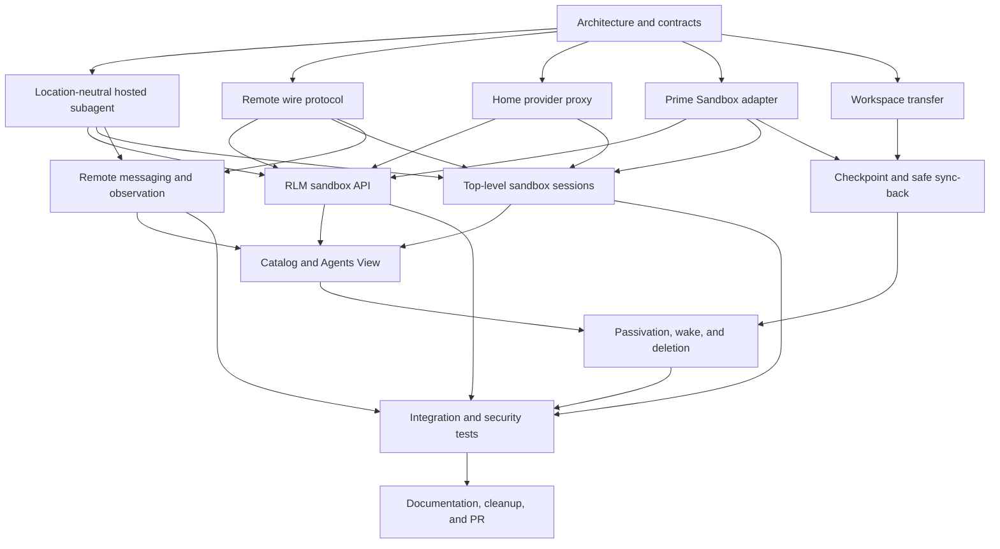

# Sandbox-backed Prime Agent sessions implementation plan

## Objective

Add `sandbox=False` by default to top-level session and RLM subagent creation. When enabled, Prime Agent creates a Prime Sandbox, runs the agent runtime and local tools there, keeps provider credentials on the home daemon, and preserves lifecycle, session discovery, observation, and direct agent-to-agent communication across the remote boundary.

## Fixed design decisions

- The home daemon owns identity, family authorization, provider authentication, session catalog state, sandbox billing, and durable archives.
- The sandbox owns the live agent loop, IPython kernel, workspace, and processes.
- Model calls use a typed streaming home-provider proxy. Provider keys and OAuth refresh tokens never enter the sandbox.
- Prime Sandboxes use an outbound authenticated relay transport. A later generic-host adapter may use OpenSSH `ControlMaster`; mosh is not a control transport.
- Agent activity (`running`, `idle`, `inactive`) is separate from connection state (`connecting`, `connected`, `reconnecting`, `unreachable`, `closed`).
- Direct agent-to-agent communication remains limited to parent, siblings, and children and is durable across reconnects.
- Every explicit `sandbox=True` creates a fresh sandbox. Descendants with `sandbox=False` remain on their current execution host.
- The home daemon checkpoints transcripts and workspace changes before it deletes an owned sandbox.

## Dependency graph

## Parallel work topology

Status values are `queued`, `in_progress`, `blocked`, `review`, and `done`.

### Wave 1: independent architecture audits

| ID | Status | Work package | Output |
|---|---|---|---|
| A01 | done | Current RLM child lifecycle and concrete `AgentSession` coupling | Refactor seam report recovered |
| A02 | done | Daemon protocol capability and compatibility requirements | Wire-change report recovered |
| A03 | done | Agent connection DTO and remote path assumptions | Remote DTO report received |
| A04 | done | Provider registry, streaming, cancellation, and auth flow | Provider-proxy report recovered |
| A05 | done | Prime Sandbox SDK, lifecycle, bootstrap, and image constraints | SDK v0.2.35 adapter report received |
| A06 | done | Direct agent-to-agent communication routing and delivery guarantees | Messaging report received |
| A07 | done | Observation, transcript, recap, and usage attribution | Observation report recovered |
| A08 | done | Session catalog, passivation, rehydration, and deletion | Lifecycle report received |
| A09 | done | Agents View status and connection-state presentation | UI report received |
| A10 | done | Workspace snapshot and conflict-safe sync-back | Workspace report recovered |
| A11 | done | Top-level session creation APIs and CLI integration | Integration points recovered from transcript |
| A12 | done | Python RLM bridge and public API compatibility | RLM API report received |
| A13 | done | Test harnesses and protocol compatibility coverage | Test topology report received |
| A14 | done | Security threat model and secret-exposure audit | Threat model received |
| A15 | done | Runtime packaging, exact-build bootstrap, and update behavior | Packaging report received |
| A16 | done | Failure injection, reconnect, idempotency, and recovery behavior | Recovery report received |

### Wave 2: implementation packages

Wave 2 begins after the related Wave 1 contracts are integrated. Each package uses an isolated worktree and produces a cherry-pickable commit.

| ID | Depends on | Status | Work package |
|---|---|---|---|
| B01 | A01, A03 | done | Add `ExecutionLocation` and opaque remote session DTOs |
| B02 | A01, A07 | done | Introduce location-neutral `HostedSubagent` and preserve local behavior |
| B03 | A02, A16 | done | Exact remote protocol, frame/journal codecs, delivery index, immutable publication, bounded recovery, and production Node backend |
| B04 | A02, A16 | done | Replace the initial relay with ordered durable receipt/delivery handling |
| B05 | A04, A14 | done | Add typed streaming home-provider proxy |
| B06 | A05, A15 | done | Add Prime Sandbox provisioner and background-job lifecycle |
| B07 | A10, A14 | done | Add Git workspace snapshot and safe sync-back |
| B08 | A12, B01, B02 | done | Add `sandbox` and `sandbox_options` to RLM APIs |
| B09 | A11, B01, B03 | done | Add top-level sandbox session creation APIs and CLI flags |
| B10 | A06, B03, B04 | in_progress | Durable target-inbox core is accepted; implement transcript-aware dispatch, pre-admission authorization, and bidirectional relay composition |
| B11 | A07, B03, B04 | done | Mirror observation, transcript, recap, and usage events; exact snapshots, durable application, and production Node backend are integrated |
| B12 | A08, B03, B06 | done | Add sandbox lifecycle, checkpoint, passivation, wake, and deletion |
| B13 | A09, B01, B11 | done | Show execution location and connection health in Agents View |
| B14 | B05, B06, B08, B09 | in_progress | Wire end-to-end sandbox session orchestration; fixed FD3 child launch and hosted factory remain |
| B15 | A13, B03, B04 | done | Add protocol compatibility and reconnect tests |
| B16 | A13, B05, B10, B11 | blocked | Add auth, messaging, observation, and security integration tests after B10 and B14 production composition |

### Wave 3: integration and release readiness

| ID | Depends on | Status | Work package |
|---|---|---|---|
| C01 | B01-B16 | in_progress | Integrate source-reviewed commits in dependency order and resolve shared-file conflicts |
| C02 | C01 | in_progress | Run focused suites and `npm run check` after each accepted integration; final pass remains pending |
| C03 | C01 | queued | Run a real Prime Sandbox smoke test without paid model calls where possible |
| C04 | C02, C03 | queued | Audit secret handling, orphan cleanup, and final workspace sync |
| C05 | C04 | queued | Update README, API docs, changelog, and migration notes |
| C06 | C05 | queued | Independent PR cleanup and regression review |
| C07 | C06 | queued | Push branch and open GitHub PR |
| C08 | C07 | queued | Verify PR diff, checks, and unresolved review threads |

## Current integration baseline

- Branch: `feat/sandbox-backed-sessions` in `/Users/milkkarten/prime-agent-sandbox-sessions`.
- Reviewed integration tip: `adf4057ca`.
- Latest full root `npm run check` is green across 1,045 files, TypeScript, Biome, installer rendering, and browser smoke.
- Accepted B03 foundations: exact frame codec `55b40d7f1`, journal-record codec `5551582bd`, delivery index `5e8e926b4`, direct-final immutable journal publication `8bd83db6c`, immutable delivery-marker publication `df846c08f`, and page-atomic bounded directory recovery `9df8a3da9`.
- Accepted B11 foundations: observation core `939a7baaf`, exact snapshots `62e8b073a`.
- Accepted B14 foundations: provider client `2195c7a23`, tunnel manager `a636f7d99`, PAB1 `d21f53c1a`, FD3 reader `723a8db52`, PAAR codec `a17f5588d`, stdin frame reader `4beeaa5da`, TypeScript correction `1d63a72c0`, SSH spawn specification `4dd8790db`, SSH specification tests `af83a786f`/`a7add61a4`, one-use upgrade authentication `a4976298c`, and Node stdin normalization `4a8962b54`.
- B03 and B04 are complete: the recovered-state durable store and ordered relay are integrated. B10 now needs their production Home router/admission composition.
- Accepted B14 SSH readiness/process cleanup monitor: integration commits `169c29526`, `7fd5770b5`, and `2da8baa52`; 133 focused tests verify synchronous registration backout, durable admission, independent exit/close evidence, no post-exit signal, shared cleanup, pending-admission uncertainty, and intrinsic Promise handling.
- Active B14 work: the accepted listener ownership core and production Node adapter are integrated. The fixed runtime launcher, early CLI wiring, and hosted orchestration remain. Rejected commits `68821a32a`, `bc85d4388`, `9a116a2b0`, `cc1dff993`, `2c1800ad0`, and `8d361990c` remain isolated after direct source review.
- Accepted B02 boundary: `2da8b4357` uses the existing `RemoteHostFrameEnvelope`, `RemoteObservationSnapshotV1`, and provider-usage semantics; it snapshots capabilities, owns subscription cleanup, and preserves local runtime behavior.
- Rejected commits remain isolated and unmerged. This includes `a772e27a`, `f1f5cad9`, `35fb1c61`, `d7b56367`, `bce99cd9`, and `610c696c` plus their earlier rejected chains.
- No paid sandbox, tunnel, VM, GPU, or live provider resource has been created during the resource-free implementation stage.

## Integration rules

- Subagents never edit the shared integration worktree directly.
- Each implementation package receives its own Git worktree and branch.
- The integration owner cherry-picks reviewed commits in dependency order.
- Daemon protocol changes must be capability-gated and include old/new compatibility tests.
- Provider secrets must not appear in sandbox environment variables, files, logs, transcripts, or protocol payloads.
- Tests use faux providers. Live paid model requests are not part of automated validation.
- The integration branch must pass every modified test file, `npm run check`, and `git diff --check` before push.

## Progress log

- Created the clean integration worktree from `origin/main` on branch `feat/sandbox-backed-sessions`.
- Started the persistent goal and five-minute feature heartbeat.
- Started Wave 1 architecture audits in parallel.
- Completed A09. The existing three activity sections stay unchanged; execution location and link health will be added as orthogonal row metadata.
- Completed A15. Remote startup will bind to the exact daemon build identity and reject protocol skew before session admission.
- Completed A05 and A08. The installed sandbox SDK supports idempotent creation and background jobs; sandbox ownership will reuse daemon leases, recovery journals, and passivation semantics.
- Completed A01, A02, A10, and A14. Contracts cover the hosted-child seam, capability-gated protocol, safe workspace sync, and feature-specific secret isolation.
- Completed A03 and A12. Remote DTOs will use opaque IDs and ISO timestamps; the Python RLM layer can forward the new kwargs without a protocol change.
- Completed A16. Remote recovery will extend existing idempotency journals, ownership checks, reconnect cursors, and interrupted-operation records.
- Completed A04 and A07. The home proxy will implement the existing `StreamFn` contract; remote observation will mirror serializable event and usage records into the home catalog.

- Started B01, B03, B05, B06, and B07 in isolated worktrees after their architecture dependencies completed.
- Completed A06 and A13. Remote message delivery needs receiver-side ID deduplication; integration tests will extend the existing faux-provider and injectable subagent-host harnesses.
- Completed A11 from its retained transcript after the subagent failed to send a final summary. Top-level support enters through CLI create options and the capability-gated daemon create command.

- Integrated B01 as `68c8c5704`; its remote-safe DTOs passed 49 focused tests after credential-field and error-sanitization review.

- Started B02 after B01 integration; it will replace concrete child-session coupling with a local adapter while preserving current behavior.

- Integrated B03 as `d609d182f`; 57 focused tests verify exact-build admission, path-free frames, durable journals, directional replay, and cursor identity. Started B04 managed relay and B09 top-level API plumbing.

- Integrated B05 as `ce567a025`; 34 focused tests verify exact model authorization, typed streaming, cancellation, validation, and credential-safe errors.

- The integration branch passes full `npm run check` after B01, B03, and B05 integration.

- Integrated B07 as `7c193eb17`; 65 focused tests cover binary-safe snapshots, secret exclusion, traversal/symlink defenses, base-hash conflicts, and atomic sync-back.

- Integrated B09 as `42a914cba`; 62 focused tests cover default-local compatibility, strict sandbox options, protocol gates, and explicit unsupported-host failures.

- Integrated B06 as `d458e2308`; 80 focused tests cover Prime Sandbox CLI preflight/provisioning, strict DTO parsing, atomic background completion metadata, separate logs, and process-group termination with escalation. No sandbox resource was created.
  Exact-build packaging/bootstrap and admission remain part of B14; B03 already supplies the build/protocol/schema compatibility gate.

- Started B12 after B06 integration. Started transport-neutral B14a provider-client and B14b authenticated Prime Tunnel foundations early because they depend only on already-integrated contracts and touch separate files.

- Integrated the B14a sandbox-side provider client as `2195c7a23`; 67 client/home-proxy tests verify exact model admission, DTO-only requests, concurrent stream isolation, deep frame validation, usage/tool-call reconstruction, cancellation, disconnect cleanup, and credential-free payloads.

- Integrated B04 managed relay as `53e6b73fe` + `c9b1cabec` (cleanup `1eff5e4e6`); 151 B03/B04 tests cover strict peer/build/session admission, session-bound durable journals, replay/deduplication, send-failure teardown, reconnect, and bounded credential-free frames. Started B10 durable cross-host communication and B11 observation mirroring.

- Integrated the B14b Prime Tunnel manager as `a636f7d99`; it uses outbound `prime tunnel start`, validates and consumes the generated one-time grant, bounds injected CLI output, captures only validated tunnel IDs for cleanup, and provides bounded TERM/KILL plus exact-ID CLI cleanup without retaining output.

- Integrated B12 durable sandbox ownership and lifecycle as `16d844a1a`; 158 B06/B12 tests cover hashed fencing tokens, locked CAS transitions, atomic/fsynced records, corrupt-record fail-closed behavior, compensated provisioning, stale reclamation, passivation/wake, tombstones, and deletion without losing a possibly live sandbox handle.

- Integrated B15 protocol compatibility hardening as `3c80229aa` + `e5a22820f`; 226 B03/B04/B15 tests cover exact accepted-ACK build identity, unknown-field rejection, restart cursors, identity isolation, reconnect, corruption, gaps, and bounded replay. Started B14c loopback WebSocket relay and exact-build bootstrap foundations.

- Started B14d sandbox-side remote runtime host and command/event routing in parallel with B14c; both use resource-free fakes and defer final home orchestration until B02/B08 land.

- Reviewed the first complete B02/B10/B11/B14c/B14d candidates against committed source. None passed integration review: B02 still coupled the parent lifecycle to `AgentSession`; B10 lacked the claimed strict durable inbox fixes; B11 accepted non-exact events and snapshots; B14c lacked a real accepted-socket managed-relay path and executable runtime bootstrap contract; B14d lost ACKed commands across crash windows. Returned exact fixes and adversarial regression requirements without merging.

- Reviewed second-round candidates. Rejected them again because committed source still violated required invariants: B02 contained duplicated/corrupt lifecycle edits; B10 still accepted symlinks and v1/unbound inbox data and silently skipped malformed durable frames; B11 advanced state for unapplied event variants and could not produce cursor-accurate recap deltas; B14c used an unsupported CLI flag and did not hand off runtime admission data; B14d double-emitted events, reset event sequences after restart, and did not pass command idempotency keys to mutating runtime operations. The integration branch remains on the last fully verified baseline.

- Source review found repeated candidate reports did not match committed source or real command results. Rejected all unintegrated B02/B10/B11/B14c/B14d commits, deleted those subagents, reset every isolated worktree to verified integration commit `1ac3996b9`, and started five fresh DeepSeek V4 Flash subagents with source-specific invariants and required real `npm run check` exit evidence. No rejected implementation remains on the integration branch.

- Reviewed the first fresh B02/B10/B11/B14d commits after their reported checks passed. Source review still rejected them: B02 exposed host paths/open records and bypassed runtime-host cleanup for retained hosted children; B10 fabricated an incompatible agent-message frame and ran persistence only after B04 had ACKed; B11 lacked exact envelope/snapshot decoding and preserved raw remote errors; B14d had non-exact codecs, a non-atomic/unbound outcome store, incomplete recovery, no transport send, and unsafe command/event crash windows. Reassigned each worktree to a new DeepSeek V4 Flash correction pass with protocol-native types, pre-ACK durability, identity-bound recovery, exact outbox replay, closed DTOs, and cleanup-failure regression tests. No rejected source was merged.

- Rejected the next B11 correction because it still decoded a non-protocol event shape, lacked caller-bound exact snapshot restoration, and advanced or reconstructed unsafe observation state. Rejected B14c's uncommitted attempt because it reversed the transport topology by starting the listener inside the sandbox, dropped post-handshake text frames, ignored the relay URL, retained grants, and used unsafe post-extraction archive checks. Reset both worktrees and started clean protocol-native correction passes.

- Rejected B10's protocol-native correction after finding memory-before-persist inbox mutations, non-exact recovery, and underlying B03 journal replay that regenerated timestamps and silently skipped corruption. Reassigned B10 to harden the shared journal, exact-envelope relay replay, composable awaited admission, and durable inbox together. Rejected B14d's next runtime-host commit because its codecs only checked keys, its "digest" persisted plaintext command bodies, nested state was unchecked, and recovery did not correlate or resume journaled commands/events. Reassigned a focused correction with true SHA-256 digests, recursive exact state validation, backend rehydration, and crash-safe terminal/outbox rules.

- Rejected B02's tagged-union correction because it still lost retained hosted identity/status, bypassed host-owned cleanup, inferred RLM IDs from session IDs, and cast an incompatible usage DTO that would produce `NaN` totals. Rejected B11's concise rewrite because it explicitly tolerated unknown fields, mutated state before validation, discarded usage/pending/name state, and restored incomplete non-exact snapshots. Both remain isolated in targeted correction passes; no candidate code was merged.

- B10's combined correction remained too shallow: journal integrity fields were optional and unchecked, replay still regenerated timestamps, and uncertain inbox writes were not poisoned. Split the dependency into a focused B03 journal/B04 relay hardening pass first; durable message inbox/service work will restart only after that shared exact-envelope foundation is integrated and verified.

- B14c's second fresh attempt again ended without a commit and left a generated package tarball. Source review found a reusable grant, missing fixed-path admission, broken accepted-link ACK ordering, a nonfunctional outbound adapter, partial FD3 reads without erasure, post-extraction archive checks, and no callable process cleanup handle. Split B14c into a focused home listener/server-side accepted-link package first; outbound FD3/bootstrap/artifact/process work will resume after that transport boundary is verified.

- B14d correction `e8220bf07` was rejected. Its codecs still accepted wrong field types, its store was not recursively exact, journal/outbox correlation allowed gaps and unbound events, duplicate admission ignored frame identity, recovery skipped malformed commands, and transport failures terminalized replayable work. Split B14d into exact codecs/store first, followed by host/recovery/outbox.
- B11 correction `dff9168aa` was rejected. It mutated gap state before full decode, accepted non-protocol event shapes, mishandled evicted message indices and second bash runs, exposed mutable nested DTOs, and restored weak/unbounded snapshot fields including raw health errors. Split B11 into exact event/transition core first, followed by persistence/metadata/observer DTO.

- Shared B03/B04 hardening `35f4d182b` was rejected. The claimed strict validator left nested frame/body schemas unchecked; the journal skipped identity/corruption during reads and could report success after poisoned close; the relay processed async arrivals concurrently, admitted before handshake, journaled outbound ACKs as received, and emitted delivery when no ACK was sent. Re-sequenced foundation as: shared exact full-envelope codec, then strict journal, then ordered relay, then B10.

- B02 correction `69778a518` was rejected. Its hosted decoders defaulted malformed data instead of exact rejection, retained identity left `activeSessionId` blank, terminal error events could be overwritten as success, raw cleanup errors reached the parent, and disposal could invoke owner cleanup more than once. Split B02 into exact runtime boundary types/codecs first, then AgentSession orchestration.
- Resource-free bootstrap research confirmed container sandboxes can carry an opaque bootstrap payload without disk/env/argv persistence through `prime sandbox ssh` stdin. HOME spawns the Prime CLI with explicit argv and a pipe; SSH runs a fixed uploaded wrapper without a PTY; the wrapper will create a local pipe and spawn the actual runtime with the read end as FD3. This replaces B06's shell-script/file background-job path. VM sandboxes remain explicitly unsupported until Prime Sandbox exposes SSH there.
- Integrated reviewed B11-a exact observation event/transition core through `939a7baaf`. The six-key event decoder now rejects accessors, symbols, non-enumerables, unsafe/canonical-time violations, preserves bounded failure markers, blocks content after sequence or message-index gaps, supports cursor-0 replay recovery, and returns immutable observer DTOs. Snapshot restoration and final Agents View projection remain separate follow-up layers.
- Integrated the reviewed shared B03 exact full-envelope codec through `55b40d7f1`. It constructs fresh DTOs for all nine frame variants, enforces exact nested schemas, canonical timestamps, independent transport/semantic/command identities, cumulative node/depth/1 MiB canonical UTF-8 bounds, strict provider optionals, safe `__proto__` handling, and fixed fail-closed results even for hostile reflection traps. This unblocks the replacement durable journal and ordered relay.
- Rejected the first replacement strict-journal attempt before commit. It still used synchronous whole-directory/file APIs, advanced sequence state before persistence, silently skipped malformed disk records, persisted exact duplicates as new entries, and could acknowledge unknown frames. Split the work into an exact async immutable sequence store followed by a separate frame/ACK index layer.
- Rejected FD3 wrapper candidate `aadf1559`. It resolved the SSH input frame before EOF, used `/dev/fd/3` instead of the numeric inherited descriptor, never routed the reserved runtime mode from the CLI, retained arbitrary stdout as strings, and could exit before a detached child was killed. The replacement must confirm EOF, use numeric FD3, statically gate both hidden modes, and await one signal-escalation teardown chain.
- Integrated reviewed B11-b exact observation snapshots through `62e8b073a`. Snapshot restore now roundtrips every state accepted by B11-a, preserves independent counters and exact retained transcript/recap suffixes, binds identity, rejects aliases and hostile descriptors, uses the shared exact JSON byte preflight, and recursively freezes fresh DTOs. The integrated 482-test observation/codec/protocol suite and full root check pass.
- Rejected PAAR artifact candidates `2cc133910` and `093d18123`. Their builder and installer normalized unsafe paths, lacked an exact canonical manifest/build identity, followed or raced symlinks, used unsafe rename fallback, and did not package the runnable Python kernel. Restarted the work as a narrow reviewed async format/builder/verifier foundation before implementing the remote installer.
- Replaced the first async journal-store track after its reported corrections still performed unpaginated multi-gigabyte recovery and used plain rename as a claimed no-replace primitive. The replacement uses an exclusive staging file, final sequence reservation, link-no-replace, exact fsync ordering, and an explicit paginated recovery state.
- Source review rejected follow-up transport/listener/wrapper commits and uncommitted corrections: SSH dropped the required isolated cwd/environment/detached process-group options and could leave credential writes unsettled; the wrapper erased a frame still owned by FD3 and installed signal cleanup too late; the FD3 reader erased buffers before pending callbacks settled and leaked the descriptor on success; the listener still conflated authentication, transport receipt, and application delivery. Replacements now isolate SSH, wrapper, FD3 reader, and one-use loopback listener into separate foundations.
- Source review rejected journal candidate `dd5639922` and PAAR candidate `c238fc31`. Both reported stronger guarantees than their source provided. Journal work is now split into an exact record codec and generic immutable byte store. Artifact work is split into a pure canonical manifest codec before any builder/verifier/installer filesystem layer.
- B02 remains unintegrated. Its correction still changed existing local runtime types and duplicated observation DTOs despite the required unchanged local boundary. Hosted runtime integration will resume only after communication and observation contracts are accepted.

- Integrated the reviewed B03 journal record v1 codec through `5551582bd`. It descriptor-copies exact records and expected bindings without hostile property reads, preserves complete remote envelopes and independent IDs, derives and verifies canonical SHA-256 envelope digests, enforces exact canonical JSON bytes and size/identity/time/direction bounds, erases caller and owned decode buffers, and freezes fresh results. The integrated protocol/frame/journal suite passes 432 tests. Immutable publication and delivery-state indexing remain separate follow-ups.
- Rejected the replacement one-use listener `692cd9eb7` and the uncommitted wrapper-v2 draft after direct source review. The listener did not start or correctly count teardown after the first upgrade, could retain grants on early rejection, removed candidate ownership before WebSocket admission, and lacked bounded listen/upgrade failure handling. The wrapper accepted input before EOF, retained credential copies, signaled the wrong process scope, hung on readiness/natural exit, and converted cleanup failures to success. Both were split again into pure upgrade-authentication and streaming-stdin foundations before lifecycle integration.
- Integrated the reviewed PAB1 one-use bootstrap payload codec through `d21f53c1a`. It accepts only exact non-shared caller bytes, descriptor-snapshots bounded metadata, validates canonical secret-free `wss:` relay URLs, rejects literal-IP and repeated-path forms, erases caller and owned grant bytes on every path, and exposes only fixed frozen results.
- Integrated the reviewed numeric-FD3 framed reader through `723a8db52`. It uses unique buffer ownership per read, bounded referenced deadlines, exact framing and premature-EOF handling, confirmed close, descriptor-copied adapters, caller-payload ownership, and erasure that waits for all callback ownership to settle. Its focused suite passes 74 tests.
- Integrated the reviewed canonical PAAR1 manifest/framing codec through `a17f5588d`. It enforces exact fixed-order canonical manifests, NFC UTF-8 byte ordering, numeric file modes, contiguous offsets, deterministic build identity separate from final archive SHA, exact genuine decode buffers including detached/subview rejection, and temporary path-buffer erasure. The integrated PAAR/PAB1/protocol suite passes 265 tests. Deterministic trusted-tree builder and streaming verifier work is now isolated from the later one-open installer.
- Integrated the reviewed B03 receipt/application-delivery index codec and recovery accumulator through `5e8e926b4`. Canonical pending/delivered markers bind exact host/generation/session/direction/frame/digest/journal sequence, recovery validates contiguous index sequences without mutation on rejection, and deterministic actions distinguish new admission, pending idempotent reapplication, and delivered replay ACK. The integrated journal/index/frame/protocol suite passes 584 tests.
- Integrated the reviewed streaming SSH-stdin bootstrap frame reader through `4beeaa5da`. It waits for exact EOF, uses only a fixed header and exact payload allocation, rejects trailing/hostile chunks, snapshots its source adapter, handles synchronous registration races, removes only owned listeners, keeps its deadline referenced, and does not erase bytes while callbacks own them. The integrated stdin/FD3/PAB1 suite passes 254 tests. HOME credential-write ownership and the production Buffer-copy adapter remain separate.
- Integrated the reviewed pure HOME SSH spawn specification through `4dd8790db`. It emits exactly `prime` plus the nine required `sandbox ssh --plain` arguments, an explicit absolute HOME cwd, detached process-group settings, piped stdio, shell disabled, and only the PATH/HOME/USER/TMPDIR environment allowlist. Strict descriptor-based inputs and fixed secret-free errors reject hostile or extra values. Its integrated PAB1 suite passes 166 tests. Credential-write ownership and process lifecycle/readiness remain separate tracks.
- Integrated direct-final immutable journal publication as `8bd83db6c`. It reserves `<20-digit>.b03-journal` with `O_WRONLY | O_CREAT | O_EXCL | O_NOFOLLOW`, mode `0600`, never unlinks evidence, verifies exact file and directory identity, handles short positional writes, reopens and checks content, fsyncs the file and identity-bound directory, owns one checked close per handle, and erases caller/internal buffers. The 68 publisher tests and 714-test integrated B03/B04/B15 suite pass; full root check is green across 1000 files.
- Integrated immutable delivery-marker publication as `df846c08f`. It reuses the same reviewed direct-final publication core for `<20-digit>.b03-delivery`, preserves journal behavior, binds exact `indexSeq` values through 40,000, and returns fixed delivery-specific results. The combined publisher/journal/index/frame/relay/compatibility suite passes 752 tests; full root check is green across 1002 files.
- Integrated one-use WebSocket upgrade authentication as `a4976298c`. It takes caller-grant erasure ownership before unrelated factory validation, snapshots and scrubs all safely discoverable grant slots before request rejection, requires exact raw/normalized header agreement and strict Upgrade/Connection grammar, compares fixed SHA-256 digests in constant time, and preserves terminal one-use status. Its 79 focused tests, 248-test bootstrap/auth suite, 81 SSH-spec tests, independent adversarial review, and 1004-file root check pass.
- Integrated B13 Agents View execution metadata as `1ccb524da`. The view accepts only exact frozen coarse `local | sandbox+link | unavailable` DTOs, rejects hostile metadata without getters or proxy reads, displays location/link health orthogonally to activity, and never carries sandbox IDs, regions, errors, timestamps, URLs, or credentials. Seven Agents View suites pass 174 tests without changing grouping/counts; the 1005-file root check is green.
- Integrated the Node stdin normalization boundary as `4a8962b54`. It adapts real Node `Buffer` chunks into exact fresh full-backing `Uint8Array` values, erases them after synchronous consumption, rejects proxies/subclasses/empty chunks without throwing, installs terminal listeners before data/resume, preserves unrelated listeners, and retains exact listener ownership across removal uncertainty. Its adapter+frame suites pass 149 tests and the 1007-file root check is green.
- Integrated the credential-frame write ownership primitive as `3f17cb640`. It copies and erases the caller payload, writes one length-prefixed frame, treats write ownership as uncertain until an explicit write/release callback or released return, never treats drain/return as completion, erases before end, and preserves the frame when release remains uncertain. Its 54 focused tests and 277-test bootstrap transport suite pass; the 1009-file root check is green.
- Integrated the accepted hosted-subagent boundary as `2da8b4357`. It reuses the accepted frame, observation snapshot, and provider usage types, binds exact capabilities, owns synchronous subscription callback/backout races, and exposes one shared checked close promise without changing local runtime behavior. Its 42 focused and 366 combined tests pass; the 1011-file root check is green.
- Replaced the rejected B03 scanner directly and integrated page-atomic recovery as `9df8a3da9`. It enforces exact cursor pagination and cross-page order, complete identity-bound reads with one checked close, transferred-byte erasure, exact marker-to-journal binding, duplicate-frame rules, and pending/delivered recovery. Its 110 focused and 680 combined tests pass; independent source review accepted it and the 1013-file root check is green.
- Rejected scanner `f9e5391f0`, SSH monitor `93c134c8a`, PAAR verifier `99168c06e`, and the uncommitted installer v3 after direct review found missing binding, asynchronous admission, one-close, mutation, and safe traversal guarantees.
- Rejected paginated scanner `f1f5cad9` after direct review found cursor advancement past unprocessed entries, pre-commit accumulator mutation, incomplete handle/read validation, and unsafe marker ordering across pages. Started a clean one-list-call, page-atomic scanner that defers full marker binding and accumulator construction until recovery completion.
- Rejected hosted boundary `35fb1c61`, upgrade authenticator `d7b56367`, PAAR builder `bce99cd9`, verifier `610c696c`, and the first SSH lifecycle/Node stdin adapter attempts after committed-source review. Their clean or focused correction tracks are active; none is present on the integration branch.
- Rejected durable-store candidate `e95f0277` after direct review found premature recovery exposure, fabricated state, incomplete persistence/byte accounting, unbounded replay, unbound delivery transitions, and unsafe close/erasure semantics. Started clean accepted-recovery-backed durable-store v2.
- Rejected PAAR verifier `c985ed406`, installer `5f3d3bbe3`, and builder `22b1d1e3e` after direct review found compilation/tuple crashes, partial-read/write failures, incomplete identity and expected-tuple checks, output ownership leaks, unsafe cleanup, and close uncertainty that did not dominate. Started independent clean verifier v4, installer v5, and builder v5 tracks.
- Rejected listener/server `f0291bc9` after direct review found duplicate socket ownership, uncancelled late admissions, post-close upgrade races, unbounded connections, unchecked setup cleanup, and timeouts that fabricated server/WebSocket/socket closure. Started clean listener/server v5.
- Integrated B08 RLM sandbox options through `26ffef380` and `f6ede58e5`. `SandboxOptions` now lives in the core execution-location contract; strict revoked-proxy-safe normalization returns frozen exact snapshots, omitted/false preserve option shapes, no-host rejection occurs before model/filesystem/map/event allocation, and concrete local hosts reject before local session allocation. Its 45 focused and 87 combined boundary tests pass; the 1014-file root check is green.
- Integrated the corrected SSH lifecycle monitor through `169c29526`, `7fd5770b5`, `2da8baa52`, `784d41f31`, and `55fe678a8`. It owns synchronous subscription backout, intrinsic native-Promise observation, independent exit/close evidence, pending admission uncertainty, referenced escalation timers, no signal after observed exit, and one shared cleanup. All 133 focused tests and the 1016-file root check pass; independent adversarial review accepted the committed source.
- Rejected durable-store candidates `e58350466` and `fe7ce5405`; later source still reconstructed markers as `new`, omitted backend close ownership and durable `delivered`, mishandled uncertain bytes, and omitted delivery SHA checks. Durable-store v4 remains the blocker for ordered relay and direct communication.
- Rejected PAAR builder commits `13fd44393` and `3949f8dbf`, verifier v6, FD3 wrapper `d7de26367`, listener v7, and offline runtime v2 after direct source review. Defects included fake or swallowed close ownership, three source passes, unbounded retained chunks, noncanonical output offsets, close uncertainty converted to success, incompatible Node writable callbacks, conflated exit/close evidence, auth-after-capacity rejection, and shared architecture inputs. None entered integration.
- Corrected one-use relay authentication in `0afbaac81`: requests presented after authentication or disposal now scrub their actual referenced raw and normalized credential slots before returning `ALREADY_USED`. All 81 focused tests and the 1016-file root check pass.
- Integrated the reviewed pure Python PAAR manifest codec through `905a4922e` and `dc2e17586`. It matches TypeScript canonical raw UTF-8 bytes and digests on cross-language ASCII, NFC, CJK, and emoji samples; rejects bool and out-of-safe-range integers; keeps immutable manifest DTOs; and passes 105 focused tests. Streaming verification and installation remain separate.

- Moved Python PAAR codec tests onto the repository `unittest` CI path in `9c5275ead`. Integrated the production Node Writable credential adapter through `31d6dede4` and `08b890cc4`; it preserves exact child-stdin ownership, copies `Buffer` inputs into genuine full-backing `Uint8Array` values, and passes 85 combined adapter/writer tests.
- Integrated the bounded one-open PAAR streaming verifier as `32b1db6b0`. It acquires close ownership before unrelated validation, distinguishes bytes/EOF/error and short reads, verifies complete bigint identity and every file/archive digest, enforces exact EOF and the full expected build/protocol tuple, erases late transferred bytes, and lets close uncertainty dominate. Its 25 focused and 98 codec tests pass; the 1020-file root check was green.
- Rejected durable-store v5, listener v8, Python installer v8, and PAAR builder `14b563f84` after direct source review. Remaining defects included unbound capability methods, concurrent fake FIFO work, factory-failure handle leaks, unsafe multi-component path traversal, output/reader leaks, ignored close uncertainty, post-close task races, and transferred-byte misuse. None entered integration.
- Integrated the independently accepted exactly-two-pass PAAR builder as `4cd92e69b`. It validates and binds hostile capability descriptors, rejects aliased owners, bounds every source read and aggregate payload, verifies full immutable file identity in both passes, hashes and writes the same pass-two bytes, preserves uncertain output, closes or abandons every confirmed owner once, and verifies the sealed archive before success. The builder/codec/verifier suite passes 146 tests and the 1028-file root check is green.
- Integrated the independently accepted Python PAAR installer as `5f753b0e7`. It opens the archive and destination root once, validates the complete expected build/SHA/protocol tuple, rechecks full archive identity and hashes around extraction, uses bounded short-read/write loops, component-wise `dir_fd` traversal with `O_NOFOLLOW`, exact output modes and identities, recursive owned-staging cleanup, checked one-shot closes, and Linux `renameat2(RENAME_NOREPLACE)` via `ctypes.CDLL(..., use_errno=True)`. Its Python 3.11 installer/codec suite passes 124 tests and the 1028-file root check is green.
- Integrated the independently accepted replacement durable relay store through `c72e62243` and alias-ownership correction `6a5c71585`. It owns and binds all three capabilities before unrelated validation, rejects shared capability aliases with one checked close, runs accepted recovery before exposure, serializes public operations through one FIFO, persists exact journal/pending/delivered transitions before memory, reconstructs and verifies receipt digests/total bytes, provides bounded sequence-cursor pages, snapshots hostile inputs, and drains accepted work before one shared close. Fifteen focused tests, including restart reconstruction, capability aliasing, and close-failure dominance, and the 1022-file root check pass. This unblocks the replacement B04 ordered relay and B10 durable communication.
- Integrated the replacement B04 ordered durable relay through `15ec5613f`, restart replay coverage `b03e9d859`, and reentry correction `3c7ad6c5e`. Incoming frames are durably journaled and marked pending before idempotent application; deterministic ACK envelopes use independent domain-separated frame/semantic IDs, are durably completed before the incoming delivered marker, and are sent only after all persistence. Delivered replay returns the exact same ACK across full store restart, outbound sends persist before transport, inbound ACKs durably complete the correlated outbound frame before application, pending outbox replay is ordered and paginated, and application-context relay reentry returns a fixed error instead of deadlocking. The combined store/relay suite passes 28 focused tests; independent adversarial review accepted the core commit.
- Added the B10 durable direct agent-to-agent communication application boundary as `cf99a139d` with ordered-relay composition coverage `63a1b0a84`. It preserves independent transport frame and semantic message IDs, authorizes exact source/target identities before delivery, passes the semantic ID as the mandatory idempotency key, accepts only exact correlated queued/delivered receipts, serializes handler work, and owns one checked router close. The combined store/relay/message suite passes 40 focused tests and the 1026-file root check is green. The daemon/router adapter that resolves home-owned family authorization and idempotent target-session admission remains part of B10/B14 orchestration.
- Integrated the independently accepted production Node SSH session adapter as `789dead81`. It spawns only the reviewed fixed `prime sandbox ssh --plain` specification through an injectable exact dependency seam, snapshots the allowlisted environment, binds and uniquely owns the child and three stdio handles, copies Node `Buffer` events into genuine full-backing transferred bytes, composes the accepted readiness/process monitor and credential Writable adapter before returning, preserves independent exit/close evidence, signals only the detached process group, unsubscribes exact listeners, and destroys stdio only after observed closure or bounded final uncertainty. Its 12 focused and 123 composed transport tests pass; independent adversarial review accepted the source and the 1030-file root check is green.
- Rejected offline runtime composer v3 after direct source review. It accepted non-exact inputs and wrong/empty runtime versions, leaked partially acquired roots and late readers, ignored close uncertainty and total-payload accounting, retained whole large files, incompletely validated ELF/glibc and neutral trees, failed to bind builder passes to the initial full identity, omitted reader-alias/race handling, fabricated duplicate close success, and returned no fixed runtime-path metadata. Clean v4 now uses normalized source layouts and the accepted PAAR builder contract.
- Rejected FD3 wrapper v5 after direct source review. It recursively spawned the CLI with the same wrapper flags, had no numeric-FD3 runtime gate, never forwarded child stdout into readiness parsing, fire-and-forgot credential writes, installed inert signal handlers, accepted arbitrary runtime argv/cwd/env, used unbound/unowned Node handles, swallowed cleanup and readiness-write failures, and returned success after arbitrary child closure. Clean v6 is restricted to a PAB1/credential/readiness composition seam until a real fixed runtime launcher and remote host exist.
- Rejected B11 observation persistence v6 after direct source review. It never recovered backend records before exposure, had no mirror/application handler or durable applied transition, raced duplicate/gap checks outside serialization, synthesized non-event sequences, never represented gaps, replayed only volatile state, assimilated hostile thenables with `Promise.resolve`, fabricated duplicate close success, and read hostile properties before descriptor-safe validation. Clean v7 persists complete pending envelopes and exact applied snapshots around an idempotent mirror application.
- Rejected listener/server v9 after direct source review. It used forbidden `require` and an undeclared `ws` dependency, unbound hostile capabilities and thenables, leaked upgrade-head bytes on auth failure, left fail-closed servers and timed-out paused sockets alive, raced late handler/upgrade tasks and WebSocket close observation, ignored WebSocket/TCP closure evidence, leaked deadline timers, and fabricated cleanup on factory/listen failures. Clean v10 isolates a dependency-free semantic listener ownership core before a production Node/WebSocket adapter.
- Rejected offline runtime composer v4 after direct source review. It read hostile envelope fields before validation, fire-and-forgot partial-acquisition closes, left its failure `finally` empty, ignored reader close uncertainty, allowed ELF validation bypasses, reread prefixes outside its identity window, and returned a passthrough builder reader that never rechecked the stored identity/digest/EOF. Its output also accepted hostile opens and fabricated duplicate close success. The next design will validate within the accepted builder's exact two source passes instead of adding an unsafe pre-pass.
- Rejected FD3 bridge v6 after direct source review. It accepted proxy/null-prototype/symbol inputs, left methods unbound, used a string publisher instead of transferred bytes, assimilated hostile launcher/monitor promises, leaked invalid/late started resources, swallowed cleanup uncertainty, and returned distinct/fabricated lifetime-close results. A smaller bridge is now being implemented directly against the accepted PAB1/stdin/writer/monitor primitives.
- Rejected committed B11 observation application `41dea58a3` after direct source review. It was incompatible with the ordered-relay application shape, leaked its recovery owner, persisted circular zero receipts, accepted and retained unsafe recovery bytes, lacked bounded cursor progress, discarded invalid transition order by sorting/deduplication, incompletely verified envelopes/snapshots, accepted duplicate/collision mismatches, and let volatile/durable pending-applied state diverge. None entered integration.
- Rejected listener ownership core v10 after direct source review. It used live unbound synchronous capabilities, dropped synchronous subscription events, had no unsubscribe/admission timeout, fabricated missing connection records, failed to validate/own socket and WebSocket handles, awaited hostile thenables, omitted upgraded capacity, and misread task/closure deadlines as success while ignoring independent closure evidence. No source entered integration.
- Integrated the independently reviewed narrow FD3 bootstrap bridge as `e1209d850`. It validates and re-encodes one exact EOF-confirmed PAB1 frame, transfers credentials only through the accepted checked writer, invokes a path-free exact runtime-launch seam, waits for credential completion and validated readiness, publishes only transferred canonical readiness bytes, owns late/invalid runtime cleanup, and exposes one shared checked close plus sanitized lifetime. The static parser accepts only the exact wrapper/runtime reserved modes and fixes the runtime descriptor at numeric FD 3. Its 11 focused and 245 composed bootstrap tests pass; independent adversarial review accepted the corrected source and the 1033-file root check is green. Real fixed runtime launch and CLI wiring remain gated on hosted orchestration.
- Rejected listener ownership core v11 after direct source review. It dropped synchronous pre-listen callbacks, conflated TCP acceptance with HTTP upgrade, omitted owned socket pause/reject/destroy and durable admission/upgrader seams, fabricated a null WebSocket and closure observations, used live unbound capabilities/hostile promises, omitted counters and exclusive phases, listened on a nonsanitized non-loopback address, and treated ignored/fire-and-forget cleanup as checked closure. No source entered integration.
- Rejected durable observation application v8 after direct source review. Its recovery lacked page-owner closure and genuine transferred-byte validation, was not page-atomic or cursor-complete, rejected valid pending/applied pairs, reordered history, failed to durably finish terminal pending replay, raced concurrent applies, accepted unvalidated publication results, violated byte transfer ownership, diverged the live mirror from the persisted complete snapshot, omitted semantic event collision identity, and fabricated/shared-close results incorrectly. No source entered integration.
- Rejected offline runtime composer v5 after direct source review. It omitted an explicit target, accepted live/noncanonical manifests and ambiguous tree digests, acquired/cleaned source ownership too late, failed to track reader aliases, parsed ELF64 offsets with invalid JavaScript shifts, validated only the first short chunk and selected extensions, allowed required binaries to be non-ELF, mapped runtime paths incorrectly, added unreliable identity checks, and fabricated mutable/close success. No source entered integration.
- Integrated the independently accepted pinned offline runtime composer as `dd486fee7`. It acquires and checks all four source roots before unrelated validation, binds frozen per-file/build/tree manifests to an explicit target, maps the exact Node/CPython/bundle/runtime layouts, streams every file through the accepted builder's two passes with stable identity/size/SHA checks, validates every ELF and both required glibc interpreters from a bounded split-safe prefix, rejects ELF in neutral trees, and owns aliases/late readers/root closure without fabricating success. Its 11 focused and 157 composed PAAR tests pass for x64 and arm64; the 1037-file root check is green and an independent final adversarial review returned ACCEPT.
- Integrated the canonical durable observation record codec as `cdd45dfc6`. Pending and applied records bind the complete envelope and snapshots to independent Home identity, transport frame ID, semantic event ID/sequence, envelope digest, and observation ID without receipts or synthetic sequence fields. Decode owns and erases only genuine full-backing nonshared bytes, enforces bounded canonical JSON by exact re-encoding, and rejects hostile descriptors, aliases, Buffer/subclass/proxy/shared/subview bytes, identity divergence, and noncanonical encodings. Eight focused plus 158 mirror tests pass; independent adversarial review accepted the corrected cursor-identity binding. Durable page publisher/recovery/application composition remains pending.

- Integrated the independently accepted durable observation application as `c71c2a83d`. It acquires and closes every bounded recovery-page owner, owns and erases canonical record bytes, validates each page atomically with contiguous cursors and total limits, preserves independent frame/event/sequence collision indexes, and reconstructs the exact complete applied snapshot before exposure. A terminal pending record is deterministically reapplied and durably published as applied before the factory returns. Live event work is serialized and publishes pending before any live-state change and applied before swapping the exposed snapshot; reentry poisons without deadlock, transferred publication bytes have one owner, and close waits for in-flight work through one shared checked promise. Thirteen focused application tests plus eight codec and 158 mirror tests pass, including malformed-page atomicity, crash recovery, collision rejection, publication failure, reentry, and close-during-apply; the 1039-file root check is green and independent adversarial review returned ACCEPT. The production filesystem backend and ordered-relay/router composition remain pending.

- Rejected B03 scanner candidate `f9e5391f0` after committed-source comparison with the current `9df8a3da9` recovery. The candidate removed proxy rejection, full cursor-cycle detection, `IO_UNCONFIRMED` classification, malformed-result close discovery, and ten adversarial ownership/binding tests, and left debug logging in production. Its page-atomic decode-then-commit, explicit EOF/final-fstat checks, and typed result improvements should be ported separately without replacing the accepted current protections.

- Integrated the independently accepted production Node durable-observation backend as `d86e7d600`. A dedicated mode-0700 Home directory is bound by a canonical write-once `identity.json` held open for the backend lifetime; path and open-handle identities are rechecked before recovery and publication. Observation records use contiguous one-based `.b11-observation` files created with `O_EXCL | O_NOFOLLOW`, full positional writes, file fsync, checked writer close, read-only reopen with short-read/EOF/stat/hash/byte verification, directory fsync, and no deletion on uncertainty. Recovery is byte/count bounded and paginated, returns full-backing owned bytes plus page-owned open handles, enforces cursor progress, and retains strict pending/applied parity. All operations serialize, publication aliases are rejected, publication bytes are erased, and root/page/file handles have shared checked close. Nine backend, thirteen application, and eight codec tests pass, including restart recovery, identity mismatch/mutation, sequence gaps, tampering, symlinks, byte-boundary pagination, alias rejection, and ownership; the 1041-file root check is green and independent adversarial review returned ACCEPT.

- Integrated the independently accepted single-use relay listener ownership core as `9d40331f6`. The core creates and owns the one-use authenticator from transferred grant bytes and a fixed path, scrubs the actual request header containers before every semantic rejection, erases every authenticated Node upgrade head, persists durable admission before one native upgrade promise, installs the handler subscription before resume, and retains independent socket/WebSocket/server closure evidence without reusing consumed aliases. Exact capability snapshots reject proxies, subclasses, aliases, non-native promises, malformed results, duplicate TCP/upgrades, and late owners. One shared close drains dynamically appearing cleanup tasks to a bounded fixed point. Eleven listener-core plus eighty-one auth tests pass; the 1045-file root check is green and independent final adversarial review returned ACCEPT. The production Node HTTP/WebSocket adapter is integrated as `cf826a0c6`.

- Integrated the independently accepted production Node HTTP/WebSocket relay adapter as `cf826a0c6`, with a direct `ws` dependency. It binds only `127.0.0.1` on an ephemeral port, caps the server at one concurrent connection, reports dropped or sequential duplicate TCP connections to the semantic core, and transfers exactly one paused socket through `WebSocketServer.handleUpgrade`. The adapter passes the actual Node upgrade head and authenticates through a plain view that aliases the actual `IncomingMessage.rawHeaders` and `headers` containers; the upgrade path verifies those containers were scrubbed before HTTP 101. Callback aborts, late WebSockets, terminal calls, normal HTTP requests, and unrouted requests erase/scrub and close fail-closed. WebSocket cleanup has a referenced terminate fallback and independent socket/WebSocket/server closure evidence. Five adapter, twelve listener-core, and eighty-one auth tests pass; the 1045-file root check is green and independent final adversarial review returned ACCEPT.

- Reconciled the plan at integration tip `c07f16d66`: B11 is complete through the accepted exact snapshot, durable application, and production Node backend; B10 remains in progress on restart-durable target admission; B14 remains in progress on the fixed numeric-FD3 child launcher and hosted orchestration; B16 is blocked only on those production compositions.
- Rejected two B10 designs that incorrectly treated the volatile `SessionActionStore` or non-fsynced `SessionManager.flushNow()` as a crash-durable admission boundary. The replacement uses a permanent B03-backed target inbox, independent transport and semantic IDs, a canonical semantic collision index, `pending` before queued ACK, and recovery-time verification of every record including `delivered` records.
- Accepted the B10 durable target-inbox core after adversarial review: ownership-first capability acquisition, semantic collision indexing independent of transport IDs, durable `pending` before queued ACK, explicit deferred retry, restart re-verification of `delivered` records, exact store-error preservation, and reentrant checked close. The composed B03/B10 suite passes 508 tests.
- Started isolated implementations for the B10 durable target inbox, the B14 FD3 child-readiness monitor, and the missing production Node B03 relay backend. Direct review returned concrete ownership, paging, scheduling, identity-binding, and path-safety corrections before integration.
- Audited and terminated 43 orphaned test, daemon, Python, and esbuild processes left by completed isolated review worktrees; a follow-up process scan found none remaining from those completed worktrees. No paid resources were created.
- Integrated the independently accepted dependency-free FD3 child-readiness monitor as `adf4057ca`. It validates one exact canonical readiness line without claiming relay admission, owns transferred stdout/stderr bytes, preserves synchronous terminal evidence even at queue overflow, requires independent exit and close evidence, and performs referenced process-group `SIGINT → SIGTERM → SIGKILL` cleanup without signaling after observed exit. Eighty-five focused and 229 composed FD3/SSH monitor tests pass; independent adversarial review returned ACCEPT. The fixed child launcher is active in an isolated worktree.

- Integrated the independently accepted production Node B03 relay backend as `bbe38dc82`. The backend creates the target directory only below an existing canonical private parent, binds exact canonical identity bytes with `O_EXCL`, file fsync, checked close, and directory fsync, and retains separate inode-bound directory owners for journal publication, delivery publication, and recovery. Publisher inputs snapshot and erase genuine transferred bytes synchronously, serialize before checked close, and revalidate both directory and identity before and after publication. Recovery rejects unknown, unsafe, oversized, or out-of-range entries; pages at 64 records; opens one identity-checked handle per file; supports short reads and explicit EOF; drains admitted reads before one checked close; and poisons on directory or identity replacement. Thirty-four backend and 335 composed B03 tests pass; direct review and independent adversarial review returned ACCEPT.
