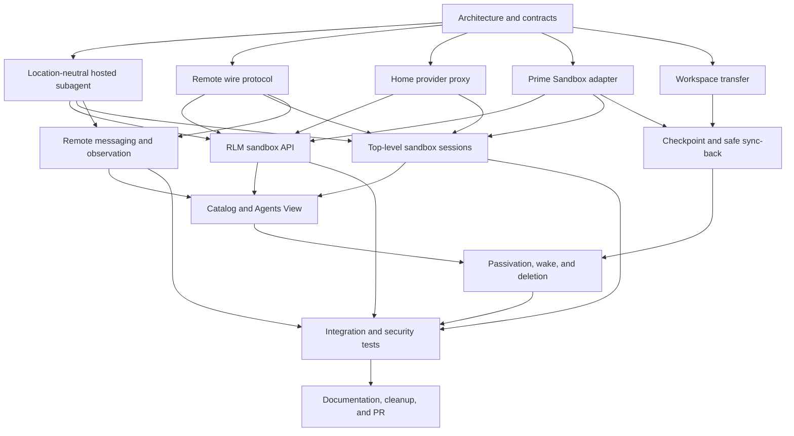

# Sandbox-backed Prime Agent sessions implementation plan

## Objective

Add `sandbox=False` by default to top-level session and RLM subagent creation. When enabled, Prime Agent creates a Prime Sandbox, runs the agent runtime and local tools there, keeps provider credentials on the home daemon, and preserves lifecycle, session discovery, observation, and direct agent-to-agent communication across the remote boundary.

## Fixed design decisions

- The home daemon owns identity, family authorization, provider authentication, session catalog state, sandbox billing, and durable archives.
- The sandbox owns the live agent loop, IPython kernel, workspace, and processes.
- Model calls use a typed streaming home-provider proxy. Provider keys and OAuth refresh tokens never enter the sandbox.
- Prime Sandboxes use an outbound authenticated relay transport. A later generic-host adapter may use OpenSSH `ControlMaster`; mosh is not a control transport.
- Agent activity (`running`, `idle`, `inactive`) is separate from connection state (`connecting`, `connected`, `reconnecting`, `unreachable`, `closed`).
- Direct agent-to-agent communication remains limited to parent, siblings, and children and is durable across reconnects.
- Every explicit `sandbox=True` creates a fresh sandbox. Descendants with `sandbox=False` remain on their current execution host.
- The home daemon checkpoints transcripts and workspace changes before it deletes an owned sandbox.

## Dependency graph

## Parallel work topology

Status values are `queued`, `in_progress`, `blocked`, `review`, and `done`.

### Wave 1: independent architecture audits

| ID | Status | Work package | Output |
|---|---|---|---|
| A01 | in_progress | Current RLM child lifecycle and concrete `AgentSession` coupling | Refactor seam report |
| A02 | in_progress | Daemon protocol capability and compatibility requirements | Wire-change report |
| A03 | in_progress | Agent connection DTO and remote path assumptions | Remote DTO report |
| A04 | in_progress | Provider registry, streaming, cancellation, and auth flow | Provider-proxy report |
| A05 | in_progress | Prime Sandbox SDK, lifecycle, bootstrap, and image constraints | Sandbox adapter report |
| A06 | in_progress | Direct agent-to-agent communication routing and delivery guarantees | Messaging report |
| A07 | in_progress | Observation, transcript, recap, and usage attribution | Observation report |
| A08 | in_progress | Session catalog, passivation, rehydration, and deletion | Lifecycle report |
| A09 | in_progress | Agents View status and connection-state presentation | UI report |
| A10 | in_progress | Workspace snapshot and conflict-safe sync-back | Workspace report |
| A11 | in_progress | Top-level session creation APIs and CLI integration | Top-level API report |
| A12 | in_progress | Python RLM bridge and public API compatibility | RLM API report |
| A13 | in_progress | Test harnesses and protocol compatibility coverage | Test topology report |
| A14 | in_progress | Security threat model and secret-exposure audit | Threat model |
| A15 | in_progress | Runtime packaging, exact-build bootstrap, and update behavior | Packaging report |
| A16 | in_progress | Failure injection, reconnect, idempotency, and recovery behavior | Recovery report |

### Wave 2: implementation packages

Wave 2 begins after the related Wave 1 contracts are integrated. Each package uses an isolated worktree and produces a cherry-pickable commit.

| ID | Depends on | Status | Work package |
|---|---|---|---|
| B01 | A01, A03 | queued | Add `ExecutionLocation` and opaque remote session DTOs |
| B02 | A01, A07 | queued | Introduce location-neutral `HostedSubagent` and preserve local behavior |
| B03 | A02, A16 | queued | Add capability-gated remote host protocol and replay primitives |
| B04 | A02, A16 | queued | Add authenticated link state machine and fake relay transport |
| B05 | A04, A14 | queued | Add typed streaming home-provider proxy |
| B06 | A05, A15 | queued | Add Prime Sandbox provisioner and exact-build bootstrap |
| B07 | A10, A14 | queued | Add Git workspace snapshot and safe sync-back |
| B08 | A12, B01, B02 | queued | Add `sandbox` and `sandbox_options` to RLM APIs |
| B09 | A11, B01, B03 | queued | Add top-level sandbox session creation APIs and CLI flags |
| B10 | A06, B03, B04 | queued | Route durable direct agent-to-agent communication across hosts |
| B11 | A07, B03, B04 | queued | Mirror observation, transcript, recap, and usage events |
| B12 | A08, B03, B06 | queued | Add sandbox lifecycle, checkpoint, passivation, wake, and deletion |
| B13 | A09, B01, B11 | queued | Show execution location and connection health in Agents View |
| B14 | B05, B06, B08, B09 | queued | Wire end-to-end sandbox session orchestration |
| B15 | A13, B03, B04 | queued | Add protocol compatibility and reconnect tests |
| B16 | A13, B05, B10, B11 | queued | Add auth, messaging, observation, and security integration tests |

### Wave 3: integration and release readiness

| ID | Depends on | Status | Work package |
|---|---|---|---|
| C01 | B01-B16 | queued | Integrate commits and resolve shared-file conflicts |
| C02 | C01 | queued | Run all directly changed test files and `npm run check` |
| C03 | C01 | queued | Run a real Prime Sandbox smoke test without paid model calls where possible |
| C04 | C02, C03 | queued | Audit secret handling, orphan cleanup, and final workspace sync |
| C05 | C04 | queued | Update README, API docs, changelog, and migration notes |
| C06 | C05 | queued | Independent PR cleanup and regression review |
| C07 | C06 | queued | Push branch and open GitHub PR |
| C08 | C07 | queued | Verify PR diff, checks, and unresolved review threads |

## Integration rules

- Subagents never edit the shared integration worktree directly.
- Each implementation package receives its own Git worktree and branch.
- The integration owner cherry-picks reviewed commits in dependency order.
- Daemon protocol changes must be capability-gated and include old/new compatibility tests.
- Provider secrets must not appear in sandbox environment variables, files, logs, transcripts, or protocol payloads.
- Tests use faux providers. Live paid model requests are not part of automated validation.
- The integration branch must pass every modified test file, `npm run check`, and `git diff --check` before push.

## Progress log

- Created the clean integration worktree from `origin/main` on branch `feat/sandbox-backed-sessions`.
- Started the persistent goal and five-minute feature heartbeat.
- Started Wave 1 architecture audits in parallel.
