# Update flow state machine — design spec

Status: **design, lane `lane/update-fsm`**. Owner crate: `pa-daemon` (supervision) with
`pa-cli` composition (coordinator process mode, staged activation) and `pa-types`
(protocol vocabulary). TS ground truth: `~/prime-agent` (read-only; `packages/coding-agent/src/cli/daemon-update-restart.ts`,
`cli/native-update.ts`, `cli/package-manager-cli.ts`, `modes/daemon/daemon-mode.ts`,
`modes/daemon/daemon-supervisor.ts`, `modes/daemon/daemon-supervisor-ownership.ts`,
`utils/native-installation.ts`).

This document specifies the Rust update supervisor as a **state machine**, not prose:
states, events, transitions, the on-disk artifact each state owns (with exactly when each
is created and removed), the timeout/rollback transition table, the roster-snapshot
artifact schema, the client reattach flow, and six implementation slices.

## 1. Scope and non-goals

In scope:

- `prime-agent update` end to end: download, staged activation, graceful daemon
  restart, session/heartbeat/subagent restore, client reattach, rollback.
- The update FSM shared by the coordinator process, the old supervisor, and the new
  supervisor's boot path.
- The on-disk artifacts under `$agentDir/update-restarts/` and the install root, with
  lifetime guarantees.

Non-goals:

- Release download/manifest resolution internals and the release pipeline
  (see `docs/installer-ci-design.md`; the artifact layout stays TS-installer-compatible).
- `--rollback`'s release-candidate validation beyond what the FSM needs (the TS
  `native-update.ts` plan logic ports as-is in the installer lane).
- Session-internal resume mechanics (queue snapshot format, continuation prompt) —
  specified here only as roster fields; the session engine (`pa-core`) owns the payloads.

## 2. What TS does today, and the failure modes this spec kills

TS facts (file-referenced):

- The new binary runs a detached **coordinator** (`update --internal-update-restart-coordinator`)
  that drives phases `starting → preparing → stopping → starting_daemon → restoring →
  complete|skipped|failed` and heartbeats a status file (`daemon-update-restart.ts`).
- The running daemon (supervisor) handles `prepare_update_restart` as an in-process
  transaction with phases `preparing → fencing → prepared → publishing`
  (`daemon-mode.ts::prepareUpdateRestart`, supervisor variant
  `daemon-supervisor.ts::prepareUpdateRestart` with `draining → fencing → prepared`),
  a 90 s prepare deadline, and a manifest written to
  `$agentDir/daemon-update-restarts/<socket-hash>.json`.
- While any update transaction exists, **all mutating client commands fail** with
  `"Daemon is preparing an update restart"` (`daemon-mode.ts`, `daemon-supervisor.ts`)
  — attached clients see errors, not a graceful stop.
- A **persisted prepared manifest and startup fence** survive across boots
  (`persistDaemonStartupFenceFromOwner`, `waitForDaemonStartupFence`; a
  predecessor-exit fence file, plus `prepareConnectedDaemonUpdateRestart` reusing any
  pending manifest it finds on disk). A coordinator that died between persisting the
  fence/manifest and clearing it leaves a flag a later boot must respect
  (`waitForDaemonStartupFence` blocks socket startup until the recorded pid is gone or
  the timeout throws), and a stale manifest gets "restored" against a daemon that was
  never prepared. This is the owner-evidenced "pending-update flag blocks the next boot".
- Session stop is a **close with reason `"update"`** after draining
  (`commitPreparedUpdateRestart`) — sessions are shut down, not paused; the transcript
  gets an interruption marker and a continuation prompt on restore. Clients are closed
  with `daemon_closing{reason:"update"}` and are left to their own devices
  (`daemon-client.ts` has a reconnect loop, but nothing guarantees the session ids they
  hold still resolve after restore — restore remaps active session ids and nothing
  tells the old client).
- Rollback (`prime-agent update --rollback`) is a **separate user action** driven by the
  `previous` launcher symlink and the `.activation-state` recovery record
  (`native-installation.ts::readNativeRollbackInstallation`). Nothing rolls back
  automatically when the restart wedges; the coordinator just marks `failed`.

Design consequences (the five owner constraints, restated as invariants):

- **I1 (bounded prepare + automatic rollback):** the prepare phase has a hard budget and
  the prepared state self-expires; a wedged `preparing` is structurally impossible because
  every transition is an idempotent, atomically-written state record and every state has a
  watchdog. Rollback to the previous binary is a *transition of the FSM*, not a user action.
- **I2 (recovery never outlives the daemon process):** the new supervisor **never reads**
  an update artifact at boot except one path handed to it by its own spawner through the
  process environment; every on-disk update artifact is **swept unconditionally at boot,
  before the first client command is served**. Boot always wins.
- **I3 (graceful stops only):** workers stop by `roster snapshot → SIGTERM → flush ack →
  exit`; if a worker refuses to stop in budget, the **update is abandoned**, not forced —
  sessions never die mid-run for the update's sake.
- **I4 (client reattach is the default end state):** clients are handed a resume token
  before the socket closes; the new supervisor accepts attach by durable session id,
  including before the restore finished; the end state of every non-rollback path is
  "client attached to the same session".
- **I5 (per-phase UX reporting):** every FSM transition maps to exactly one user-visible
  phase event (client banner + CLI status line + telemetry event), including sessions,
  heartbeats, and subagents that came back.

## 3. Actors and process model

```
prime-agent update            pa-cli, user-invoked, short-lived: download + validate + spawn coordinator
coordinator                   detached pa-cli process running the NEW binary (from its release dir),
                              owns the update FSM until a terminal state; writes the status file
old supervisor                running pa-daemon process (old binary); owns the prepare transaction
workers                       per-session pa-daemon worker processes owned by the old supervisor
new supervisor                pa-daemon process spawned by the coordinator (new binary); owns
                              boot sweep + restore + re-arm
clients                       pa-tui / pa-cli attach processes; own reconnect state
installer state               $installRoot: releases/<ver>-<platform>-<sha256>/, bin/prime-agent
                              and bin/previous symlinks, .activation-state   (TS-compatible layout,
                              see docs/installer-ci-design.md §2)
```

Process-identity everywhere is `{pid, process_start_id}` (Linux: `/proc/<pid>` start time
bucket, Windows: process creation time via the platform trait) — the TS `getProcessStartId`
contract, so a recycled pid can never impersonate a live process.

The coordinator runs the **new binary directly from its release dir**, before any symlink
switch. The user-facing `prime-agent update` process exits after spawning it; only the
status file couples them.

## 4. The coordinator FSM

States, events, transitions. Every state writes `{update_id, state, epoch, updated_at}`
to the status file before acting (atomic tmp+rename; the `epoch` is a monotonically
increasing counter owned by the coordinator process, so late writes from a dying
predecessor cannot regress state).

```mermaid
stateDiagram-v2
    [*] --> Acquire: update (user)
    Acquire --> Join: another live coordinator holds the lock
    Acquire --> Planning: lock acquired
    Join --> [*]: terminal status relayed
    Planning --> Downloading: release newer / --force
    Planning --> RollbackPlanned: --rollback requested
    Planning --> Skipped: no update candidate
    Downloading --> Staged: artifact downloaded + validated
    Downloading --> Aborted: download/validate failed
    Staged --> Preparing: prepare_update_restart sent
    Preparing --> Prepared: old supervisor acked (roster durable)
    Preparing --> Aborted: prepare refused / T_prepare exceeded
    Prepared --> Stopping: roster consumed within T_prepared
    Prepared --> Aborted: prepared marker expired (old supervisor resumed)
    Stopping --> Stopped: all workers flushed + exited
    Stopping --> Aborted: worker stop budget exceeded (graceful-only)
    Stopped --> Activating: launcher symlink swap (atomic)
    Stopped --> Rollback: swap failed
    Activating --> Booting: new supervisor spawned (roster via env)
    Rollback --> Booting: previous binary spawned (roster via env)
    Booting --> Restoring: hello within T_boot
    Booting --> Rollback: T_boot exceeded
    Rollback --> Failed: rollback boot also failed
    Restoring --> Complete: restore pass finished (per-session failures recorded)
    Complete --> [*]
    Aborted --> [*]: daemon never stopped; user retried later
    Failed --> [*]
    Skipped --> [*]
```



Transition rules (idempotency):

- `Acquire` is a lockfile create under `$agentDir/update-restarts/<socket-hash>/intent.json`
  holding `{update_id, pid, process_start_id, heartbeat_at}`. If a live coordinator holds
  it, the new process does not steal it; it `Join`s (tails the existing status file and
  relays it, TS `waitForActiveDaemonUpdateRestartCoordinator` parity). If the recorded
  identity is not alive (pid + start-id check), the stale intent is overwritten — this is
  the only cross-process steal, and it is safe because a dead coordinator owns nothing.
- `prepare_update_restart` carries `update_id`. The old supervisor's transaction is
  idempotent on it: a repeated request with the same id returns the same state; a
  request with a different id while a transaction exists is refused (TS's
  `"Daemon is already preparing an update restart"` becomes a typed refusal the
  coordinator maps to `Join`).
- `Prepared → Stopping` is the *only* consumption of the prepared artifact; the old
  supervisor deletes the prepared directory itself when its watchdog fires (self-expiry),
  and the coordinator deletes it after `Restoring`. Both deletions are idempotent.

## 5. The old supervisor's prepare transaction

The running supervisor (old binary) runs a small FSM of its own, driven by the
coordinator's commands and its own watchdogs:

| state | entry event | exit events | owns |
|---|---|---|---|
| `Serving` | boot sweep done | `prepare_update_restart(update_id)` | — |
| `Draining` | prepare accepted | drain ok → `Fenced`; `T_prepare` → `Aborted` | admission gate (new mutations refused, read/list/attach still served) |
| `Fenced` | in-flight mutations drained | roster written → `Snapshotted`; `T_prepare` → `Aborted` | mutation-drain latch |
| `Snapshotted` | roster.json + marker.json durable | ack sent → `Prepared`; `T_prepare` → `Aborted` | prepared dir (§7) |
| `Prepared` | ack sent to coordinator | `commit` from coordinator → `Stopping`; `T_prepared` expiry → `Aborted` | prepared dir expiry timer |
| `Stopping` | coordinator consumed the roster | all workers exited → exit process; worker budget exceeded → `Aborted` | worker stop protocol |
| `Aborted` | any watchdog above | cleanup done → `Serving` | nothing; clients notified "update cancelled" |

The admission gate rejects **only mutating commands** while `Draining…Prepared`
(reads, `list`, `get_state`, transcript fetches, and `attach` stay served, so a client
that reconnects mid-prepare never sees a dead socket). The `Aborted → Serving` path is
the structural fix for TS's wedged prepare: the supervisor itself, not the coordinator,
owns the deadline; even a `kill -9` of the coordinator leaves at worst a `Prepared`
transaction whose self-expiry timer (durable: the marker file carries `expires_at`,
re-checked on a timer and on any later command) returns the supervisor to `Serving`.

## 6. The new supervisor's boot sweep (invariant I2 by construction)

At boot — after socket bind, **before the first client command is served** — the
supervisor (any binary version, update or normal boot):

1. Deletes `$agentDir/update-restarts/` recursively (this socket's subdirectory; plus
   legacy `daemon-update-restarts/` and `daemon-update-restart.json` if present). No
   liveness checks, no exceptions: everything there is per-update scratch state.
2. Consumes the roster, if any, **only** from `PRIME_AGENT_UPDATE_ROSTER` in its own
   spawn environment — a path the coordinator passed, never a discovered file. Normal
   boots have no such env; the sweep is unconditional either way.
3. Re-arms scheduled work by scanning `scheduled-jobs.json` under session artifacts
   (source of truth lives there; §8) and recomputes the wake timer — TS
   `recomputeScheduledSessionWake` parity.
4. Serves.

**Proof sketch of I2:** the boot path reads exactly one update-related input — its own
spawn env — and deletes everything else before serving. No boot path blocks on a fence,
a manifest, or an intent record (TS's `waitForDaemonStartupFence` has no Rust
counterpart; the socket is protected by bind semantics plus the coordinator's guarantee
that the predecessor exited before spawn). Therefore no state an update flow can leave
behind — wedged, crashed, or `kill -9`ed — can delay or divert the next daemon boot.
The maximum damage is losing a restore that the coordinator did not finish, and the
sessions still exist on disk (`[S]` class, never touched by the sweep).

## 7. On-disk artifacts: who creates what, when, and who removes it

Install root (TS-compatible, `native-installation.ts` parity):

| artifact | created | removed |
|---|---|---|
| `releases/<ver>-<platform>-<sha256>/` (candidate) | `Downloading` (extracted) / `Staged` (validated) | never by the update flow; release GC per installer lane |
| `bin/previous` symlink | `Activating` (points at the old release) | never removed while it names a valid release |
| `bin/prime-agent` symlink | `Activating` (atomic repoint to candidate; TS `PRIME_AGENT_EXPECTED_*` checks port) | never removed |
| `.activation-state` | `Activating` (records both link targets + update_id) | rewritten on every swap; **deleted on `Complete`** after the new supervisor's hello (leaving it is only a recovery hint for a manual `update --rollback`) |

Agent dir (all under `$agentDir/update-restarts/<socket-hash>/`; every entry swept at boot, §6):

| artifact | created | removed |
|---|---|---|
| `intent.json` (coordinator lock: `{update_id, pid, process_start_id, heartbeat_at}`, heartbeat 5 s) | `Acquire` | coordinator at any terminal state; boot sweep otherwise |
| `status.json` (`{version, update_id, socket_path, state, counts, failures, message, started_at, updated_at, heartbeat_at}` — TS status-file schema) | coordinator start | coordinator at terminal state; later boots sweep |
| `prepared/<update-id>/roster.json` | `Snapshotted` (fsync before the `Prepared` ack) | old supervisor on self-expiry; coordinator after `Restoring`; boot sweep last resort |
| `prepared/<update-id>/marker.json` (`{update_id, expires_at, supervisor: {pid, process_start_id, generation}}`) | `Snapshotted`, same write as roster | same as roster |

The `expires_at` field is what makes `Prepared` self-expiring: the supervisor arms a
timer, and any command arriving after expiry treats the prepared dir as garbage and
returns to `Serving`. The coordinator reads `marker.json` before consuming; an expired
marker is a refusal (`Prepared → Aborted`), never a restore of stale snapshots.

What is **never** written or touched by the update flow: `sessions/*.jsonl`,
`session-artifacts/<id>/` (including `scheduled-jobs.json` and kernel state),
`harness/`, `rlm-ledger/`, `settings.json`, `models.json`. The restore path in
particular must NOT archive sessions (no move into `archive/`) — restore is
create-or-adopt in place.

## 8. Roster snapshot schema (`roster.json`)

Written once, durably, at `Snapshotted`. The schema is a `pa-types` type
(`serde`-versioned, `format_version` gated):

```jsonc
{
  "format_version": 1,
  "update_id": "018f…-uuidv7",
  "socket_path": "/tmp/prime-agent-<uid>/daemon.sock",
  "created_at": "2026-10-01T12:00:00Z",
  "supervisor": { "pid": 4242, "process_start_id": "…", "generation": "…" },
  "binary": { "from_version": "0.9.5", "to_version": "0.9.6" },

  "sessions": [
    {
      "session_id": "01a0b4f6-…",              // durable id == session file id; STABLE across restore
      "active_session_id": "…",                // transient id, preserved on restore so clients reattach
      "session_file": "~/.prime/agent/sessions/<id>.jsonl",
      "name": "worker-1",
      "kind": "top-level" | "subagent",
      "parent_session_id": null,               // set for subagents (durable parent id)
      "rlm_depth": 1,
      "cwd": "/home/ubuntu/prime-agent-rs",
      "runtime_config": { /* AgentSessionRuntimeConfig snapshot */ },
      "queue": {
        "next_turn": [ /* CustomMessage[] — restored before any continuation prompt */ ],
        "actions": { /* SessionActionRecoverySnapshot */ }
      },
      "in_flight": {
        "streaming": false, "compacting": false, "bash_running": true,
        "rlm_children": false, "retrying": false, "prompt_in_flight": false
      },
      "should_resume": true                    // false: idle session, restore without continuation
    }
  ],

  "workers": [
    {
      "worker_id": "w-…",
      "worker_instance_id": "…",
      "sessions": ["<session_id>"],            // durable session ids hosted by this worker
      "launch_env": { /* env snapshot to respawn the worker identically */ }
    }
  ],

  "subagents": [
    {
      "child_id": "…",                          // rlm child id (ledger key)
      "session_id": "…",                       // child's durable session id
      "parent_session_id": "…",
      "name": "api-reviewer",
      "status": "running" | "completed",
      "depth": 2,
      "session_file": "…",
      "display_file": "…/rlm-subagent.json"    // topology record survives; the ledger is not rewritten
    }
  ],

  "heartbeats": [
    {
      "job_id": "…",
      "session_id": "…",                       // owning session (durable id)
      "label": "…", "schedule": "every 5m",
      "delivery_mode": "steer",
      "status": "active" | "paused",
      "next_run_at": "2026-10-01T12:05:00Z"
    }
  ]
}
```

Heartbeat rules (I5 + the "heartbeats must survive" constraint):

- `scheduled-jobs.json` in session artifacts is the **only** write path for heartbeat
  jobs; the roster rows are a *projection* used for UX reporting, never a restore input.
  The update flow never writes, moves, or archives them.
- Re-arm is §6 step 3: the new supervisor scans `scheduled-jobs.json` after restore and
  recomputes the wake timer. A due heartbeat that fired zero times during the update
  window (budget minutes) runs on the first re-arm pass; `next_run_at` is never advanced
  to hide a gap.
- After restore, each heartbeat's `status` is reported per-session to clients
  ("heartbeat re-armed, next run in 2m") from the post-restore scan, not the roster.

Subagent rules: the roster carries the topology *projection* for reporting; the durable
truth stays the `rlm-ledger/` files (untouched). Restore re-creates subagent sessions
bottom-up (deepest first) so parents attach to existing children; a `completed`
subagent restores as a passive entry only (no worker spawned until its parent
addresses it — TS passive-hydration parity).

## 9. Timeout / rollback transition table

| state | watchdog | budget (default, env-overridable) | on expiry |
|---|---|---|---|
| `Downloading` | network + checksum budget | 300 s, 3 attempts | `Aborted`; daemon untouched |
| `Staged`→`Preparing` | prepare RPC timeout | 10 s | `Aborted`; RPC retried once, then abandoned |
| `Preparing` (supervisor `Draining`→`Prepared`) | supervisor-side hard deadline | 90 s (TS `UPDATE_RESTART_PREPARE_TIMEOUT_MS` parity) | supervisor `Aborted`→`Serving`; coordinator `Aborted`; clients told "update deferred" |
| `Prepared` (self-expiry) | durable `expires_at` in `marker.json` + supervisor timer | 45 s | supervisor deletes prepared dir, resumes `Serving`; coordinator `Aborted` |
| `Stopping` (per worker) | graceful-stop protocol | 30 s, +30 s extension while a flush is in progress and acked in-flight | **update abandoned**: coordinator `Aborted`, supervisor `Serving` resumed; never SIGKILL a session mid-run (I3) |
| `Stopped` (predecessor exit) | fence-free liveness wait | 30 s (pid+start-id poll) | coordinator `Rollback` (nothing activated yet) |
| `Activating` | symlink swap + validation probes (`--version`, `--help`) | 20 s | `Rollback` (TS `native-update.ts` probe parity) |
| `Booting` | supervisor hello (bind + `daemon_hello` with generation) | 45 s | `Rollback`: repoint launcher to `previous`, spawn previous binary with the same roster env |
| `Rollback` boot | same as `Booting` | 45 s | `Failed` — supervisor down entirely; sessions persist on disk; user-land `prime-agent attach` brings them back; status file records both failures |
| `Restoring` (per session, parallel) | restore RPC | 60 s per session, 300 s overall | per-session failure recorded in `failures[]`; **never fails the boot**; the session stays on disk for manual resume |
| client reconnect window (client side) | reattach loop | 10 min, exponential backoff capped 5 s | client shows "update stalled — daemon not back; your sessions are safe on disk" |

Every budget is overridable by `PRIME_AGENT_UPDATE_<NAME>_MS` for tests (CI runs the
whole FSM in seconds). The rollback path is a first-class FSM path (`Rollback`),
not an error: after rollback the previous binary **also** restores the roster
(graceful stops already happened, the sessions are consistent), so the end state of a
rollback is still "daemon serving, sessions restored, clients reattached" — on the old
version. `.activation-state` records the failed update so `update --retry` skips
re-downloading.

## 10. Client reattach flow (I4)

1. `Stopping` starts: the supervisor sends each attached client
   `daemon_closing{reason:"update", payload:{update_id, resume: true, est_seconds,
   sessions: [{session_id, name}]}}` **before** closing the sockets. Clients
   receive this as an instruction, not an error (contrast TS: same close frame, but no
   resume contract after it).
2. The client keeps its UI mounted, shows the update banner (§11), and enters the
   reconnect loop: retry connect + `hello` with backoff for up to 10 min.
3. The new supervisor's `hello` carries `{generation, update_resume:
   {update_id | null, complete: bool}}`. `update_resume.complete == true` tells the
   client the restore pass finished.
4. The client re-attaches by **durable session id** (`attach{session_id}`), not the
   transient active id. The supervisor accepts attach-by-durable-id at any time:
   - session already restored → normal attach + transcript replay;
   - restore still in flight → the attach is queued server-side and streams once the
     session comes up (no client-visible retry);
   - session failed to restore → typed error with the session file path and a
     "resume manually" hint.
5. End state: client attached to the same session, transcript replayed, queue and
   in-flight continuation prompts delivered. For a session that was streaming when the
   update began, the restored session gets the TS-parity continuation treatment
   (update marker + continuation prompt), and the client banner reflects "work resumed".

This makes reattach the **default**: there is no code path where a client is left
holding a dead socket with no instruction — every daemon close during an update carries
the resume contract, and the supervisor honors attach-by-durable-id from the first
command after boot.

## 11. Per-phase UX reporting (I5)

One phase event per coordinator state; all surfaces (client banner, `prime-agent update`
status line, telemetry) are derived from the same status-file transitions:

| state | client banner | CLI status | telemetry event |
|---|---|---|---|
| `Downloading` | — | `Downloading vX.Y.Z… (12 MB/s)` | `update_download_started` |
| `Staged` | — | `Verified sha256` | `update_staged` |
| `Preparing` | `Prime Agent is preparing an update… (N sessions)` | `Preparing daemon (N sessions)` | `update_prepare_started` |
| `Prepared` | `Update ready — stopping N sessions gracefully` | `Prepared in 4.2s` | `update_prepared` |
| `Stopping` | `Stopping sessions gracefully (2/5 flushed)` | `Stopping workers (2/5)` | `update_stopping` |
| `Activating`/`Booting` | `Restarting daemon on vX.Y.Z…` | `Activating → booting` | `update_restarting` |
| `Restoring` | `Restoring sessions (3/5)…` | `Restoring 3/5 sessions` | `update_restoring` (per-batch counts) |
| `Complete` | `Updated to vX.Y.Z — M sessions, K heartbeats, J subagents back` | report: restored/resumed/failed counts (TS `buildDaemonUpdateRestartReport` parity) | `update_complete` |
| `Rollback` | `New version failed to start — rolling back to vA.B.C` | `Rolling back` | `update_rollback` |
| `Aborted` | `Update deferred — daemon still serving your sessions` | reason string | `update_aborted` |
| `Failed` | `Update failed; sessions safe on disk — run prime-agent attach` | both failure strings | `update_failed` |

Heartbeats and subagents get explicit "came back" reporting: after the restore pass the
supervisor emits one roster refresh containing per-heartbeat `next_run_at` and
per-subagent status, and the `Complete` banner aggregates them (M sessions, K
heartbeats, J subagents). Telemetry events carry counts and phase timings only — no
session, prompt, or file content (privacy contract, `docs/telemetry-design.md`); the
event names land in `docs/telemetry-events.md` in the same PR as the feature.

## 12. Platform notes (Windows-readiness)

Per `ARCHITECTURE.md`, no hard POSIX anywhere in the update flow:

- process identity: `process_start_id` behind a platform trait (`/proc` start time vs
  creation time);
- SIGTERM: workers receive a cross-platform "graceful stop" worker-protocol frame; the
  supervisor falls back to the platform terminate signal only for the *supervisor's own*
  exit path, never for sessions (I3);
- launcher swap: symlink trait (POSIX symlink vs Windows copy-on-rename fallback) —
  the swap is one atomic `rename` of a prepared link/dir either way;
- locks/fsync: file-lock trait (flock vs LockFileEx) for `intent.json` and the roster
  directory.

## 13. Implementation slices

1. **pa-types vocabulary.** Update protocol messages (`prepare_update_restart`,
   `commit_update_restart`, worker `graceful_stop`, `daemon_closing` payload),
   `UpdatePhase` enum, roster snapshot types (`format_version: 1`), status-file types.
   Pure serde; no behavior.
2. **Supervisor prepare transaction (pa-daemon).** `Draining→Fenced→Snapshotted→Prepared`
   with the mutation-drain admission gate, hard deadline, durable self-expiry marker,
   and the `Aborted→Serving` path. Unit tests: deadline expiry, repeated `update_id`
   idempotency, expiry-after-coordinator-death.
3. **Graceful stop + roster write (pa-daemon).** Worker `graceful_stop` frame
   (snapshot→flush ack→exit), per-worker budgets, abandon-on-refusal, roster
   fsync-before-ack. Tests: worker that never acks → update abandoned, sessions intact.
4. **Staged activation + coordinator FSM (pa-cli/pa-daemon).** Candidate staging,
   atomic launcher swap, `.activation-state` handling, detached coordinator mode,
   status file + heartbeats, the full transition table of §9 including `Rollback`.
5. **Boot sweep + restore + re-arm (pa-daemon).** Unconditional §6 sweep, roster-via-env
   restore (bottom-up subagents, create-or-adopt, per-session failure capture, no
   archiving), scheduled-jobs re-arm with due-run catch-up, attach-by-durable-id
   (including queued attach during restore).
6. **Client reattach + UX + verifiers (pa-tui/pa-cli + battery).** Reconnect loop,
   banners from §11, telemetry events + `docs/telemetry-events.md` rows, and the tmux
   battery: live update under 3 attached sessions; `kill -9` the coordinator in
   `Preparing` and in `Prepared` (boot must win); stale artifacts + fence leftovers from
   a simulated TS-era wedge; heartbeats firing across the window; client auto-reattach
   end state. Differential vs the TS binary where flows overlap (status-file schema,
   restore report).

Slices 1–3 are reviewable without the installer lane; slice 4 needs its artifact
manifest (tracked there). No slice touches `.github/` or anything outside the crates
and docs named above.

## 14. Open questions

- Should the coordinator heartbeat a durable `updatedAt` that pa-tui can render
  live for *other* clients of the same user (multi-terminal UX), or is the status file
  strictly for the invoking CLI? (Lean: yes, broadcast via the still-serving old
  supervisor — it is in `Serving…Prepared` and read-capable.)
- Rollback retention: how many candidate releases may pile up if updates repeatedly
  fail to boot? (Lean: installer-lane release GC covers it; cap at 3 candidates here.)
- Exact wake catch-up policy for heartbeats whose `next_run_at` passed during a
  long rollback: run-once vs skip-to-next-tick (Lean: run-once, §8).
