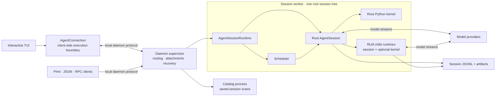
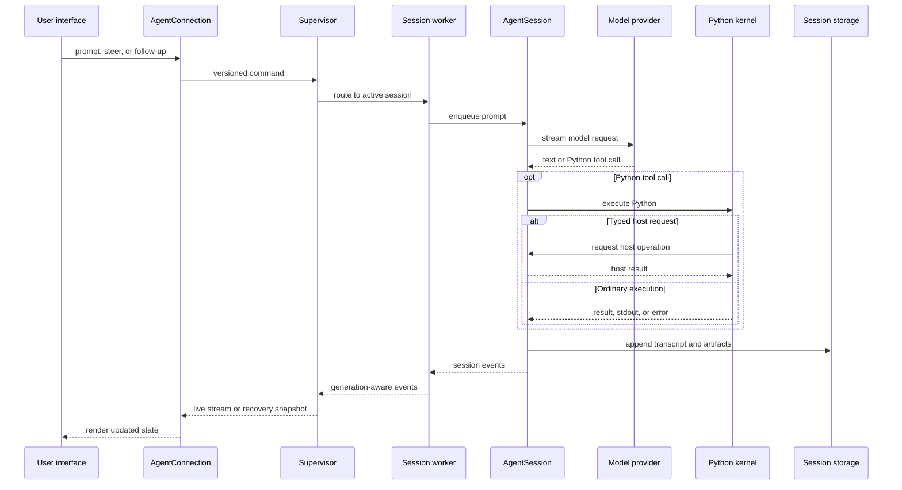

# Architecture Overview

Prime Agent separates terminal presentation, process coordination, agent execution, model-facing Python, and persisted state. Normal interactive sessions use the daemon-backed path below; explicit SDK and fallback integrations can run the same `AgentSessionRuntime` in process.

## System at a Glance

- The client owns rendering, keyboard input, and local UI preferences; it does not own execution.
- The supervisor owns discovery, routing, attachments, worker health, and cross-agent message delivery.
- Each worker owns one root runtime, its scheduler, kernels, and all descendants below that root.
- `AgentSession` owns provider calls, queues, tools, compaction, goals, child lifecycles, and transcript writes.
- The Python REPL is the model-facing control environment. Typed host requests return authoritative operations to the TypeScript session.

Workers and kernels are separate processes for lifecycle and failure containment, not security sandboxes. They normally run with the same operating-system permissions as the client.

## Prompt Execution Flow

From the session queue onward, the same execution and persistence path is used when a prompt comes from a heartbeat, cron schedule, goal continuation, autonomous mode, or another agent instead of an attached user.

## Source Ownership and Module Boundaries

Place code inside the smallest feature that owns its behavior. Promote it outside that feature when it provides an independently useful capability with a clear API and actual consumers across subsystems. This rule applies to new code and incremental extractions; existing paths are not precedents for new exceptions.

### Choosing a directory

| Responsibility | Home |
| --- | --- |
| A feature of one session, including its state, policies, persistence adapters, and cleanup | `src/session/<feature>/` |
| Coordination across session features, such as choosing when a turn compacts, refines, or continues | Session composition or `src/session/turns/` |
| An independent capability used across subsystems, with its own API and dependency boundary | Its own named feature directory outside `session/` |
| Presentation or process coordination specific to a mode | The owning directory under `src/modes/` |

Use feature names and keep the structure shallow: files directly inside a feature directory are the default. Add another directory only for a coherent subfeature. Application source stays under `src/`; tests, scripts, docs, and build output stay at the package root. `core/` is a transitional location for existing code, not the default home for new shared code.

A directory containing feature subdirectories should keep only its entry points, composition, and explicitly named cross-feature contracts directly inside it. Feature implementation belongs with its owner, even when other features import its contracts. Do not create a folder for every file or prohibit useful files at a feature root merely to make the tree uniform.

Complete a feature's placement across old and new files. Extracting its controller does not leave its algorithms, persistence, or contracts ownerless in `core/`. Separate files can express those responsibilities inside one feature. If similar directory names represent an independent capability and its session integration, document the distinct APIs and consumers; neither naming nor hypothetical reuse establishes that boundary. Mixed files require a responsibility split before relocation.

Every transitional location needs a named destination and migration scope. The [source organization completion plan](source-organization-plan.md) records the current gaps, proposed destinations, and validation requirements. Its proposed tree is not a claim that those moves have shipped.

Independent testability, a pure function, or a small dependency interface does not require a top-level directory. Multiple importers are evidence to inspect, not a promotion rule: a UI reading a session goal's status does not make goal execution independent of sessions. Do not promote code for hypothetical future reuse.

### Keeping a feature together

- Keep a responsibility's state, transitions, cancellation, recovery, and cleanup under one feature owner. Parsing, persistence, and execution may use separate files within that feature when their dependencies differ.
- Keep one authoritative copy of mutable state. Derived views may read it; extracting a module must not introduce a second queue, registry, transcript, or competing lifecycle owner.
- Put feature contracts beside their owner in lightweight modules. Clients may import those contracts without importing controllers or session orchestration. Contract modules must not depend on their feature's runtime implementation.
- Pass only the named operations and state views a module needs. Avoid passing the entire session, exposing mutable maps, or introducing a universal context object. Keep imports acyclic; compose dependencies at the owner that coordinates the features.
- Keep cross-feature ordering visible in the composition layer. A feature may request scheduling or persistence through a narrow interface without owning the scheduler or storage implementation.
- Keep feature tests with the corresponding feature in `test/` where practical. Integration tests continue to cover behavior through the public session or mode API.

For example, goal state, accounting, persistence, command parsing, and goal-specific continuation live in `session/goals/`. General turn selection and coordination stay in `session/turns/`. Goal contracts stay with goals even when the UI and protocol types consume them. Kernel transport and process APIs are separate from the session-specific code that creates, replaces, and disposes its kernel. The [source map](../src/README.md) records the current implementation and its ordering invariants.

### Reviewing a structural change

Before choosing files, identify four things in the change description:

1. The feature that owns the behavior and why this is its directory.
2. The state and lifecycle operations that must move together.
3. The public operations and contracts, including their consumers.
4. The allowed dependencies and the layer responsible for cross-feature ordering.

Group complete feature responsibilities into a few substantial, reviewable changes. Avoid one file per method, arbitrary line-count targets, or new frameworks introduced only to make files smaller. Preserve behavior during extraction, including event order, cancellation, persistence, and public contracts; functional changes should be identified and reviewed explicitly. Keep protocol compatibility requirements in force whenever a wire shape changes.

Validate affected behavior with focused tests and the repository's required checks. Record missing-environment skips. File moves alone do not establish lower memory use, faster execution, or smaller bundles; performance claims require measurements of the affected workload.

## Detailed Architecture

- [Agent Connection Architecture](agent-connection.md) explains the client/runtime boundary, snapshots, replay, and reconnect behavior.
- [Daemon Architecture](daemon.md) covers process ownership, leases, scheduling, backpressure, and crash recovery.
- [RLM Runtime Architecture](rlm-runtime.md) follows kernel host requests and recursive child execution.
- [Long-Running and Background Agents](long-running-agents.md) shows how detached sessions, messages, goals, and scheduled work share the worker runtime.
