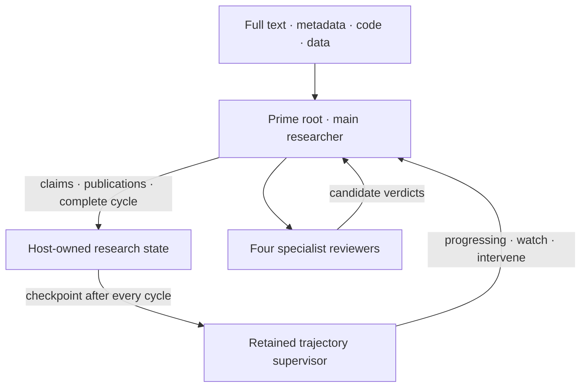

# Supervisor-First Autoresearch

Prime Agent ships a root-session `autoresearch` Python skill for long-horizon,
publication-grounded research problem discovery. It adds a control plane around
Prime's existing RLM runtime and small standards-based scholarly API clients; it
does not add another model/provider client.

The root agent remains the researcher. One retained RLM child monitors the
broader trajectory, while four temporary reviewer roles attack individual
candidates. The TypeScript host owns the canonical research ledger and computes
progress signals whenever the root commits a major cycle.



## Start a run

In Prime's IPython kernel:

```python
run = await autoresearch.initialize(
    "Identify a publication-grade problem in long-horizon agent memory",
    topic="evidence authority and memory reuse",
)
print(run["supervisor"])
```

Initialization is idempotent for the same objective. A session containing a
different objective is not silently reset; start a new session instead. The
supervisor is a normal retained Prime child and inherits the active model,
provider, skills, tools, and retry policy.

## Evidence before prose

Important papers enter a publication table with a stable `paper_id`, authors,
venue/status, DOI or preprint/full-text identity, and metadata-verification
sources. Claims separately bind an interpretation to an exact source location:

```text
claim
  -> source identity
  -> exact section/page/figure/table
  -> what the source demonstrates
  -> the agent's interpretation
  -> confidence and unresolved objections
```

This separation prevents a valid citation from being treated as automatic proof
of an agent's stronger interpretation. Literature claims cannot become canonical
without a publication binding already present in the publication table.
Contradicting evidence remains visible; promotion marks such a claim
`contested`, not uncontested.

Later evidence can be appended with `autoresearch.update_claim(...)`. A
canonical claim that gains contradictory evidence is downgraded to `contested`
and receives a new lineage entry. Fully unsupported claims can be invalidated
without deleting their earlier evidence history.

Use Prime's native search/web tools to discover papers, follow references and
citations, search adjacent terminology, and inspect publisher/repository pages.
Discovered records do not become evidence until inspected. Use Crossref or
publisher metadata to verify bibliographic identity/status, and use legal OA or
arXiv/publisher full text to inspect the paper itself.

The skill exposes `crossref_search`, `crossref_verify`, `arxiv_search`, and
`unpaywall_lookup` as verification/full-text helpers, not as a replacement for
agent-driven search. `download_open_full_text` saves a declared legal OA/arXiv
copy as a bounded, hashed session artifact after public-HTTPS and redirect
validation. Crossref results remain `published_status_unclear` until a
venue establishes `published`; neither Crossref nor an arXiv page establishes
peer review. `verify_peer_review` requires an explicit peer-review/refereeing
quote on the DOI item's own publisher page before the ledger records
`peer_reviewed_verified`. The host rejects negative wording, validates public
DNS before every redirect, pins the connection to the vetted address, bounds
the response, and requires a complete item-specific positive sentence in
visible, applicable context on the same publisher document as the DOI. Contact
emails come from environment variables and are not written into canonical
state.

Every serious candidate records literal search receipts: coverage kind, query,
source, result URLs, inspected publication IDs, candidate digest, and host
timestamp. The host derives coverage from those receipts; the model cannot
submit coverage booleans. A surviving candidate must have receipts for
mechanism queries, adjacent terminology, backward/forward citations,
recommendations, recent 12–24 month work, preprints, and surveys.

## Candidate review

`await autoresearch.review_candidate(candidate)` creates four independent RLM
children and waits for their marked, automatically ingested responses:

| Role | Responsibility |
|---|---|
| Literature auditor | Checks that candidate claims are supported and correctly worded |
| Prior-art killer | Searches synonyms, adjacent terminology, citations, references, and recent preprints for the same mechanism |
| Experimental critic | Attacks falsifiability, confounds, feasibility, baselines, and hypothesis separation |
| Top-tier editor | Tests importance, broad relevance, evidence path, and incrementalism |

Their JSON replies are evidence for the root's decision, not canonical truth.
Every completed major cycle—including rejected, revised, and failed cycles—must
have results from all four roles. A candidate recorded as `survived` or
`promoted` must additionally have four passing results and pass all eight
problem gates: importance, unresolved status, publication support, mechanistic
motivation, falsifiability, feasibility, closest-prior-work analysis, and
broader relevance.

`spawn_reviewers` and `await_reviews` remain available separately when a caller
needs custom orchestration. Reviewer and supervisor replies carry explicit
candidate/cycle markers; the host scans root-session agent messages,
schema-validates them, rejects role duplication or marker mismatches, and
ingests each message ID once.

## Memory and experiments

The host persists the roadmap's ten research-memory types. Rejected directions,
failed experiments, reviewer objections, and interventions are written
automatically; the root can add other findings with `remember`. Recall uses a
bounded deterministic lexical/importance fallback and never grants authority to
reuse an old action. `prepare_memory_reuse` requires current-state bindings,
applicability conditions, a reusable procedure, and verification requirements;
`verify_memory_reuse` records the evidence before a plan becomes `verified`.

The skill pins NVIDIA NOOA 0.0.9 in an isolated Python 3.13 `uv` sidecar and
mirrors these typed memories into NOOA's official `MemoryStore`. Prime's active
model/provider and main Python runtime are unchanged. The adapter reports
availability through `nooa_backend_status()` and preserves the host ledger as a
lossless fallback.

Initialization and each completed cycle perform bounded non-reinforcing NOOA
recall and return the context for the next research step. Official NOOA
reflection/consolidation runs every five cycles, after a supervisor
intervention, and at candidate promotion. Its report and newly archived memory
IDs are written to canonical maintenance history, so maintenance is auditable.
The host memory ledger stays lossless; a sidecar pruning decision cannot delete
or invalidate canonical research history. Subsequent syncs preserve NOOA-owned
access history, graph edges, importance scores, and archive tombstones.

`record_experiment` owns experiment identity, hypothesis, design, baselines,
data/code/compute requirements, artifacts, metrics, results, interpretation,
confounds, and lifecycle. Completed experiment evidence cannot be recorded
without an artifact path, results, and an interpretation; empirical claim
bindings must reference a completed or failed experiment in this ledger.

## Cycle checkpoint

Call `autoresearch.complete_cycle(...)` after every major cycle, including a
rejection, revision, prior-art collision, or failed experiment. The call:

1. joins all four results from host-bound reviewer children;
2. derives search coverage from candidate-bound receipts;
3. deduplicates newly encountered publications;
4. compares the complete field map with the previous map;
5. records the outcome and verified promotions in canonical lineage;
6. computes deterministic progress/stagnation signals in the host;
7. sends a compact packet to the retained supervisor; and
8. runs milestone reflection when due and bounded recall for the next cycle.

The initial thresholds are explicitly prototype heuristics:

| Intervention trigger | Default |
|---|---:|
| No canonical claim promotion or field-map refinement | 5 cycles |
| Same normalized rejection reason | 3 consecutive rejected cycles |
| Same prior-art cluster | 3 cycles |
| New publications without a field-map change | 10 publications |
| Explicit stuck report | Immediate |
| Same trajectory fingerprint | 3 cycles |

Early signals produce `watch`; a satisfied trigger produces `intervene`. The
supervisor still receives every checkpoint so it can judge the broader history.
Its marked response is ingested automatically. `record_supervision(response)`
is retained as a recovery path for a manually copied or legacy unmarked reply.
An intervention contains a diagnosis, the repeated search pattern, an assumption
to question, and exactly three genuinely different directions with a kill search
and falsifier for each.

The supervisor cannot promote claims, declare novelty, delete failed history,
override evidence, or mark experiments successful.

## Durable state and export

Persisted sessions store the ledger at
`<session-artifact-dir>/autoresearch/state.json` using atomic replacement and
user-only file permissions. Kernel restart and compaction therefore do not erase
the research run. Non-persisted sessions keep the same state in memory only.

`await autoresearch.stop_gate()` checks the promoted candidate, two or more
status-verified motivation publications including a publisher-evidence-verified
peer-reviewed work,
latest-preprint coverage, closest prior work,
mechanism, falsifier, feasibility, completed preliminary evidence, baselines,
broader relevance, four passing reviews, and a `progressing` supervisor result
for that cycle.

`await autoresearch.export_deliverable()` is a final export and is blocked until
that gate passes. It returns the roadmap's 18 sections: final problem statement,
publication table, provenance ledger, literature and four field matrices,
rejected ideas, novelty threats, questions, objectives, contribution
hypotheses, falsifiers, experiment design/ledger, requirements, supervisor
history, and canonical lineage. Use `export_deliverable(final=False)` only for
an explicitly labeled draft/diagnostic preview.

Long-running runs may call `enable_heartbeat`; this uses Prime's existing
session-owned heartbeat scheduler with follow-up delivery. Cycle checkpoints
remain host-triggered after every completion—the heartbeat advances the root
researcher and does not make the supervisor poll private state.

## Architectural scope

This is an adaptation of the publicly described AVO control structure, not a
claim to reproduce NVIDIA's private implementation. Public AVO materials motivate
an autonomous main agent using lineage, domain knowledge, evaluation feedback,
persistent memory, and a supervisor that monitors the broader trajectory. Prime's
retained RLM children and persistent sessions supply those runtime roles; the
research ledger and cycle evaluator are specific to this implementation.

References:

- [AVO: Agentic Variation Operators for Autonomous Evolutionary Search](https://arxiv.org/abs/2603.24517)
- [NVIDIA AVO long-horizon architecture article](https://developer.nvidia.com/blog/nvidia-avo-reaches-100-on-arc-agi-3-demonstrating-a-frontier-level-general-purpose-architecture-for-long-horizon-autonomous-agents/)
- [Prime Agent RLM programming model](rlm.md)
- [Crossref REST API](https://www.crossref.org/documentation/retrieve-metadata/rest-api/)
- [arXiv API manual](https://info.arxiv.org/help/api/user-manual.html)
- [Unpaywall API](https://unpaywall.org/api)
- [NVIDIA NOOA memory](https://github.com/NVIDIA-NeMo/labs-OO-Agents/tree/main/packages/nooa-memory)
- [Beyond Retrieval: Query-Conditioned Reuse of Long-Horizon Agent Trajectories](https://arxiv.org/abs/2608.12847)
- [Autonomous Research Agents: A Survey of AI Scientists and the Verification Gap](https://arxiv.org/abs/2608.05179)
- [Artifact-centered Claim-aware Observability for Autonomous Scientific Agents](https://arxiv.org/abs/2608.18312)
- [Nature editorial and referee criteria](https://www.nature.com/nature/for-referees/policies-and-processes)
- [Nature Methods editorial criteria](https://www.nature.com/articles/nmeth.4603)
- [Nature Methods content and validation guidance](https://www.nature.com/nmeth/content)
