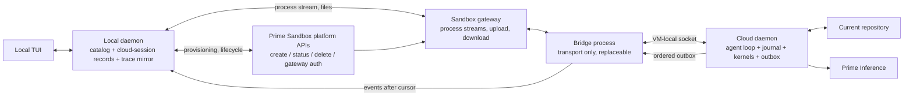
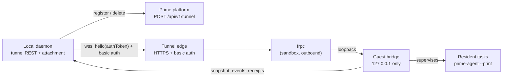

# Cloud Sandbox Delegation (Direct Model)

Implementation plan for delegating Prime Agent sessions and subagents to Prime Sandboxes, with the local daemon driving the Prime Sandbox platform APIs directly. This document is the engineering plan; it references the current daemon, connection, and session code as the seams to build on.

- Status: M0 implementation on `feat/direct-cloud-sandbox`. `/cloud run`, status, stop/forfeit, reconnect recovery, durable result retrieval, and explicit apply are implemented. Live steering over a Prime Tunnel bridge (`/cloud run --tunnel`, `/cloud steer`) is implemented and opt-in; the gateway remains the fallback transport for control, upload, and download.
- Source snapshot: Agent `427ea4c72cc606ac061a14287c0c15c471eff002`; Prime Sandboxes SDK `0.2.42`; platform source observations as cited in the design investigation.
- Companion requirements: the Prime Agent Sandbox Implementation design (Notion) and the parent task brief. Where the design assumed a platform agent-session controller, this plan replaces it with the direct model described here.

## What this ships

Prime Agent continues to run locally by default. A user can delegate a session or subagent to a Prime Sandbox when it needs cloud compute, a Linux environment, isolation, or the ability to continue while the laptop is disconnected.

1. Start a local session as usual.
2. Use `/cloud run <prompt>` (or the `/sandbox` alias) and confirm the transfer and resource grant.
3. The local daemon durably captures the current Git repository or worktree before it allocates compute.
4. The daemon creates a VM Sandbox, uploads the fixed task inputs, and starts `prime-agent --print` as a resident command session.
5. The remote one-shot agent owns inference, tools, Python, subprocesses, and delegated children for that task.
6. The local daemon monitors completion, retrieves bounded stdout/stderr and a binary Git patch, and keeps the patch for review. It changes the checkout only after `/cloud apply <id>` and a second confirmation.

M0 supports one-shot task delegation, provisioning progress, stop/forfeit, reconnect recovery, background result retrieval while the owning daemon stays online, durable lifecycle traces, changed-path review, and explicit patch apply. It does not attach the TUI to a remote daemon, stream full remote history, or accept live steering. Those features remain in the later bridge milestone.

## Configuration

Cloud delegation is capability-gated and is advertised only when both inputs resolve before daemon startup:

- `PRIME_AGENT_CLOUD_IMAGE`: a pinned VM image that contains `prime-agent` and its runtime dependencies. For tunnel delegations the image must also contain an `frpc` binary on `PATH` (see the Prime Tunnel bridge section); the bridge server itself is uploaded by the daemon on every delegation, so no image change is needed for bridge logic alone. The maintained build recipe (validated runtime base, current published `prime-agent`, checksum-pinned `frpc`) lives in `packages/coding-agent/cloud-image/`; see its README for the prepare/push/build-vm flow.
- A guest-scoped inference credential, resolved by one shared loader in this order:
  - `PRIME_AGENT_CLOUD_INFERENCE_API_KEY` (explicit override, e.g. from a secret manager), or
  - `PRIME_AGENT_CLOUD_INFERENCE_API_KEY_FILE`, defaulting to `~/.config/prime-agent-cloud/inference-api-key`. The key file must be a regular file (never a symlink) readable only by its owner (`chmod 600`), holding one single-line key. An insecure file fails closed: the cloud capability is not advertised and the reason names the file.

Sandbox and tunnel control authentication still comes from `PRIME_API_KEY` or the logged-in Prime CLI. The guest credential is written with mode `0600` and removed before the terminal result is published.

Optional overrides:

- `PRIME_AGENT_CLOUD_TEAM_ID`: bills sandbox compute and registers tunnels under this team without touching the user's global Prime CLI team selection. Precedence: explicit daemon option, then `PRIME_AGENT_CLOUD_TEAM_ID`, then the CLI config team.
- Guest inference billing: the daemon passes the delegation team to the guest as `PRIME_TEAM_ID`, so the image's `prime-agent` sends `X-Prime-Team-ID` and inference bills the team instead of the guest credential's personal balance (which typically holds no funds and fails every request with 402). `PRIME_AGENT_CLOUD_INFERENCE_TEAM_ID` overrides only the guest inference team when it must differ from the compute team; setting neither sends no team and the guest bills the personal balance.

## The direct model: what is removed, what is kept

**Kept:** the Sandbox platform APIs and the sandbox gateway still provision compute. Sandbox create/delete, status, gateway authentication, file upload/download, and the command-session process API are generic platform services. The local daemon authenticates with the user's existing Prime credentials (`~/.prime/config.json` or `PRIME_API_KEY`).

**Removed:** there is no intermediary Prime Agent control-plane service. No platform-side agent-session controller, no `POST /api/v1/agent-sessions`, no platform-owned session record, no platform-issued per-session attachment credentials, no platform-managed event outbox. Every responsibility the controller variant assigned to a platform service moves to one of two places:

| Responsibility | Direct-model owner |
|---|---|
| Provision / terminate compute, sandbox-bound gateway tokens, egress policy, sandbox lifetime | Sandbox platform (generic APIs, existing today) |
| Session records, identity allocation, generation fencing, admission, cleanup sequencing, result import, trace mirroring | Local daemon (new `core/cloud/` modules) |
| The one-shot delegated agent loop, inference requests, kernels, tools, descendants, terminal result files | Resident `prime-agent --print` process in the Sandbox (M0) |

Consequences of this choice, stated up front:

- The generic Sandbox REST and CommandSession APIs needed by M0 exist today, so M0 needs no new platform service. Prime Agent must implement a TypeScript client: `undici` for REST plus generated Node Connect/protobuf types for the VM process API, because no TypeScript Sandbox SDK is published today.
- Session durability beyond the sandbox's own lifetime, per-session inference budget enforcement, and platform-side scoped grant issuance do not exist in this model. The local daemon is the only durability sink; the sandbox's ordered spool is the only remote buffer. These gaps are tracked explicitly in Risks.
- The delegated task keeps working while the laptop is disconnected because the sandbox keeps its resident command session running. The local daemon retrieves results while connected; if both the local daemon and sandbox disappear before retrieval, M0 cannot recover the work. External durability is the M3 milestone.

### Non-goals

- **No live heap migration.** Moving a running local Python process into a sandbox is not part of any milestone here. Handoff of an already-running local session is a later, idle-boundary feature that transfers the conversation and a repository snapshot into a fresh kernel; it never migrates a live Python heap.
- No platform agent-session controller. The platform APIs used are exactly the ones the Sandbox product already exposes.
- No continuous workspace synchronization, no custom ELF patching, no new encryption protocol, no Bun-migration dependency for image packaging.
- Not every recursive child gets its own VM. Descendants of a delegated root stay in that root's sandbox by default (see Remote children).

## What runs where

| Local | Prime Sandbox |
|---|---|
| TUI, local daemon, durable delegation records, lifecycle traces, user confirmations, result review and patch apply | One-shot Prime Agent process, inference requests, tools, Python kernels, subprocesses, child agents, and the submitted repository |

The remote Prime Agent process is the authority for the one-shot task while it runs. The local daemon does not broker inference or execute part of the agent loop. M0 sends one fixed prompt, monitors the resident process, retrieves terminal files, mirrors lifecycle events, and applies the reviewed patch only on request. Live steering and full event-history mirroring are not M0 features.

## Invariants

1. `local` is the default execution target. `ExecutionTarget` defaults to `{ kind: "local" }` when omitted. Existing local behavior remains available without Sandbox availability, without Prime credentials, and without any cloud code path active.
2. The TUI keeps talking to the local daemon through `AgentConnection`. It does not become a separate sandbox client.
3. In M0, the resident one-shot Prime Agent process owns the delegated task: inference requests, kernels, tools, subprocesses, descendants, and submitted repository. A remote daemon, command journal, and event outbox belong to the later bridge milestone.
4. Delegation is explicit and per session or per child. A local root may have local children and sandbox children at the same time; a child of a local root stays local unless explicitly delegated.
5. M0 stores lifecycle events and terminal output locally. It does not claim a complete streamed remote product trace; an ordered guest event spool and acknowledgement protocol belong to the later bridge milestone.
6. Remote compute deletion and remote trace-spool deletion are separate. The spool is eligible for deletion only after local acknowledgement or an explicit retention policy; in the direct model, deleting the sandbox destroys the spool, so the local daemon deletes compute only after the local mirror is complete or the user explicitly forfeits it.
7. M0 exposes task lifecycle, stop, output, and patch results through the local workflow. Cross-location rosters, messages, observation, usage streaming, and live cancellation are later bridge features.
8. Session identity is allocated before compute, and identity validation never depends on guest filesystem paths.
9. Prime Agent never silently overwrites concurrent local edits. Returned changes are compared with the submitted baseline and opened for local review.
10. No live Python heap migration, ever; only conversation-plus-snapshot handoff at an idle boundary (later release).

## Identity model

Allocate every identity before the work it names, and persist relationships by logical ID only. A guest path may appear as display metadata, never as an address the local daemon attempts to open.

| Identity | Purpose | Allocated by |
|---|---|---|
| Session ID | Stable conversation and task ownership across attachments | Local daemon, before sandbox creation |
| Generation | One execution incarnation; fences stale writers | Local daemon, incremented per incarnation |
| Sandbox ID | Current compute resource | Sandbox platform (returned by create) |
| Resident process UUID | Retrying the same cloud-daemon launch | Local daemon, persisted in the cloud-session record |
| Bridge process UUID | One attachment; replaced on every reconnect | Local daemon, per attachment |
| Command ID | One semantic operation, retained across transport retries | Local daemon (or TUI via the daemon) |
| Baseline / checkpoint / artifact ID | Immutable workspace or saved-output identity | Producer side (local for baselines, cloud daemon for artifacts) |

The local daemon persists a **cloud-session record** before allocating a sandbox (schema in PR c3): owner, session/root/parent IDs, generation, normalized execution spec, create-operation identity, sandbox ID, resident process UUID, desired and observed lifecycle state, deadline, event cursor, latest checkpoint, and cleanup state. Records live under the local agent directory; they are the direct-model replacement for a platform session record.

Inside the sandbox, the cloud daemon opens its session with the pre-allocated ID. `SessionManager.newSession({ id })` (packages/coding-agent/src/core/session-manager.ts) assigns that ID and throws if the session file already exists, which is the duplicate-launch guard: a retried launch of the same generation reattaches; it must never create a second runtime for the same session.

## Architecture



Two transports matter:

- **Control path** (local daemon → platform): sandbox lifecycle and gateway credentials. Uses the user's Prime API credentials. This is the only platform dependency, and it is the generic Sandbox API.
- **Data path** (local daemon ↔ cloud daemon): the bounded cloud session protocol, relayed through a replaceable bridge process whose stdin/stdout is a gateway process stream. No public port is required; TLS and the sandbox-bound gateway token are the transport boundary.

## Direct Sandbox API lifecycle

Every step uses the existing Sandbox SDK surface (`prime_sandboxes` 0.2.42). Resource values, VM mode, image identity, and timeouts are explicit because defaults differ across the CLI, SDK, and documentation.

1. **Preconditions.** Prime credentials resolve (via the same path as `core/prime-inference-auth.ts` reads `~/.prime/config.json`); the workspace is a Git repository or worktree (`utils/git.ts` `findGitPaths` handles both); the user confirmed the delegation (see `/cloud`).
2. **Allocate logical identity.** Create the cloud-session record with a new session ID, generation 1, desired state `provisioning`. Nothing is sent to the platform yet.
3. **Create the sandbox.** Send the existing REST `CreateSandboxRequest` with an explicit `idempotency_key` derived from session ID + generation + attempt, `vm: true` (live processes are VM-only), `docker_image` pinned to the Prime Agent cloud image, explicit `cpu_cores`/`memory_gb`/`disk_size_gb`, `timeout_minutes` covering the session lifetime plus the save window, `idle_timeout_minutes` bounded below the lifetime, `labels` for discoverability and bulk cleanup (e.g. `prime-agent-cloud`, `session:<id>`), `team_id` when applicable, and `secrets`/`environment_vars` carrying only the scoped cloud inference credential. VM region is selected by the deployed Sandbox service; the current create API does not accept a caller-selected VM region. `network_allowlist` restricts egress to inference endpoints and package mirrors (VM-only feature). Ambiguity rule: after an inconclusive create failure, re-issue with the same idempotency key or reconcile the operation result before allocating again — never allocate a second sandbox for one generation.
4. **Wait for readiness.** `wait_for_creation` (RUNNING status plus reachability, with the platform's separate first-use image-build budget). Observed state lands in the cloud-session record.
5. **Transfer the workspace.** Capture locally (see Workspace capture), then push the archive and manifest through the sandbox gateway (`upload_file`/`upload_bytes` to `/upload`, `download_file` to `/download`), within the gateway's size limits. Bulk bytes never ride the session protocol.
6. **Ingest in the guest.** `execute_command` unpacks into a fixed guest workspace, validates the manifest (contained paths, link targets, file types, counts, expanded size, content hashes), and reconstructs the Git baseline so ordinary status/diff/commit work in the guest. Ingestion failures are terminal and inspectable; the sandbox is deleted.
7. **Start the cloud daemon.** Use a generated Node Connect client to call `command_session.CommandSession.Start` with the persisted **resident process UUID** as `session_uuid` and no interactive stdin. The current Python SDK's public `open_process()` generates this UUID internally and does not accept a caller-provided one, so it is not the resident-launch API. Raw Start is create-or-attach: re-issuing the identical request attaches to the existing process instead of spawning a second one. The cloud daemon opens its `SessionManager` with the pre-allocated session ID, verifies the identity and generation, and listens on a VM-local Unix socket (mode 0700).
8. **Attach.** Start a **bridge** process (its own Start with a fresh per-attachment UUID), perform `hello` (protocol version + capabilities), `snapshot`, and `subscribe` from the last acknowledged cursor; then `submit` user commands and `ack` imported events.
9. **Steady state.** Commands flow local → bridge → cloud daemon; events flow back through the ordered outbox. The local daemon mirrors the trace and advances its acknowledgement cursor only after the local append is fsynced.
10. **Disconnect and reconnect.** A dropped local connection only kills the bridge. Reconnect = re-auth (`POST /sandbox/{id}/auth`), a fresh bridge Start, `hello` + `snapshot` + `subscribe` after the last acknowledged cursor, gap fill, then live updates. The local daemon never calls `newSession` again and never creates a second agent session. Reconnecting does not extend the original process deadline; the SDK's live-process stream budget is 24 hours per attachment.
11. **Results.** On task completion the cloud daemon publishes a result manifest (baseline-relative changes, artifacts, hashes). The local daemon downloads bulk bytes through the gateway, opens the review flow, and imports only approved changes (see Result review).
12. **Cleanup.** After the local mirror is complete and results are durable locally (or the user explicitly forfeits them), the local daemon deletes the sandbox (`DELETE /sandbox/{id}`). Task outcome, save failure, and cleanup failure are separately inspectable in the cloud-session record. Idle and lifetime deadlines (`idle_timeout_minutes`, `timeout_minutes`) bound the cost of a forgotten delegation.
13. **Failure and uncertainty.** Sandbox loss before an event reached the ordered outbox produces an explicit gap or an uncertain outcome. M0 records it; it does not replay. Normal cleanup waits for saved results.

## Resident cloud daemon vs replaceable bridge

The distinction is load-bearing because of the SDK's process contract:

- Guest process context survives the original request, so a process started with a persisted `session_uuid` keeps running after the stream that started it drops. That is the resident property.
- A re-attached process stream does **not** recover output emitted while detached; only a retained end event is replayed. That is why the cloud daemon — not the stream — must own the ordered event outbox.
- `AsyncSandboxProcess.aclose()` terminates the process it wraps. It is correct for disposing an attachment and never for the cloud daemon.

| | Cloud daemon | Bridge |
|---|---|---|
| Process start | One `CommandSession.Start` with the persisted resident process UUID; idempotent create-or-attach | One `Start` per attachment with a fresh UUID |
| Lifetime | The whole delegated session (bounded by sandbox `timeout_minutes`) | One attachment; killed freely, replaced on every reconnect |
| State | Logical session, model client, kernels, tools, command journal, ordered event outbox, result manifest | None — a byte pump between the gateway stream and the VM-local socket |
| Failure mode | Lost only with the sandbox; then outcomes are uncertain, never auto-replayed | Losing it loses nothing; reconnect opens a fresh one |

Rules that follow:

1. The cloud daemon never listens on a public port; the bridge is reached only through the gateway process stream with the sandbox-bound token.
2. A bridge is allowed to buffer only what is in flight. Reconnect always asks the cloud daemon for a snapshot plus events after the cursor; it never replays prompt admission.
3. The local daemon uses the raw Connect Start stream only long enough to confirm the resident process started, then closes that transport without sending a process signal. It must not wrap the resident process in `AsyncSandboxProcess` or call its `aclose()`, because that helper terminates the remote process. Later recovery relies on create-or-attach by the persisted UUID.
4. The cloud daemon and bridge use one HTTP/2 transport per live process (the SDK already does this because the gateway caps concurrent streams per connection).

## Cloud session protocol

The bounded JSON protocol between local daemon and cloud daemon is defined in `packages/coding-agent/src/core/cloud/protocol.ts` (in flight). It is deliberately small and separate from the local daemon JSONL protocol: the local protocol is not a remote wire contract (the file's own comment says so), and the cloud protocol must be replayable and bounded.

Message set: `hello`, `snapshot`, `subscribe`, `submit`, `get_command`, `command`, `ack`. `command` returns a durable command receipt; `ack` advances the imported-event cursor after the local mirror is fsynced. Wire payloads are bounded JSON; credentials and bulk files use the separate gateway channels.

```ts
interface CloudCursor {
	generation: number;
	sequence: number;
}

type CloudCommandRequest =
	| { kind: "start_task"; taskId: string; prompt: string }
	| { kind: "steer"; taskId: string; text: string }
	| { kind: "cancel_task"; taskId: string };

interface CloudSubmit {
	type: "submit";
	sessionId: string;
	generation: number;
	commandId: string;
	request: CloudCommandRequest;
	digest: string; // SHA-256 over deterministic canonical JSON
}

type CloudCommandState = "accepted" | "running" | "completed" | "failed" | "cancelled";

interface CloudCommandReceipt {
	commandId: string;
	digest: string;
	state: CloudCommandState;
	submittedAt: string;
	updatedAt: string;
	uncertain: boolean;
	error?: string;
}

interface CloudCommand {
	type: "command";
	sessionId: string;
	generation: number;
	receipt: CloudCommandReceipt;
	request?: string; // canonical request JSON when an executor claims work
}

interface CloudAck {
	type: "ack";
	sessionId: string;
	cursor: CloudCursor; // locally imported and fsynced through this event
}
```

Command kinds start with `start_task`, `steer`, and `cancel_task`; family messaging and checkpoint commands land in later milestones. Admission semantics follow the existing connection model: a `cancel_task` receipt confirms admission of the cancellation, only a subsequent state transition confirms the task stopped, and cancelling a caller's wait after prompt acceptance is not a task cancellation (`AgentConnectionPromptAdmissionError` carries the same cancelled/owned/unknown distinction).

Durability rules, backed by the durable append-only command journal in `core/cloud/command-journal.ts`:

1. The receiver recomputes the request digest from the canonical encoding; a client-supplied digest is never trusted. Same command ID with a different digest is an error.
2. A transport failure triggers a `get_command` status lookup or a resubmission of the same identity and bytes — never a new logical prompt.
3. Admission is fsynced before it is acknowledged. A durable "running" record without a confirmed outcome becomes `uncertain` after sandbox loss; the journal never replays uncertain work.
4. Command identities and outcome tombstones are retained for the advertised session retention window; commands outside retained history are rejected, not treated as new. (This is why the journal is new code: the supervisor's `CommandRecoveryJournal` at `modes/daemon/command-recovery-journal.ts` drops acknowledged entries and is not a retention store.)
5. `ack` advances the local acknowledgement cursor and is sent only after the mirrored event range is fsynced locally.

Events, not just commands, are bounded: token fragments batch into bounded updates; ephemeral previews may be dropped under backpressure and reconstructed from the latest message snapshot; large tool output becomes an artifact reference with a bounded preview. A snapshot carries a consistent cursor; subscription replays subsequent durable events; an expired cursor or generation mismatch requires a fresh snapshot.

## Prime Tunnel bridge (live steering, Direction A)

M0's data path is a gateway process stream, which cannot carry interactive
steering. The tunnel bridge adds a second, opt-in attachment transport that
can. The direction is fixed:

**Direction A: the local daemon owns the tunnel; the sandbox dials out.**

1. `/cloud run --tunnel <prompt>` registers a Prime Tunnel with the Prime
   platform REST API (`POST /api/v1/tunnel`) using the local daemon's existing
   platform credentials. The registration carries edge HTTP basic auth (fixed
   username `prime-agent`, backend-generated one-time password) and labels
   (`prime-agent-cloud`, `session:<id>`).
2. The guest receives only that one tunnel's frp connection details (frp
   token, per-tunnel binding secret, frps host/port, subdomain) as fixed-name
   environment variables on the resident process. It never receives the
   platform API key and can never call the tunnel REST API itself.
3. Inside the sandbox, the uploaded bridge server binds `127.0.0.1:<port>`
   only, and `frpc` (from the image) forwards the public tunnel edge to that
   loopback listener. The bridge is the only network surface: it speaks the
   bounded cloud session protocol over WebSocket frames.
4. The local daemon attaches over the public `https://` tunnel URL with the
   edge basic-auth password in the upgrade headers and the bridge protocol
   token in `hello`. Both layers are required: the edge gates anyone who
   reaches the URL, the protocol token gates anyone who survives the edge.



### What runs in the guest

The bridge is a standalone, dependency-free Node script
(`core/cloud/bridge/guest-bridge-script.ts`) uploaded by the daemon alongside
the bootstrap. In tunnel mode the bootstrap sets up the workspace baseline,
then `exec`s the bridge; the bridge owns the rest of the delegation:

- It supervises tasks: the initial prompt task from the uploaded prompt file,
  then queued `steer` commands as follow-up `prime-agent --print` tasks in the
  same workspace (real live steering without re-provisioning), and
  `cancel_task` by signalling the active child. A `/cloud stop` reaches it as
  SIGTERM through the ordinary VM process signal path.
- It serves the full session protocol: `hello` (protocol authentication,
  generation fencing), `snapshot`, `subscribe` with cursor replay and bounded
  live push (`events` frames), idempotent `submit` with digest verification and
  a durable command journal, `get_command` receipts, and `ack` trimming.
- It streams live output as bounded `output_delta` events, batched and capped
  (64 KiB per event).
- It writes the same terminal results contract as the plain bootstrap:
  `stdout.txt`, `stderr.txt`, a baseline-relative `changes.patch`, removal of
  the guest credential, and `status.txt` last as the commit marker. The
  gateway download path retrieves them unchanged.

This is a real bridge for steering, not a status page: every wire frame it
accepts is a validated session-protocol message, and `test/cloud-guest-bridge.test.ts`
executes it end-to-end against a fake agent process over loopback.

### What runs locally

`core/cloud/bridge/tunnel-attachment.ts` owns one durable attachment per
delegation:

- **Durable**: the tunnel record on the cloud-session record (non-secret facts
  only), the bridge token and edge password in a 0600 secret store, and the
  acknowledged guest cursor on disk. A daemon restart re-attaches a running
  delegation from `list()`.
- **Reconnectable**: capped exponential backoff with jitter; on every
  reconnect it re-authenticates, resubscribes from the last durably
  acknowledged cursor, and re-sends unacknowledged commands with the same
  command id and digest (the guest journal deduplicates). Acknowledgement is
  sent only after the mirrored events are fsynced into the local trace.
- **Bounded**: tunnel-liveness probes stop the supervisor when the platform
  registration is gone, and the delegation falls back to gateway-only
  monitoring without failing the task.

### Gating, cleanup, and fallback

- `/cloud run --tunnel` is opt-in. The daemon advertises a `cloud_tunnel`
  capability (schema revision 30) alongside `cloud_sessions`; the TUI checks
  it before showing or sending the option, and `/cloud steer` is gated the
  same way. Old clients and daemons keep working in both directions: every new
  field is optional and degrades locally.
- The tunnel is registered before the resident process starts and deleted with
  sandbox cleanup: stop, forfeit, apply, and every sandbox-loss path release
  it, and a failed launch releases its own registration. The sandbox and
  tunnel deletions are separately inspectable.
- Gateway control (create/status/delete), workspace upload, and result
  download remain the fallback and the primary control path. If the tunnel is
  gone, the delegation still completes and results still flow through the
  gateway; only steering becomes unavailable.

### Image and platform requirements

- The pinned image must contain `frpc` on `PATH`. The bridge server itself
  needs no image support beyond Node ≥ 22, because the daemon uploads it
  verbatim on every tunnel delegation.
- Tunnel registration TTL, edge behavior on expiry, and re-registration into a
  running sandbox remain to be validated against the deployed tunnel service;
  the current implementation falls back to the gateway when a tunnel expires
  mid-session (see Risks).

## Workspace capture and result review

The default workspace grant is the current repository or worktree, including its local changes. It does not require a GitHub token or any repository credential.

| Mode | What enters the guest | What the user is authorizing |
|---|---|---|
| Current repository (default) | Snapshot of the repository/worktree at its submitted state, including staged and unstaged changes and non-ignored untracked files, plus a Git baseline | The contents of that repository at that state |
| Additional paths | Explicitly added files or directories from outside the repository | Those additional bytes |
| Live repository access (later) | A repository-scoped credential permitting remote fetch or push | Repository objects and operations that credential allows; presented as a separate approval, never bundled |

Capture (implemented in `core/cloud/workspace-snapshot.ts`, in flight) is a staged, verified pipeline:

1. Enumerate tracked state, local changes, and included untracked files; apply exclusions (`.git` internals beyond the baseline, `node_modules`, virtual environments, credential/key filenames, sockets and devices) and size limits (per-file, count, total).
2. Copy submitted bytes into an independent staging directory — no hardlinks to originals.
3. Detect unstable captures: re-verify metadata and content hashes after copying; a changed file aborts and reports rather than promising an atomic multi-file snapshot the filesystem does not provide.
4. Emit a versioned manifest: relative path, content digest, file type, executable bit, internal symlink targets only, baseline provenance (repo root, HEAD if present, manifest digest).
5. Ingestion in the guest re-validates everything before unpacking: contained paths, link targets, file types, counts, expanded size, hashes.

Host Git configuration, credential helpers, SSH agents, hooks, virtual environments, `node_modules`, and the user's home directory are never transferred. Submodules, LFS objects, additional private repositories, and large data are separate grants. A sanitized Git bundle (or an equivalent reconstructed baseline) plus a working-tree overlay gives the guest ordinary `git status`, `git diff`, and `git commit` against the submitted baseline.

### Results

The cloud daemon compares the final guest tree with the **submitted baseline** — including pre-existing dirty changes, so the diff is exactly what the delegated work did. It returns changed and deleted paths, binary artifacts, content hashes, and the baseline ID. Import is always a review flow:

1. Download the result manifest and bulk bytes through the gateway.
2. Create a new local worktree (never write into the user's current checkout).
3. Three-way compare: submitted base, remote result, current local contents.
4. Surface conflicts; apply only user-approved changes; preserve unrelated concurrent local edits.
5. Record the outcome in the cloud-session record; only then release the sandbox for cleanup.

## Local trace mirror and reconnect

Every remotely produced trace envelope carries session ID, generation, sequence, a stable event ID, timestamp, and payload. The local daemon appends each envelope into the ordinary local session representation for that session ID, deduplicates by event ID, fsyncs, and only then advances its acknowledgement cursor. The mirror is a passive replica: it is not a shadow `AgentSession`, runs no model loop, and owns no kernel.

While connected, mirroring is continuous and the TUI updates through the existing local subscription. While disconnected, the cloud outbox preserves completed messages, tool calls/results, usage, child lifecycle events, message receipts, checkpoints, and completion. On reconnect the daemon requests the last acknowledged cursor, fills the gap, then resumes live updates. Completion is advertised as remotely durable only after the final trace and the result manifest are in the outbox; it is locally reconciled after import and acknowledgement.

Disconnect states are surfaced, not hidden: connectivity is metadata on the delegated session (provisioning / connected / reconnecting / disconnected / completed / lost), separate from the child task states so a disconnected child is not marked failed merely because its bridge vanished.

## Credentials and security

| Holder | Grant |
|---|---|
| Local daemon | Prime API credentials for sandbox provisioning; sandbox-bound gateway token for the data path; send user commands; mirror the trace; retrieve results |
| Sandbox platform (generic) | Validates the API key; provisions/terminates the sandbox; issues sandbox-bound gateway tokens; enforces egress policy and sandbox lifetime |
| Cloud daemon | Run the full session and its descendants: inference via the injected cloud credential, tools, kernels, repository access, outputs, checkpoints, event outbox |
| TUI | View and control local and delegated sessions through the local daemon only |

- **The cloud daemon is the model client for every cloud session.** It authenticates to Prime Inference with a cloud credential injected at sandbox creation (`secrets`/`environment_vars` on the create request, never via the session protocol or gateway URLs). The local daemon never brokers inference and never sends local provider credentials.
- **Attachment credential.** The sandbox-bound gateway token from `POST /sandbox/{id}/auth` is per-sandbox, platform-managed, cached, and re-fetched on 401 — this is the direct-model replacement for platform-issued per-session attachment credentials. Token expiry and refresh are validated against the deployed gateway (see Risks).
- **Approvals are scoped.** Sending the repository snapshot, adding extra paths, and granting live repository access are three separate confirmations. The delegation prompt states image, resources, lifetime, egress policy, transferred size, excluded paths, and the inference credential being granted.
- **Authority stays enforceable outside guest code.** Gateway auth and sandbox lifetime are enforced by the platform; admission and cleanup sequencing by the local daemon; the guest is confined to its sandbox filesystem and the egress allowlist (inference endpoints and package mirrors). Guest-set permission bits are never treated as an access-control boundary.
- **Revocation.** Deleting the sandbox revokes its gateway access. Inference credential revocation inherits the platform's authorization-cache latency; a cached identity may remain usable longer than expected. Per-session inference budget enforcement does not exist in the direct model (see Risks).
- **Capability manifest.** A cloud delegation declares which tools, skills, extensions, and repository operations the cloud daemon supports. Unsupported local-only callbacks are rejected before allocation. No release should promise that a macOS session configuration transfers unchanged into a Linux image.

## Daemon protocol and capability gating

Every local daemon wire change follows the repo's daemon protocol rules (`AGENTS.md`): classify as backward-compatible, capability-gated, or incompatible; bump `DAEMON_SCHEMA_REVISION` (currently 27, protocol 7) for gated additions; update the command/event compatibility maps and both old/new compatibility-direction tests; optional metadata must degrade locally without breaking startup.

- New cloud commands and events (delegation lifecycle, cloud session catalog rows, connectivity metadata) are **capability-gated** behind a new server capability (e.g. `cloud_sessions`) with a schema revision bump. Old clients and old daemons must keep working in both directions; the TUI checks capabilities before sending or rendering.
- The cloud session protocol has its **own** version and capability negotiation inside `hello` (it is a different protocol from the local daemon protocol). Cross-version rules mirror the daemon's: optional features behind negotiated capabilities, incompatible shapes behind a protocol version bump.
- The kernel boundary gets the same treatment: `prime-agent-runtime`'s spawn handle currently requires `session_dir: Path` (`prime-agent-runtime/src/rlm/__init__.py`). A remote child handle variant (IDs and location, no fake path) is negotiated as a proposed `remote_child_handles_v1` capability before any remote spawn is admitted; a kernel that only accepts local paths never receives a remote handle.
- Provisioning health and connectivity are separate from child task states (`queued | running | done | error | cancelled`); no wire change may conflate them.

## `/cloud` and `/sandbox`

`/cloud` is the canonical command; `/sandbox` is its alias (registered in `core/slash-commands.ts` the same way `clear` aliases `new`). Both are client-side commands: the TUI validates arguments, shows the delegation surface, and drives the local daemon through the new capability-gated daemon commands. The local daemon owns the cloud-session records, so the TUI can close freely without stopping a delegation.

```
/cloud run <prompt>         confirm, capture the current Git workspace, and start one remote task
/cloud run --tunnel <prompt> as above, plus a Prime Tunnel bridge for live steering
/cloud status               reconcile and show delegations, output previews, and changed paths
/cloud stop [id]            request stop and retrieve results when available
/cloud stop [id] --forfeit  release compute even if results cannot be retained
/cloud steer <id> <text>    submit a follow-up prompt to a running tunnel delegation
/cloud apply <id>           review changed paths and a bounded diff preview, confirm, and apply the stored patch
```

`--tunnel` and `steer` require the daemon's `cloud_tunnel` capability; the
delegation confirmation states the tunnel exposure before anything is
registered.


Flags for `run` are explicit because defaults differ across the platform's CLI, SDK, and docs: `--model`, `--cpu`, `--mem`, `--disk`, `--lifetime`, `--idle`, `--image`, `--network`, `--add-path` (extra paths, separate confirmation), `--live-repo` (live repository access, later release, separate confirmation). A VM `--region` flag is not exposed until the Sandbox API supports caller-selected VM regions.

Behavior rules:

1. No argument shows usage and never silently delegates; `/cloud status` is explicit.
2. `run` explains the repository transfer, remote permissions, resources, lifetime, and reviewed-patch behavior, then asks for confirmation before allocating anything.
3. M0 shows lifecycle progress and terminal output in the local TUI. It does not forward new prompts, approvals, or steering into an already-running task.
4. Without Prime credentials or with an unsupported daemon capability, `/cloud` degrades to a clear error. Local sessions and startup are never blocked by cloud state.
5. `/sandbox` behaves identically (pure alias, one code path).

## Milestones M0–M3: reviewable PR sequence

Milestone structure follows the companion design; module locations are `core/cloud/` for the platform/session adapter and shared protocol, `modes/cloud/` for the cloud daemon and bridge, `modes/agent-connection/cloud-agent-connection.ts` for the TUI adapter. Each PR is independently reviewable, runs `npm run check` clean, and lands on `main` through a draft PR. Tests run from the package root with the vitest runner the repo documents; new suite-level regressions go under `packages/coding-agent/test/`.

### M0 — one remote session

**PR c1 — cloud session protocol + command journal (in flight).**
Files: `packages/coding-agent/src/core/cloud/protocol.ts`, `packages/coding-agent/src/core/cloud/command-journal.ts`, `packages/coding-agent/src/core/cloud/index.ts`; tests `test/cloud-protocol.test.ts`, `test/cloud-command-journal.test.ts`.
Scope: bounded JSON schemas for hello/snapshot/subscribe/submit/get_command/command/ack; stable IDs, generations, cursors, command receipts; deterministic canonical JSON + SHA-256 request digest; runtime validation; durable append-only journal (fsync admission before acknowledge; same-commandId/different-digest rejection; accepted/running/terminal restore; uncertain work never replayed).
Exit gate: tests cover digest verification, duplicate submit returning the retained receipt, same-ID/different-body rejection, cursor monotonicity, truncated-final-line crash recovery, retention bounds; `npm run check` clean.

**PR c2 — workspace snapshot manifest (in flight).**
Files: `packages/coding-agent/src/core/cloud/workspace-snapshot.ts`; test `test/cloud-workspace-snapshot.test.ts`.
Scope: deterministic manifest generation over a Git repo/worktree (tracked + non-ignored untracked, staged/unstaged bytes, internal-only symlinks, regular files only, executable bit, SHA-256), file/count/total-size limits, explicit exclusions, unstable-capture detection after staging, baseline provenance, no host git config/credentials/hooks, cleanup.
Exit gate: manifest round-trip, traversal/absolute-path/link-escape rejection, limit enforcement, instability detection, provenance correctness; `npm run check` clean.

**PR c3 — sandbox provisioner + cloud-session records.**
Files: `packages/coding-agent/src/core/cloud/sandbox-provisioner.ts`, `packages/coding-agent/src/core/cloud/cloud-session-store.ts`, `packages/coding-agent/src/core/cloud/index.ts`; test `test/cloud-sandbox-provisioner.test.ts`.
Scope: typed TypeScript wrapper over the existing Sandbox REST surface using `undici` (create with derived idempotency key, wait for creation, auth fetch/invalidate/refresh, upload/download, delete, logs, batch status) plus generated Connect/protobuf types for VM processes; local cloud-session record schema and store (desired/observed state, deadline, cursor, cleanup state, resident/bridge UUIDs); create-ambiguity reconciliation (same idempotency key, reconcile before reallocating); deadline math (`timeout_minutes` ≥ lifetime + save window; idle bounded below lifetime).
Tests: fake `fetch`/SDK client (no network) for request mapping, idempotent create retry, record persistence across restart, cleanup ordering (results before delete), deadline validation.
Exit gate: unit + fake-transport suite green; record store round-trip test; `npm run check` clean.

**PR c4 — cloud daemon mode.**
Files: `packages/coding-agent/src/modes/cloud/cloud-daemon.ts` (plus small `src/modes/cloud/` support files); test `test/cloud-daemon-mode.test.ts`.
Scope: entrypoint that opens `SessionManager` with the pre-allocated session ID and generation (verify before open; `newSession({ id })` duplicate guard), builds the runtime through the existing `createAgentSessionRuntime`, serves the PR c1 protocol on a VM-local Unix socket (0700), writes the ordered event outbox and command journal, produces result manifests and baseline-relative diffs, and honors `cancel_task`/`steer` through the existing admission semantics.
Tests: in-process session protocol tests with the faux provider (`test/suite/harness.ts` style) covering hello/snapshot/subscribe/submit/ack flows, disconnect-during-stream, cursor resume, outbox ordering.
Exit gate: faux-provider end-to-end test shows one full task (inference + tool + kernel) completing and being mirrored; `npm run check` clean.

**PR c5 — bridge + attachment transport.**
Files: `packages/coding-agent/src/core/cloud/bridge.ts`, `packages/coding-agent/src/modes/cloud/bridge-main.ts`; test `test/cloud-bridge.test.ts`.
(Implemented on this branch in its Prime Tunnel form instead: `core/cloud/bridge/` holds the uploaded guest bridge script, the local WebSocket frame codec and transport, the durable attachment supervisor, and the tunnel secret store; see the Prime Tunnel bridge section above.)
Scope: stateless bridge process (stdin/stdout ↔ VM-local socket), per-attachment UUID, bounded frame handling, backpressure-safe forwarding; local-daemon attach/reconnect loop (fresh `POST /sandbox/{id}/auth` + fresh bridge Start per attachment; never a second agent session; resident handle released after start confirmation).
Tests: fake process transports for frame round-trip, mid-stream drop, reconnect with snapshot + gap fill, bridge replacement while the cloud daemon keeps running.
Exit gate: fault-injection test proves bridge loss and replacement preserve cloud-daemon state and event continuity via cursor replay; `npm run check` clean.

**PR c6 — `/cloud` M0 UX + trace mirror + result import.**
Files: `packages/coding-agent/src/core/cloud/trace-mirror.ts`, `packages/coding-agent/src/core/cloud/result-import.ts`, `packages/coding-agent/src/core/slash-commands.ts`, `packages/coding-agent/src/modes/daemon/daemon-protocol.ts` (+ `daemon-mode.ts` routing), `packages/coding-agent/src/modes/interactive/interactive-mode.ts`, `packages/coding-agent/src/main.ts`; tests `test/cloud-trace-mirror.test.ts`, `test/cloud-result-import.test.ts`, and compatibility tests per the daemon protocol rules.
Scope: schema revision bump + `cloud_sessions` capability + new gated commands/events; slash command + alias registration and dispatch; local trace mirror (append, dedupe by event ID, fsync before ack); three-way result import into a fresh worktree with conflict surfacing; footer execution-location and connectivity display.
Exit gate (M0 milestone gate): from the normal local TUI, delegate a task with its current repository; watch inference, tools, and Python run in the cloud daemon; disconnect; reconnect to the same runtime and kernel; see the complete trace in local session history; import only the task's changes. Faux-provider integration tests for the failure matrix below; both-direction protocol compatibility tests green; `npm run check` clean.

M0 does not advertise recovery after sandbox loss. It records lost/uncertain executions and preserves confirmed outputs.

### M1 — remote children

**PR c7 — child execution handle.**
Files: `packages/coding-agent/src/core/rlm-runtime.ts`, `packages/coding-agent/src/core/agent-session-runtime.ts`, `packages/coding-agent/src/core/agent-session.ts` (child orchestration slices), `packages/coding-agent/src/core/cloud/child-handle.ts`; tests alongside the touched modules.
Scope: refactor parent orchestration around a small `ChildRuntimeHandle` (submit/getCommand/snapshot/changes/completion/detach) so the local implementation keeps its `AgentSession` while a remote implementation forwards over the PR c1 protocol. Spawn returns while allocation is queued (persist admission before long work); cancellation can precede publication; completion waits for RLM quiescence; explicit replies suppress fallback completion messages; usage reconciles by own-session totals and revision, never by summing replayed deltas.
Exit gate: local parent spawns, cancels, messages, observes, and recovers one remote child through the same workflows as a local child; queued-reply and usage-reconciliation regressions green.

**PR c8 — remote kernel handles.**
Files: `prime-agent-runtime/src/rlm/__init__.py` (handle variants), the kernel host-request surface in `packages/coding-agent/src/core/kernel/`, `packages/coding-agent/src/core/rlm-runtime.ts`; tests in both trees.
Scope: `remote_child_handles_v1` capability negotiation between host and kernel; remote handle variant carrying IDs and location with no fake path; local handles unchanged; the cloud image contains the matching runtime.
Exit gate: a kernel that lacks the capability never receives a remote handle (test both directions); remote spawn surfaces as a normal child in the parent's roster with a cloud location marker.

### M2 — product connection

**PR c9 — cloud AgentConnection adapter + catalog.**
Files: `packages/coding-agent/src/modes/agent-connection/cloud-agent-connection.ts`, `packages/coding-agent/src/modes/daemon/daemon-session-list.ts` (+ protocol rows), `packages/coding-agent/src/modes/agents-view/` where roster rows render; tests `test/cloud-agent-connection.test.ts` and compatibility tests.
Scope: remote `AgentConnection` adapter so the existing TUI attaches to a delegated session exactly as it attaches to a local one (`DaemonAgentConnection.attach` parity: snapshot, replay info, resume cursor); catalog rows show execution location and connectivity as optional, capability-gated metadata that degrades locally; watch/observe flows work on mirrored state.
Exit gate: the normal TUI shows local and remote work in one catalog; the normal local session store contains deduplicated remote traces; `resume`/agents-view attach works on a delegated session.

**PR c10 — result review UX.**
Files: `packages/coding-agent/src/modes/interactive/` review components, `packages/coding-agent/src/core/cloud/result-import.ts` extensions; test `test/cloud-result-import.test.ts` additions.
Scope: review flow for baseline-relative changes (three-way conflicts, unrelated-edit preservation), result manifest browsing, artifact download on demand.
Exit gate: import against concurrent local edits surfaces conflicts and never silently overwrites (regression test); review is the only path that writes local files from a delegation.

### M3 — durable cloud recovery

**PR c11 — external durability + generation fencing.**
Files: `packages/coding-agent/src/core/cloud/` (checkpoint export), `packages/coding-agent/src/modes/cloud/cloud-daemon.ts` (checkpoint policy), `packages/coding-agent/src/core/cloud/cloud-session-store.ts`; tests for each.
Scope: commit completed messages, checkpoints, result manifests, and command outcomes to a second durable sink before advertising remotely-durable completion — in the direct model the primary sink is the local daemon after reconciliation, with optional generic platform storage for artifacts written from inside the sandbox; bounded checkpoint loss window exposed as "last saved position"; generation fencing so a fresh execution generation never auto-replays an old prompt or historical cells; conservative recovery after sandbox loss (recover confirmed state or report uncertainty; never replay uncertain work).
Exit gate: abrupt-loss test recovers confirmed cloud state after failure or reports uncertainty; no automatic replay of old generations; spool deletion tracked separately from compute deletion.

**PR c12 — scoped credentials + hardening.**
Files: `packages/coding-agent/src/core/cloud/sandbox-provisioner.ts`, `packages/coding-agent/src/core/prime-inference-auth.ts` (token scoping), `packages/coding-agent/src/core/cloud/capability-manifest.ts`; tests for each.
Scope: short-lived, narrowly scoped cloud inference credentials issued from the local daemon; revocation/expiry checks accounting for the inference authorization cache; capability manifest validation before allocation (reject unsupported local-only callbacks pre-allocation); egress allowlist policy IDs recorded in the session record.
Exit gate: a delegated session cannot outlive its scoped credential (test expiry handling); unsupported configuration is rejected before a sandbox is created.

Sequencing notes: c1–c2 land first (already in flight); c3 can land in parallel with c4 given the protocol contract from c1; c5 needs c4; c6 needs c3–c5; M1 needs M0's protocol and daemon; M2 needs M1 only for child rows — `cloud-agent-connection.ts` can start after c6; M3 is additive hardening and must not change the M0 data path.

## Verification

Deterministic coverage first, controlled VM runs second.

Faux provider + fake transports (no network, no paid tokens, per repo test rules):

- admission uncertainty (response lost between admit and ack)
- duplicate commands and same-ID/different-body rejection
- cancellation before allocation completes
- lost bridge output mid-stream, then cursor replay
- queued parent replies surviving offline parents without fallback duplication
- cumulative usage reconciliation across reconnect
- result import against concurrent local edits (conflict surfacing)
- bridge replacement preserving resident cloud-daemon state
- record-store restart round-trip; create-ambiguity reconciliation
- protocol compatibility both directions (old client/new daemon, new client/old daemon) for every gated addition

Controlled Linux VM checks before activation (short-lived, inference-only credential; supported Prime Inference model):

- same resident process and Python state after dropping and recreating a bridge
- gateway token expiry mid-attachment; 401 re-auth; process deadline behavior; detached-task idle handling
- abrupt sandbox loss after admission and after external effects, with no automatic replay
- save/import/delete failures each inspectable; bounded resource lifetime
- workspace capture: exclusions, symlinks, binaries, submodules/LFS handling, upload/output limits
- local parent memory/CPU with 1, 4, and 16 delegated children; remote peak memory and total cost
- cold vs warm end-to-end timing: workspace staging/upload, image/VM readiness, runtime startup, first useful output, completion save, import

Measurement reuses the sandbox benchmark work that landed on `main` after this checkout (startup, footprint, direct CPython probes); note that it does not establish VM or reconnect correctness — the checks above do. The intended gain is removal of the complete delegated agent loop — inference orchestration, Python, tools, subprocesses — from the local machine; locally, the daemon spends resources only on connection management, UI state, trace mirroring, and work that stays local.

## Risks and unresolved deployed-gateway validation

Platform source observations (sandboxd, gateway, inference auth) come from specific snapshots; the deployed gateway/account must be validated before activation:

1. **Deployed-gateway process contract.** Confirm on the deployed sandboxd: Start create-or-attach reuse with the same `session_uuid`; retained end-event replay window; behavior at the 24-hour stream budget; whether a cloud daemon observes a pre-termination signal within the sandbox lifetime window (save window).
2. **Auth token semantics.** Confirm `POST /sandbox/{id}/auth` token TTL, refresh mid-attachment, 401 recovery, and multi-token coexistence; confirm the SDK's cached-auth behavior against the deployed gateway.
3. **Limits.** Confirm gateway upload/download size caps (`SandboxFileTooLargeError` thresholds) and throughput for repository-sized archives; gateway HTTP/2 concurrent-stream caps under many live processes; batch status endpoint availability on the account.
4. **Deadline semantics.** Confirm `timeout_minutes` enforcement timing and idle-timeout interplay for long-running agent sessions; reconnecting does not extend process deadlines, so lifetime math must cover the save window.
5. **Create ambiguity.** The platform's create path caches idempotent creates (observed ten minutes in platform source) and has a failure path that can bypass the Redis guard; after an ambiguous create, reconcile the operation before allocating again. Validate against the deployed ingest.
6. **No per-session budget enforcement (direct-model gap).** The inference credential injected into the sandbox is user-scoped, not session-scoped; the direct model cannot enforce a per-session inference budget at the platform. Observability comes from mirrored usage records; enforcement would need platform token-scoping work outside this plan.
7. **Revocation latency.** Inference authorization caching may keep a revoked identity usable longer than expected; the capability-gated revocation check in PR c12 must account for it.
8. **Durability window.** Events that never reached the ordered outbox before sandbox loss are gone; the local mirror is the only complete durable trace, and even it can have an explicit gap. "All traces stored locally" is eventual, not instantaneous.
9. **Linux transfer.** A macOS session configuration does not transfer unchanged; the capability manifest must reject what the Linux image cannot honor before allocation.
10. **Cost.** A delegated session bills sandbox compute for its whole lifetime plus inference; idle timeouts and the review-before-cleanup flow are the guardrails. Child fan-out inherits this per additional sandbox.
11. **Image drift.** The cloud image must pin Node (engines: `>=22.8`), Python/`uv` kernel bootstrap, `prime-agent-runtime`, and skills in lockstep with the agent package version; drift shows up as capability-negotiation failures, which must fail closed.
12. **Tunnel lifecycle validation.** The deployed tunnel service's registration TTL, edge behavior on expiry, and basic-auth enforcement at the edge must be confirmed before activation. The implementation treats a vanished tunnel as a release: it stops the attachment, records the reason, and continues the delegation on gateway-only monitoring; it never re-registers into a running sandbox (the resident process carries its env from start time).
13. **frpc in the image.** Direction A requires `frpc` in the pinned cloud image; an image without it leaves the bridge unreachable (the delegation still completes through the gateway, and the tunnel is deleted at cleanup).
14. **Known non-goals restated.** No live heap migration; no continuous workspace sync; no platform agent-session controller; recovery is conservative and explicit.

## Companion follow-ups (not in this plan)

- Register this document in `docs/docs.json` navigation (owned by the PR that lands this doc).
- Handoff of an already-running local session at an idle boundary (conversation + snapshot into a fresh kernel — never a live heap migration).
- Live repository access via repository-scoped GitHub installation tokens, as a separately granted mode.
