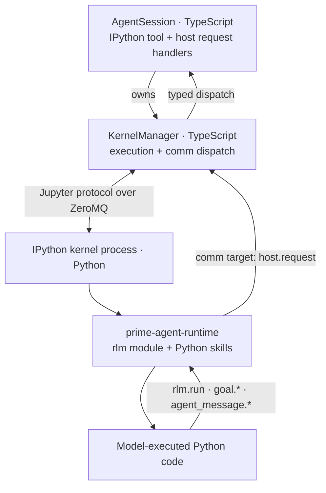
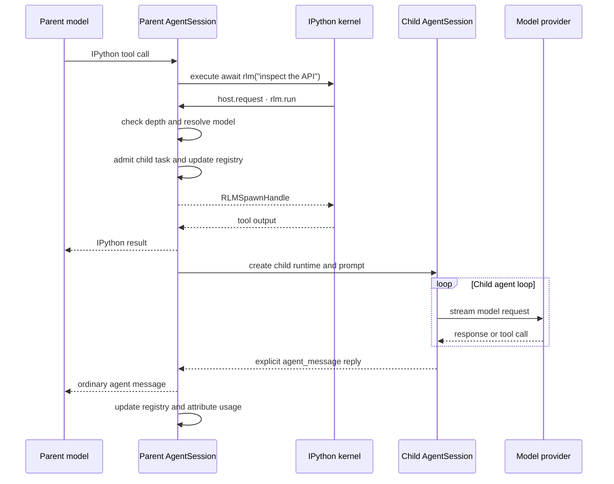

# RLM Runtime Architecture

Prime Agent gives each agent session a persistent IPython kernel and a native recursive sub-agent interface. The Python `rlm` package is a model-facing shim; the TypeScript host owns child execution, persistence, usage accounting, and lifecycle.

## Architecture



When the model delegates work:

```python
handle = await rlm("inspect the API", name="api-reviewer")
print(handle.rlm_child_id, handle.name, handle.session_dir, handle.model)
```

the call travels through a Jupyter comm target named `host.request`. `KernelManager` dispatches request type `rlm.run` to the parent `AgentSession`, which starts a child through the same TypeScript agent machinery as the parent. The call returns over the comm immediately after task admission with a child handle; it never waits for or returns the child's answer. Results arrive only through explicit `agent_message` replies or files.

The same bridge supports other typed host requests. Bundled Python skills such as `goal` call `rlm.host_request("goal.get", ...)`; state and policy remain in the TypeScript host.

## Delegation Flow



## Component Ownership

| Component | Responsibility |
|---|---|
| `src/core/kernel/index.ts` | ZeroMQ sockets, Jupyter framing, execution, comm dispatch, interrupt, and shutdown. |
| `src/core/tools/ipython.ts` | Agent tool wrapper, lazy kernel provisioning, namespace bootstrap, and output shaping. |
| `src/core/agent-session.ts` | RLM policy, child creation, registry, usage attribution, cancellation, and goal handlers. |
| `src/core/rlm-runtime.ts` | Typed request/spawn-handle validation for `rlm.run`, model discovery, list, and delete. |
| `prime-agent-runtime/src/rlm/` | Python shim, handle types, callable `rlm`, and session-backed harness state. |

The Python side does not call providers or implement an agent loop.

## Kernel Lifecycle

The kernel is created lazily on first IPython use. Python resolution is:

1. `PRIME_AGENT_KERNEL_PYTHON`, when it can import `ipykernel`;
2. `~/.prime/agent/kernel-venv/bin/python`, bootstrapped with `uv`; or
3. the XDG data location when `~/.prime` is not writable.

The managed environment includes Python 3.11, `ipykernel`, and `prime-agent-runtime`. A bootstrap marker detects stale environments.

Startup creates a temporary Jupyter connection file with loopback TCP ports and an HMAC key, starts `python -m ipykernel_launcher`, connects shell, IOPub, and control sockets, waits for subscription propagation, and probes readiness with `kernel_info_request`.

The manager owns the child process, connection directory, ZeroMQ sockets, and a bounded stderr tail. Shutdown sends `shutdown_request`, closes sockets, terminates the process as a fallback, and removes temporary connection data. Persistent sessions may snapshot the kernel namespace into their session artifact directory for revival.

## Jupyter Transport

Prime Agent uses three channels:

```text
shell    execute_request, execute_reply, kernel_info_request
iopub    stdout, stderr, results, errors, status, comm_open
control  interrupt, shutdown, and host-request replies during execution
```

Messages use normal Jupyter multipart framing:

```text
<IDS|MSG>
signature
header
parent_header
metadata
content
```

JSON frames are signed with HMAC-SHA256. Ordinary output is accepted only when `parent_header.msg_id` matches the active execution. Comm messages are handled before that filter because asynchronous Python tasks can open comms after their scheduling cell returns to idle.

Calls to `KernelManager.execute()` are serialized. One kernel has one shared namespace and does not run two ordinary IPython cells concurrently. RLM child agents can still run concurrently because each delegation uses a distinct comm and child runtime.

## Why Host-Request Responses Use the Control Channel

A running cell can await task admission:

```python
handle = await rlm("subtask")
```

IPython processes shell messages serially. Sending the admission response on the shell channel would deadlock: the active `execute_request` cannot finish until the response arrives, while the kernel will not process that shell response until the request finishes.

The Python shim therefore registers comm handlers on the control channel, and the host sends admission responses there. Future completion is scheduled with `loop.call_soon_threadsafe()` because the control handler may run on another thread. Child answers do not use this response path; they arrive later through explicit `agent_message` replies or files.

## Python API

`prime-agent-runtime` exports:

```python
rlm
run(prompt: str, **kwargs)
find_models(query: str = "", limit: int = 8)
list_subagents()
delete_subagent(selector)
host_request(request_type: str, payload: dict | None = None)
RLMSpawnHandle
RLMModel
RLMSubagent
TokenUsage
```

The IPython bootstrap places the callable `rlm` object in the user namespace, so these are equivalent:

```python
await rlm("subtask")
await rlm.run("subtask")
```

`RLMSpawnHandle` contains `rlm_child_id`, `name`, `session_dir`, and `model`. It confirms admission only and never contains the child's answer.

Supported `rlm.run` options are:

- `name`: a unique readable child session name; and
- `model`: an exact `provider/model` selector from `rlm.find_models()`.

Unknown options fail instead of being ignored. Model search is bounded to active, non-expired credentials. If an exact selection is unavailable or fails auth preflight, spawn fails instead of silently falling back to another model. A child otherwise inherits the parent model.

## Child Execution

`AgentSession.runRlmChild()` performs the following sequence:

1. Check `RLM_DEPTH < RLM_MAX_DEPTH`.
2. Resolve the requested model or inherit the parent model.
3. Create a `sub-xxxxxxxx` child directory under the parent artifact directory.
4. Admit the task into the parent registry and return its `RLMSpawnHandle`.
5. In detached work, create a child `SessionManager`, `Agent`, and `AgentSession`.
6. Reuse provider hooks, resource loader, model registry, tools, transport, retry settings, and thinking configuration.
7. Run the child prompt, retain its session, and update lifecycle state independently of the admission call.
8. Attribute child usage to the parent assistant turn and persist the attribution.

When a token budget is active, the child's allowance is reserved between steps 2 and 3, once the spawn can no longer fail and before any session state exists; a pool that cannot fund the child fails the spawn there.

Children receive incremented `RLM_DEPTH`, the inherited maximum depth, and their own `RLM_SESSION_DIR`. The default maximum depth is 1, so root sessions may create children and those children may not create grandchildren unless the limit is configured higher.

## Token Budgets

`/rlm-token-budget` bounds what a session delegates, not the session itself. The thread the user is talking to is never stopped by a budget; the budget is the pool of tokens it may hand to subagents, and each grant bounds that subagent and everything below it.

A budget is resolved per session with the same precedence as max depth (chat > inherited > global > env > default off), except that a subagent stops at `inherited`: a child is funded entirely by its parent, and falling through to the global default would re-seed every child with a full root-sized budget, multiplying spend instead of bounding it.

There is one allocation rule. A session holds a pool and decides for itself how much of it each child is worth:

```python
await rlm("audit the retry logic", token_budget=200_000)
await rlm("quick lookup", token_budget=(50_000, 150_000))
```

A grant is drawn from the pool and never returned, so the sum of everything a subtree receives is bounded by the budget however unevenly the caller allocates it. A range grants as much of the ceiling as the pool affords and refuses the child if even the floor cannot be met. A child spawned without `token_budget=` receives whatever is left, which is why the recursion prompt instructs the model to size every delegation.

A funded subagent holds one pot covering both its own turns and anything it delegates: every token it hands to a child is one it can no longer spend itself. Nothing is stranded on a subagent that never delegates. `--floor` and `--ceiling` bound any single grant, so a floor larger than the whole budget is rejected when the budget is set rather than at the first spawn.

Enforcement happens in three places:

- Between turns: once a funded subagent has generated its grant, `shouldStopAfterTurn` ends its agent loop. The turn that crossed the allowance is preserved; the loop simply does not start another. Aborting is deliberately not used, because an aborted turn reports `stopReason: "aborted"` and would not be charged.
- At prompt admission: the agent loop always runs at least one turn per prompt, so an exhausted subagent refuses new prompts instead of burning a fully charged turn per message. Each refusal re-emits `rlm_token_budget_exhausted`, which the interactive client renders with the usage and the recovery command.
- At spawn time: `runRlmChild` reserves the child's grant once the spawn can no longer fail, and throws when the pool cannot fund it.

The active budget is stated in the system prompt: the main thread is told how much it may grant to subagents, and a funded subagent is told what it may spend, so it can wrap up rather than being cut off mid-thought.

Enforcement is per turn, not per token. Usage is charged when an assistant turn ends, so a subagent stops at the first turn boundary after its grant is spent rather than mid-turn. Actual spend is therefore bounded by the granted total plus at most one turn per participating session, and a grant smaller than a single turn does not prevent that turn from running.

Grants are deducted permanently: re-issuing `/rlm-token-budget` or navigating the message tree recomputes the pool minus everything already handed out, so a parent cannot refund live children by re-applying its budget.

Spend is persisted with the session, so resuming a chat resumes its remaining pool rather than restoring a full one, and a subagent rehydrated after a daemon restart keeps the grant it was spawned with.

### Ranges

A budget may be a range instead of a single ceiling, which lets a caller state a band rather than one number:

```
/rlm-token-budget 200k-600k
/rlm-token-budget 1m --floor 50k --ceiling 400k
```

`--floor` and `--ceiling` bound any single grant. A request is granted as much of its ceiling as the pool affords, and refused when even the floor cannot be met, so a child is never funded below the point where it could finish. A floor larger than the whole budget is rejected when the budget is set rather than at the first spawn. The positional range and the `--floor`/`--ceiling` flags are alternative spellings of the same bounds, so supplying both is an error rather than one silently overriding the other.

Budget state flows downward as a value snapshot taken at spawn time. A running child never re-reads its parent, so changing a budget mid-run affects only sessions spawned afterwards. A child that persists its own per-chat override can lower its allowance but never raise it above the grant it was spawned with.

### Budgeting a delegation

Setting a budget when spawning is the default way to use this feature, and it needs no tree-wide configuration:

```python
await rlm("audit the retry logic", token_budget=200_000)
await rlm("quick lookup", token_budget=(50_000, 150_000))
```

The grant bounds that child and every descendant it spawns, and with no active budget it starts one for that subtree alone, so delegation is bounded even when the session is not. The model is told this in its system prompt, so budgeting each delegation is doctrine rather than an advanced option.

A request is bounded only by what the parent has left to grant, so a caller may weight one child far above its siblings; the pool remains the bound. A range is funded as far as the pool allows and refused only when it cannot reach the floor.

Kernel env exposes `RLM_TOKEN_ALLOWANCE`, the grant the session was funded with, at provisioning time; as with `RLM_MAX_DEPTH`, the TypeScript-side check is authoritative. No remaining-pool variable is published, because it would be absent whenever a budget was set after the kernel started and wrong after the first grant. The system prompt states the configured budget rather than a live balance for the same reason, and a spawn the pool cannot fund reports the exact remainder in its error.

## Independent Delegation

Each direct call admits an independent child and returns its handle immediately:

```python
api_review = await rlm("review the API", name="api-reviewer")
test_review = await rlm("review the tests", name="test-reviewer")
audit = await rlm("slow independent audit", name="audit-reviewer")
```

End the turn instead of waiting for completion. Children send requested answers with `await agent_message.send(message, receiver_role="parent")`, and replies arrive as ordinary agent messages over later turns. A child may instead write results to files for the parent to read. The host runs each admitted child as an independent `AgentSession`; daemon-backed children can be retained as independently addressable session workers.

## Parent-Scoped Sub-Agent Registry

The TypeScript parent maintains the authoritative direct-child registry. `await rlm.list_subagents()` returns stable child IDs, active-session IDs when daemon-backed, session IDs, names, directories, and running/completed status.

This registry survives kernel restart, compaction, and parent restore. Successfully completed daemon-backed children are rehydrated from the parent artifact registry. Inline children remain inspectable in the current process but have no active-session ID.

The parent can continue a retained daemon child with `await agent_message.send(..., receiver_role="child", receiver_name=child.session_name)`. `rlm.delete_subagent()` accepts an exact child ID, active-session ID, session ID, or unique name. Deletion cancels or closes the runtime, writes a durable tombstone, and removes the child from messaging and observation. It does not erase the transcript or artifacts on disk.

Registry scope follows the parent transcript. An unrelated new parent session does not inherit children.

## Usage and Cost Attribution

The admission handle does not contain usage or completion data. Prime Agent asynchronously folds the child's assistant usage and cost into the parent assistant turn that launched it.

The parent transcript persists a `child_usage_attributed` entry containing:

- the target parent assistant message ID;
- the child usage being attributed; and
- the resulting aggregate usage.

On reload, the aggregate is reapplied to the parent message. Context-tree reporting subtracts attributed child usage when showing each node's own usage, so tree-wide own usage and root aggregate totals remain reconcilable. Child work increases billable session totals but does not inflate the parent model's context-window measurement.

## Continual Harness State

`rlm.harness` is a persisted state ledger for prompt notes, memories, reusable skill descriptions, sub-agent specifications, and refinement events. It is not a second execution engine.

Session-local state lives in the session artifact directory under `harness/harness_state.json`. Explicitly global entries live under `~/.prime/agent/harness/`. The Python store reloads after external modification so host-side `/refine` writes and kernel writes do not overwrite each other.

`/refine` runs a dedicated review over the current trajectory and applies small create/update/delete edits. Rollback uses recorded before/after snapshots. The base system prompt remains immutable; refinements are supplemental state.

## Goal Requests

The bundled `goal` Python skill is a thin host-bridge client:

```python
await goal.get()
await goal.create("ship the release", token_budget=200000)
await goal.complete()
```

Goal state, persistence, token and wall-clock accounting, and continuation prompting live in `AgentSession`. When goals are disabled, the skill and `goal.*` host handlers are not registered.

## Session Artifacts

For a persisted root session, the relevant layout is:

```text
~/.prime/agent/
  sessions/
    <root-session-id>.jsonl
  session-artifacts/
    <root-session-id>/
      kernel-state.dill
      kernel-state.json
      scheduled-jobs.json
      harness/
        harness_state.json
      sub-xxxxxxxx/
        <child-session-id>.jsonl
        sub-yyyyyyyy/
```

Exact artifact files are created only when their features are used. Non-persistent sessions place RLM directories under the OS temporary directory and do not gain revivable session artifacts.

## Trust Boundary

IPython executes model-generated Python and shell-magics with the worker's OS permissions. The kernel boundary isolates protocol and lifecycle concerns; it is not a security sandbox. Installed Python packages, skills, and extensions are trusted code. Use an external sandbox or restricted execution environment when the workspace or generated code is untrusted.

Provider credentials are resolved by the TypeScript host. The bounded model catalog crosses into Python as metadata; the full auth store does not.

## Failure Modes

| Failure | Behavior |
|---|---|
| Managed runtime is missing | Kernel bootstrap rebuilds it; a custom Python without `rlm` fails clearly when recursion is called. |
| Depth limit reached | Python raises before opening a comm; the host checks again. |
| Unsupported options | Host rejects the request. |
| Requested model unavailable | Spawn fails instead of substituting another model. |
| Shell-channel comm reply | Deadlock risk; current replies use control. |
| Child cancellation | Host aborts the child and removes failed/cancelled registry entries. |
| Parent teardown | Active descendants are cancelled and their runtimes are closed. |

## Focused Validation

From the repository root, the implementation is covered by focused kernel, recursion, context-tree, daemon RLM, and runtime tests. When changing child creation or accounting, include `agent-session-recursion.test.ts`; when changing comm transport, include the kernel comm tests; when changing daemon retention, include the daemon RLM lifecycle tests.
