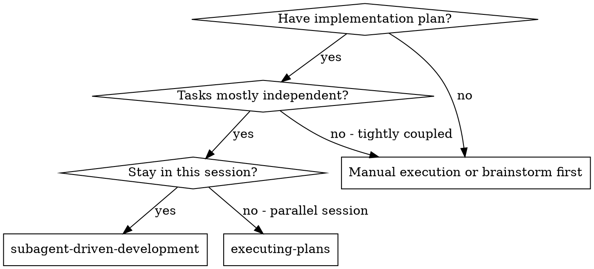
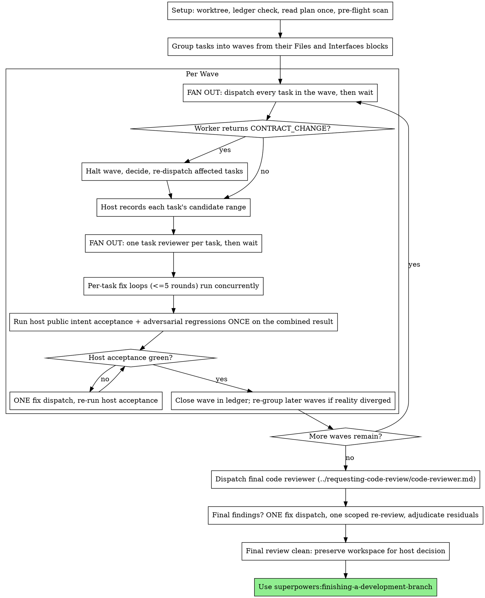

# Subagent-Driven Development

## Prime Agent fork contract

- Contract: `role=scheduler; authority=methodology-only; authority-model=role-based; capacity=host-assigned-luna; host-authority=commit,stage,push`
- Contract: `capacity-selection=host-scheduler; hardcoded-model-families=forbidden; write=none; commit=none; stage=none; push=none`
- Contract: `approval=none; merge=none; completion=none; acceptance=black-box-public-boundary; mocks=mock-only-inadequate`
- Contract: `unit-probes=temporary-debugging-only`
- Contract: `intent=required; forbidden-outcomes=required; red=observed-recorded-before-implementation; adversarial-probes=regression-before-fix`
- Contract: `durability=real-store-process-restart; adversarial=metamorphic,race,caller-mutation,locale,stale-replay; anti-cheating=required; green=independent-verification-adversarial-review`

This skill describes role-based dispatch and review methodology only. The host scheduler selects approved capacity and grants any scoped write authority; the skill itself never writes, commits, approves, merges, deletes, or declares completion. Product and durable intent tests belong to the implementer under the host recipe. Unit probes are permitted only temporarily for debugging; coverage counts are supplemental and neither can promote a task.

Execute the plan in waves. Group the plan's independent tasks, dispatch every
task in a wave to its own implementer subagent at once, review each, then run
the host public intent acceptance command and adversarial regressions on the
combined result before starting the next wave.

**Why subagents:** You delegate tasks to specialized agents with isolated
context. By precisely crafting their instructions and context, you ensure they
stay focused and succeed at their task. They should never inherit your
session's context or history — you construct exactly what they need. This also
preserves your own context for coordination work.

**Core principle:** Widest safe wave + fresh subagent per task + task review
(spec + quality) + host acceptance on the combined result + broad final review

**Your job is coordination methodology, not authority.** You describe scheduling,
dispatch, review, and adjudication steps. The host scheduler applies writes,
commits, approvals, integration, and completion decisions; you never write
product code yourself.

**Narration:** between tool calls, narrate at most one short line — the
ledger and the tool results carry the record.

**Continuous execution:** Do not pause to check in with your human partner
between tasks or between waves. Execute the whole plan without stopping. The
only reasons to stop are: BLOCKED status you cannot resolve, ambiguity that
genuinely prevents progress, or all tasks complete. "Should I continue?"
prompts and progress summaries waste their time — they asked you to execute
the plan, so execute it.

## When to Use



A fully sequential plan is not a reason to skip this skill. It runs as a
series of one-task waves — the old behavior of this skill exactly.

**vs. Executing Plans (parallel session):**
- Same session (no context switch)
- Fresh subagent per task (no context pollution)
- Independent tasks run concurrently instead of one at a time
- Review after each task (spec compliance + code quality), broad review at the end
- Faster iteration (no human-in-loop between tasks)

## The Process



## Acceptance gate for every task

Before dispatching implementation, require the task brief to name user intent,
forbidden outcomes, and a black-box acceptance scenario at the public
host/store/process/integration boundary. The host records the observed RED
before implementation. Each adversarial bypass becomes a durable regression
before its fix, with metamorphic, race, caller-mutation, locale, and
stale-replay probes where applicable. Durability or authority requires real
store/process/restart/integration evidence; unit probes are permitted only
temporarily for debugging, and unit or mock-only output is inadequate and
cannot promote the task. GREEN is followed by independent
verification and adversarial review against immutable candidate SHAs.

Permanent acceptance evidence must invoke the public operation available to
the user or host. Calls to private symbols, source-text inspection, and
production `*_for_test` hooks are temporary nonauthorizing debugging probes;
remove them before terminal review. Reviewers must reject a candidate when a
test hook makes a private check pass while the public outcome remains wrong.

## Setup

For substantial work, use superpowers:using-git-worktrees with the
host-supplied immutable integration SHA; do not continue in the current
checkout or another unverified workspace. Small edits remain
coordinator-owned in the current checkout.

Conversation memory does not survive compaction. In real sessions,
controllers that lost their place have re-dispatched entire completed task
sequences — the single most expensive failure observed. Track progress in
a ledger file, not only in todos.

- Each plan owns a workspace: at skill start, run this skill's
  `scripts/sdd-workspace PLAN_FILE` — it prints the plan's git-ignored
  directory (`<repo-root>/.superpowers/sdd/<plan-basename>/`), home to
  every artifact for THIS plan: ledger, briefs, reports, review packages.
  Another plan's directory is never yours to read or write.
- Check for this plan's ledger at `<workspace>/progress.md`. If its first
  line names your plan file, tasks with a `Task <N>: complete` line are DONE
  — do not re-dispatch them; resume at the first task without one. A task
  whose last line is a fix round is mid-loop: resume the loop at the next
  round. A wave with no `Wave <W>: closed` line never finished: check
  `git log` for which of its tasks were committed before dispatching any of
  them again. A ledger whose first line names a different plan file — or a
  stray ledger at the old flat path `.superpowers/sdd/progress.md` — is
  another plan's progress: leave it in place and start your own, fresh.
- Create the ledger with its identity as the first line:
  `# SDD ledger — plan: <plan file path>`.
- The ledger is your recovery map: the commits it names exist in git even
  when your context no longer remembers creating them. After compaction,
  trust the ledger and `git log` over your own recollection.
- `git clean -fdx` will destroy the workspace (it's git-ignored scratch); if
  that happens, recover from `git log`.

Read the plan once, note its context and Global Constraints, and create a
todo per task.

Before dispatching, scan the plan once for conflicts:

- tasks that contradict each other or the plan's Global Constraints
- anything the plan explicitly mandates that the review rubric treats as a
  defect (a test that asserts nothing, verbatim duplication of a logic block)

Present everything you find to your human partner as one batched question —
each finding beside the plan text that mandates it, asking which governs —
before execution begins, not one interrupt per discovery mid-plan. If the
scan is clean, proceed without comment. The review loop remains the net for
conflicts that only emerge from implementation.

## Grouping Tasks Into Waves

A plan written with superpowers:writing-plans already contains the whole
dependency graph. Each task carries:

- **Files:** — Create / Modify / Test, with exact paths
- **Interfaces:** — Consumes (what it uses from earlier tasks) and Produces
  (exact signatures later tasks rely on)

Read those two blocks per task. Task B waits for task A when any of these
hold:

- **Interface:** B's Consumes matches A's Produces.
- **Path:** B's Files and A's Files name the same file.
- **Mandate:** the plan's prose orders B after A ("once the schema lands…").

Everything else is concurrent. **Wave W = every task whose predecessors are
all in earlier waves.** Because a shared file is a dependency, tasks inside a
wave never write the same file — that is what makes it safe to run them at
once in one checkout.

If a plan's Files or Interfaces blocks are missing or vague, you cannot derive
the graph and must not guess: read the code the tasks touch to establish which
files each one really writes, or fall back to one-task waves. A wrong edge
costs speed; a missing edge costs a corrupted wave.

**Scale the machinery to the plan.** Grouping is a couple of minutes of
reading, not a deliverable. One task, or one trivial change, needs no
grouping at all — one implementer, one review, or for a genuinely one-line
change just make the edit. Ceremony you pay for in dispatches is a cost, not
rigor.

**Width is set by the graph, not by nerve.** Every task with satisfied
dependencies goes in the wave, dispatched together before you wait on any of
them. Harnesses that cap
concurrent subagents queue the remainder and drain it automatically — you do
not manage that queue, and you must not pre-shrink a wave to stay under a
limit you are guessing at.

## Shared Interfaces

Parallel implementers cannot ask each other questions. Two agents building
against the same interface will invent two incompatible versions of it, and
you will not find out until the host acceptance command runs — after both have
written their durable intent tests
that pass.

The plan's **Interfaces: Produces** block exists precisely so a task's
implementer learns the names and types its neighbors use. Copy the relevant
Produces entries **verbatim** into every dispatch in the wave. An interface
paraphrased into two dispatches is two interfaces.

Where the plan left a shared interface underspecified, settle it yourself
before the fan-out and state it in the dispatches the same way — exact
signatures, exact field names, exact error values. A type one task calls
`Schema` and another calls `Spec` is a defect you created by being vague.

An implementer that concludes one of these interfaces is wrong must stop and
return **CONTRACT_CHANGE** rather than change it — the whole wave was
dispatched against it. On CONTRACT_CHANGE:

1. Halt the wave. Do not let the remaining workers keep building on an
   interface you are about to change.
2. Decide: amend it, or tell the worker to build to the stated version.
3. If amended, re-dispatch every task in the wave that touches the changed
   interface with the new text. Tasks that don't touch it continue undisturbed.
4. Ledger it: `Wave <W>: interface change — <what> — ruling: <decision>`.

If the plan specified the interface and you are overriding it, that is a plan
contradiction: ask your human partner which governs.

## One Checkout, Disjoint Paths

All of a wave's implementers work in the same checkout. Grouping guarantees
they write different files; these rules keep everything else from colliding:

- Each dispatch names the task's files, from the plan's Files block. Workers
  do not create, edit, or delete anything outside them.
- Workers do **not** run git. No commits, no staging, no branch operations.
  The host records one candidate range per task, so each task keeps its own
  reviewable range and one actor serializes all index access.
- Workers run **focused public-boundary acceptance scenarios only** — unit
  probes are temporary debugging aids and cannot promote GREEN.
  Never run the host-wide acceptance command, a build that writes shared
  artifacts, or a server on a fixed port. A sibling is running at the same
  time. The host runs combined public intent acceptance and adversarial
  regressions once, at the barrier. Plans routinely give each task a
  host-acceptance verification command because
  they were written for one task at a time. Name the
  focused public-boundary equivalent in the dispatch — the specific scenario
  file or filter — and
  say the barrier run covers the rest. Otherwise every worker runs the whole
  host-wide acceptance command concurrently against a tree containing its siblings' half-finished
  work, and they fail each other's tests.
- A worker that needs a path outside its set returns NEEDS_CONTEXT instead of
  touching it. Move that task to a later wave.

If a wave's tasks genuinely cannot share a checkout — each needs its own full
build, or a task must run the host-wide acceptance command mid-work — give those tasks their own
worktrees via superpowers:using-git-worktrees, or put them in separate waves.
Separate waves is usually the cheaper answer.

## Capacity selection

The host scheduler assigns a named Luna capacity for each role. This skill
never selects capacity or names a model family, tier, provider, or fallback.
Every dispatch carries the host-supplied Luna handle explicitly; an omitted
handle is a routing error, not permission to inherit the current session's
capacity.

| Role | Host-supplied input |
|---|---|
| Implementer | Named Luna capacity handle and scoped write grant |
| Task reviewer | Named Luna capacity handle and read-only review grant |
| Scoped re-reviewer | Named Luna capacity handle and read-only review grant |
| Suite-failure fixer | Named Luna capacity handle and scoped write grant |
| Final reviewer | Named Luna capacity handle and read-only review grant |

The scheduler may choose capacity using its own policy and live availability.
The skill supplies only role, scope, evidence, and review constraints.

## Dispatching Subagents

**Use your harness's native subagent mechanism.** You already have one, and it
is the only thing this skill dispatches with. It might be a tool named
`Agent` or `Task`, a `spawn_agent`/`wait_agent`/`close_agent` trio, or
something else — the prompt templates here are harness-neutral pseudo-syntax,
not a literal call shape. If your harness appears under Platform Adaptation in
superpowers:using-superpowers, read its reference file first: it carries the
tool names, any config your harness needs to enable multi-agent support, and
how that harness collects a result.

**Never shell out to a coding-agent CLI to simulate a subagent.** Running
`claude -p`, `codex exec`, or similar through Bash is not a subagent: you lose
capacity assignment, the harness cannot see or account for the work, the result
contract dissolves into scraped stdout, and nothing you carefully constructed
as context is actually delivered. It is the same phantom-state mistake as
creating a second worktree when a native worktree tool exists.

If your harness genuinely has no subagent primitive, this skill does not apply
— use superpowers:executing-plans instead. Do not approximate subagents.

## The Wave Loop

Everything you paste into a dispatch prompt — and everything a subagent
prints back — stays resident in your context for the rest of the session and
is re-read on every later turn. At wave width N this multiplies by N. Hand
artifacts over as files, and hold subagents to the short return contract.

### 1. Fan out

Have the host record WAVE_BASE as a canonical full immutable SHA — the ledger
line that lets you reconstruct the wave after compaction. Never infer it from
a moving ref.

For each task in the wave, run `scripts/task-brief PLAN_FILE N` — it extracts
the task's full text to a uniquely named file and prints the path. Then
**dispatch every task in the wave before you wait on any of them.** On a
harness where one message carries multiple tool calls, issue every dispatch
together in that message; on a harness with separate spawn and wait
primitives, issue every spawn before your first wait. Waiting on one
dispatch before issuing the next serializes the wave and throws away the
point of this skill. The mechanic is superpowers:dispatching-parallel-agents
— the difference here is that host-granted implementer dispatches may write
scoped code, so the file
discipline above is what keeps them apart.

Each dispatch contains:

1. One line on where this task fits in the project.
2. The brief path, introduced as "read this first — it is your requirements,
   with the exact values to use verbatim".
3. The interfaces this task consumes and produces, verbatim from the plan.
4. Its file set, from the plan's Files block.
5. Decisions from earlier waves that the brief cannot know.
6. Your resolution of any ambiguity you noticed in the brief.
7. The report-file path and the report contract.

Name the report file after the brief (`…/task-N-brief.md` →
`…/task-N-report.md`). Exact values — numbers, magic strings, signatures,
test cases — appear only in the brief. Never make a subagent read the whole
plan file.

A dispatch prompt describes one task, not the session's history. Do not paste
accumulated prior-wave summaries into later dispatches — a real session's
dispatch hit 42k chars of which 99% was pasted history. A fresh subagent needs
its task, its interfaces, its files, and the global constraints. Nothing else.

If an earlier task parked a finding in the area this task touches, carry a
pointer to that ledger entry in the dispatch.

Record each implementer's agent identity from its dispatch result — fix-loop
rounds 1–3 resume that agent.

Ledger the fan-out: `Wave <W>: dispatched tasks <list> (base <full-base-sha>)`

Template: [implementer-prompt.md](implementer-prompt.md)

### 2. Handle the reports

Reports arrive independently. Triage each as it lands — do not idle waiting
for the slowest worker.

**DONE:** ready for the host to record a candidate range.

**DONE_WITH_CONCERNS:** the implementer completed the work but flagged
doubts. Read the concerns. If they're about correctness or scope, address
them before review. If they're observations ("this file is getting large"),
note them and proceed.

**NEEDS_CONTEXT:** provide the missing context and re-dispatch. A
path-boundary NEEDS_CONTEXT means re-grouping, not more context.

**CONTRACT_CHANGE:** halt the wave and follow Shared Interfaces.

**BLOCKED:** assess the blocker:
1. Context problem → provide more context, re-dispatch the host-assigned capacity
2. Needs more reasoning → ask the host for a new named Luna capacity handle
3. Task too large → break it into smaller pieces (they may form their own wave)
4. Plan itself is wrong → escalate to your human partner

**Never** ignore an escalation or force the same capacity to retry without
changes. If the implementer said it's stuck, something needs to change.

If an implementer asks questions — before starting or mid-task — answer
clearly and completely, and don't rush it into implementation. Answer
immediately rather than batching; a blocked worker holds up the wave.

One task's failure does not stall its siblings. Let the healthy tasks proceed
to review while you resolve the sick one.

### 3. Record each task's candidate range

Have the host record an immutable candidate range for each task as its report
lands, one scoped range per task. Do not wait for the whole wave before the
host records ready tasks. That range is the task's review input. Fix ranges
use the same rule, so every re-review sees only its own fix.

### 4. Fan out the reviews

Reviews are read-only and never conflict, so they always run at full width.
**Dispatch a task's reviewer as soon as the host records that task's candidate range — never hold a
ready review waiting for a slower sibling.** When several tasks land together,
their reviewers go out together. When they land one at a time, each review
starts while the rest of the wave is still building. Both are correct; idling
until the whole wave finishes is not.

The wave's barrier is the host acceptance run in step 6, not the review step. Reviews
pipeline; only host acceptance waits for everyone.

Per-task reviews are task-scoped gates. The broad review happens once, at the
final whole-branch review. Never skip the task review, and never accept a
report missing either verdict — spec compliance AND task quality are both
required. Implementer self-review never replaces the task review; both are
needed.

- Hand each reviewer its diff as a file: run this skill's
  `scripts/review-package PLAN_FILE BASE_SHA CANDIDATE_SHA INTEGRATION_SHA`
  per task, where BASE_SHA is that task's commit's parent, CANDIDATE_SHA is
  its immutable commit, and INTEGRATION_SHA is the host-supplied target; pass the reviewer the
  path it prints. Passing WAVE_BASE instead would fold every earlier task in
  the wave into this task's package, and the reviewer would flag a sibling's
  work as unrequested scope. The output never enters your own context, and the
  reviewer sees the commit list, stat summary, and full diff with context in
  one Read call. Never dispatch a task reviewer without a diff file.
- **Reviewer inputs:** the brief path, the report path, the review package
  path, the interfaces the task was built against, and the global constraints
  that bind the task.
- The global-constraints block is the reviewer's attention lens. Copy the
  binding requirements verbatim from the plan's Global Constraints section or
  the spec: exact values, exact formats, and the stated relationships between
  components ("same layout as X", "matches Y"). The reviewer's template
  already carries the process rules (YAGNI, test hygiene, review method) —
  the constraints block is for what THIS project's spec demands.
- Do not add open-ended directives like "check all uses" or "run race tests
  if useful" without a concrete, task-specific reason.
- Do not ask a reviewer to re-run tests the implementer already ran on the
  same code — the implementer's report carries the test evidence.
- Do not pre-judge findings for the reviewer — never instruct a reviewer to
  ignore or not flag a specific issue. If you believe a finding would be a
  false positive, let the reviewer raise it and adjudicate it in the review
  loop. If the prompt you are writing contains "do not flag," "don't treat X
  as a defect," "at most Minor," or "the plan chose" — stop: you are
  pre-judging, usually to spare yourself a review loop.

A task reviewer may report "⚠️ Cannot verify from diff" items — requirements
that live in unchanged code or span tasks. Parallelism produces more of
these, because a wave's tasks genuinely cannot see each other. They do not
block the rest of the review, but you must resolve each one yourself before
closing the wave: you hold the plan and the cross-task context the reviewer
lacks. If you confirm an item is a real gap, treat it as a failed spec
review — it enters that task's fix loop.

Template: [task-reviewer-prompt.md](task-reviewer-prompt.md)

### 5. Fix loops — concurrent, per task

Each task's fix loop is independent and runs at its own pace. Dispatch every
fix that is ready without waiting on the others, and send each re-review as
soon as its fix candidate range is recorded. Tasks on round 1 and round 3 proceed side by
side; a task that finishes its loop early does not wait for a task still
looping.

The loop triggers when a review reports spec ❌, any Critical or Important
finding, or a ⚠️ item you confirmed as a real gap.

Before the loop starts, two routes leave it immediately:

- Record Minor findings in the ledger as you go
  (`Task <N>: minor (deferred): <one-liner>`), and point the final
  whole-branch review at that list so it can triage which must be fixed
  before host integration into the approved target. A roll-up nobody reads is
  a silent discard. Minor findings
  never enter the loop.
- A finding labeled plan-mandated — or any finding that conflicts with what
  the plan's text requires — is the human's decision, like any plan
  contradiction: present the finding and the plan text, ask which governs. Do
  not dismiss the finding because the plan mandates it, and do not dispatch a
  fix that contradicts the plan without asking.

Everything else enters the loop. A fix round is one fix dispatch plus one
scoped re-review. Five rounds maximum per task.

**Rounds 1–3 — resume the original implementer.** Send it the open findings
verbatim. Its context is intact: it knows the task, the code, and its own
choices. If your harness cannot send another message to a live subagent,
dispatch a fresh implementer carrying the brief path, the report-file path,
its file set, and the findings — the report file is the persistent memory
either way.

**Rounds 4–5 — dispatch a fresh implementer with a new host-assigned Luna
capacity
handle**, with the brief path, the report-file path, the file set, the open
findings, and this framing: "A prior implementer attempted this task [N]
times; you own it now. Read the report file for what was tried." A loop that
survives three resumes usually means the implementer cannot see its own
problem — fresh eyes and a capability bump in one move.

**Every round, either way:** the implementer fixes, re-runs the tests
covering the amended code, appends its fix report to the same report file,
and returns the short contract. Before re-dispatching the reviewer, confirm
the fix report contains the covering tests, the command run, and the output;
dispatch the re-review once all three are present. Name the covering test
files in the fix message — a one-line fix does not need the host-wide
acceptance command.

**The re-review is scoped.** Run
`scripts/review-package PLAN_FILE FIX_BASE_SHA FIX_CANDIDATE_SHA INTEGRATION_SHA`
over the fix commit and dispatch
[re-review-prompt.md](re-review-prompt.md) with the findings list, the brief,
the report file, and the printed diff path. The re-reviewer verdicts each
finding ADDRESSED or NOT ADDRESSED and flags new breakage in the fix diff
only. New Critical/Important breakage joins the open findings list.
Out-of-scope observations go to the ledger as deferred minors — they never
extend the loop.

**After each round,** append to the ledger:
`Task <N>: fix round <R>/5 (<X> addressed, <Y> open — <finding one-liners>; commits <full-sha>..<full-sha>)`

Never fix findings yourself in the controller session — your context stays
clean for coordination, and controller fixes skip review.

**The breaker.** When round 5's re-review still leaves findings open, stop
dispatching for that task. Adjudicate each open finding yourself — you hold
the plan and the cross-task context the reviewer lacks:

- **The reviewer is wrong, or the point is contestable:** park it —
  `Task <N>: parked — <finding> — ruling: <why the code stands>`. The final
  review sees both sides.
- **Real, but nothing downstream builds on it:** park it the same way, with a
  ruling that says it's real and deferred.
- **Real and load-bearing** — a later task builds on it, or it reveals a plan
  defect: STOP. Append `Task <N>: BLOCKED — <reason>` and report to your
  human partner with the finding, the plan text it collides with, and the fix
  history. Parking a structural failure lets every dependent task build on it
  and hands the final review a problem it cannot fix either.

Adjudicate only at the cap. Adjudicating earlier to end a loop is pre-judging
with a different name. Every adjudication is a ledger entry — a silent
discard is forbidden.

### 6. Run host acceptance on the combined result

Once every task in the wave is review-clean or parked-with-ruling, run the
host's public intent acceptance command and adversarial regressions. This is
non-negotiable and it is the safety argument for running tasks in parallel:
every worker ran only focused public-boundary scenarios, and none of them ever
saw its siblings' work. Only this host run has seen the combination.

If it fails, dispatch **one** fix subagent with the complete failure output —
not one fixer per failing test. The failure is almost always two tasks that
are individually correct and jointly wrong, so give the fixer both tasks'
briefs and tell it not to weaken either side's tests to get green. Re-run the
acceptance command. If the second run still fails, stop and report to your
human partner:
two failed attempts means the wave's grouping was wrong, and more fixers will
not discover that.

### 7. Close the wave

Append to the ledger:

- `Task <N>: complete (commit <full-sha>, review clean)` per task
- `Task <N>: complete (commit <full-sha>, <K> parked)` after a tripped breaker
- `Wave <W>: closed (tasks <list> at <full-candidate-sha>, host acceptance evidence recorded)`

Mark the todos complete. Then look at the next wave before dispatching it. If
this wave changed an interface, revealed a task the plan missed, or made a
later task unnecessary, re-group now.

Never open the next wave while a task in this one has open Critical/Important
issues that are neither fixed nor parked-with-ruling at the cap.

## Final Review

The final whole-branch review gets a package too: the host supplies immutable
candidate base, candidate, and integration SHAs and runs
`scripts/review-package PLAN_FILE BASE_SHA CANDIDATE_SHA INTEGRATION_SHA`
over exactly that range.
Include the printed path in the final review dispatch, so the final reviewer
reads one file instead of re-deriving the branch diff. Request a host-assigned
Luna
review capacity through superpowers:requesting-code-review's
[code-reviewer.md](../requesting-code-review/code-reviewer.md). Point it at
the ledger's deferred-minor and parked lines so it can triage which must be
fixed before host integration into the approved target, and tell it which tasks were built concurrently — seams
between concurrently-built tasks are where the interesting defects are.

If the final whole-branch review returns findings, dispatch ONE fix subagent
with the complete findings list — not one fixer per finding. Per-finding
fixers each rebuild context and re-run host acceptance; a real session's final-review
fix wave cost more than all its tasks combined. Then run exactly one scoped
re-review of the fix wave
(`scripts/review-package PLAN_FILE FIX_BASE_SHA FIX_CANDIDATE_SHA INTEGRATION_SHA`
over the fix range, [re-review-prompt.md](re-review-prompt.md)). Adjudicate
any residual findings as in the task loop's breaker: park with rulings, or
stop on load-bearing ones. There is no second fix wave — residual
load-bearing findings surface to your human partner when
finishing-a-development-branch presents the options. ("Fix wave" here means
that one fix dispatch and its single re-review; task waves are done by now.)

## Finish

When the final whole-branch review is clean, report the evidence and preserve
the workspace for the host's explicit integration or cleanup decision.
Siblings belong to other plans; leave them alone.

Use superpowers:finishing-a-development-branch.

## Common Rationalizations

| Excuse | Reality |
|--------|---------|
| "Safer to run these one at a time" | The graph decides width, not nerve. Tasks with satisfied dependencies run together; serializing them is the failure this skill exists to prevent. |
| "I'll dispatch them one at a time so I can watch each one" | Waiting on one before issuing the next IS sequential. Parallel means every dispatch goes out before you wait on any of them. |
| "I'll shell out to a coding-agent CLI for the subagents" | That is not a subagent. Use your harness's native mechanism — check Platform Adaptation in using-superpowers. A CLI subprocess loses host capacity accounting and the result contract. |
| "These two tasks are basically independent" | "Basically" isn't a dependency check. Compare their Files and Interfaces blocks. Same file or consumed interface means the next wave. |
| "The plan doesn't list files, I'll infer which are independent" | A missing edge corrupts a wave. Read the code to establish real file sets, or run one-task waves. |
| "I'll let the implementers agree on the interface" | They cannot talk to each other. Unstated shared interfaces get invented twice and collide at the barrier. |
| "The interface is obvious, no need to quote it" | Obvious to you. Two agents will name it two things. Verbatim in every dispatch or it isn't shared. |
| "Every worker reported a pass, skip the host acceptance run" | Workers ran focused checks against a tree without their siblings' work. The host acceptance run is the only one that has seen the combination. |
| "Every plan needs a wave grouping" | Scale it to the plan. One task shares nothing with anyone; a one-line change needs no grouping and no delegation. |
| "Close enough on spec compliance" | Reviewer found spec gaps = not done. Fix or hit the cap and adjudicate — those are the only exits. |
| "I'll fix it myself, dispatching is overhead" | Controller fixes pollute your context and skip review. Resume the implementer. |
| "One more round will converge" | Past the cap, rounds don't converge — the failure is structural. Adjudicate and route. |
| "This finding is obviously wrong, I'll drop it" | You adjudicate only at the cap, and every ruling is a ledger entry. Silent discards are forbidden. |
| "The fix was small, skip the re-review" | Unreviewed fixes are how regressions land. Every round ends with a scoped re-review. |
| "Ledger bookkeeping is overhead" | The ledger is what survives compaction. Controllers without one have re-dispatched entire completed task sequences. |

## Red Flags — STOP

- You are about to dispatch the next wave while a task in this one is unreviewed
- You are about to run a coding-agent CLI through Bash to stand in for a subagent
- You are waiting on one dispatch in a wave before the rest have gone out
- Two tasks in one wave name the same file in their Files blocks
- A dispatch has no interface text but the task consumes another task's output
- You closed a wave without running host public intent acceptance and adversarial regressions
- You are editing product code yourself
- You made green by deleting or skipping a test

## Example Workflow

```
You: I'm using Subagent-Driven Development to execute this plan.

[Setup: worktree verified]
[Read plan file once: docs/superpowers/plans/feature-plan.md]
[Resolve workspace: scripts/sdd-workspace — no ledger inside, fresh start]
[Pre-flight scan: clean]

Grouping from each task's Files + Interfaces blocks: tasks 3 and 5 consume
interfaces produced in wave 1; task 6 shares no file with anything.
  Wave 1: 1, 2, 4    Wave 2: 3, 5    Wave 3: 6
[Create todos]

WAVE 1 — tasks 1, 2, 4  (WAVE_BASE <full-immutable-integration-sha>)
[task-brief for 1, 2, 4]
[3 implementer dispatches together, before waiting on any — each receives a
 host-assigned Luna capacity handle and its brief, its
 Produces text, its file set]

Task 2 implementer: "Should --verbose be repeatable?"
You: "No — boolean flag, per the brief's flag table."

[All three DONE. Host records each task's candidate range]
[3 review-packages (each immutable candidate range) → 3 reviewers together]

Reviewer 1: Spec ✅, quality Approved.
Reviewer 2: Spec ✅, quality Approved.
Reviewer 4: Spec ❌ — Logger drops the level field (src/log/adapter.ts:31).

[Fix round 1: resume implementer 4 with the finding]
Implementer 4: Added level passthrough. Host acceptance evidence recorded; fix report appended.
[Host records the fix; scoped re-review]: ADDRESSED. No new breakage.

[Host acceptance run recorded GREEN evidence]
[Ledger: Wave 1: closed (tasks 1 2 4 at <full-candidate-sha>, host acceptance evidence recorded)]

WAVE 2 — tasks 3, 5
[Wave 1's Produces text is now real code; quote it verbatim anyway]
[2 implementers dispatch together, each with host-assigned Luna capacity]
...

[After all waves]
[review-package BASE_SHA CANDIDATE_SHA INTEGRATION_SHA; final code-reviewer with host-assigned Luna
 Luna capacity, told which
 tasks were built concurrently and pointed at the deferred-minor list]
Final reviewer: Acceptance evidence is complete. Deferred minors triaged: none block host integration.

[Delete this plan's workspace — the record now lives in git]

Done! Using superpowers:finishing-a-development-branch.
```
