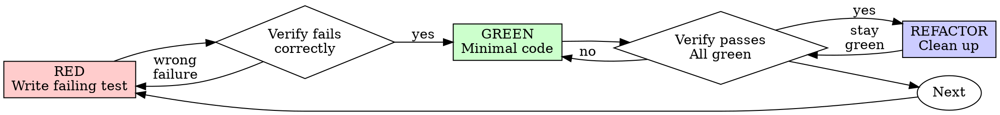

# Test-Driven Development (TDD)

## Prime Agent fork contract

- Contract: `role=tester; authority=methodology-only; capacity=host-assigned-luna; host-authority=commit,stage,push; intent=required; forbidden-outcomes=required`
- Contract: `acceptance=black-box-public-boundary; red=observed-recorded-before-implementation; adversarial-probes=regression-before-fix`
- Contract: `durability=real-store-process-restart; adversarial=metamorphic,race,caller-mutation,locale,stale-replay`
- Contract: `anti-cheating=required; mocks=mock-only-inadequate; green=independent-verification-adversarial-review`
- Contract: `unit-probes=temporary-debugging-only`
- Contract: `authority=methodology-only; write=none; commit=none; stage=none; push=none; approval=none; merge=none; completion=none`

The skill supplies a test method only. The host recipe enforces authority, and the implementer writes product and durable intent tests under that authority. Unit tests are permitted only as temporary debugging probes; they and coverage counts are diagnostics, never acceptance evidence or a basis to promote GREEN or declare completion.

## Overview

State user intent and forbidden outcomes first. Write a black-box acceptance scenario at the public host, store, process, or integration boundary. Watch it fail and record the evidence. Write minimal code to pass, then independently verify and adversarially review the exact outcome.

**Core principle:** If you didn't watch the test fail, you don't know if it tests the right thing.

**Violating the letter of the rules is violating the spirit of the rules.**

## When to Use

**Always:**
- New features
- Bug fixes
- Refactoring
- Behavior changes

**Exceptions (ask your human partner):**
- Throwaway prototypes
- Generated code
- Configuration files

Thinking "skip TDD just this once"? Stop. That's rationalization.

## The Iron Law

```
NO PRODUCTION CODE WITHOUT A FAILING PUBLIC-BOUNDARY ACCEPTANCE TEST FIRST
```

Write code before the test? Delete it. Start over.

**No exceptions:**
- Don't keep it as "reference"
- Don't "adapt" it while writing tests
- Don't look at it
- Delete means delete

Implement fresh from tests. Period.

## Prime Agent acceptance method

Use this order for every implementation workflow:

1. Record the user's intended outcome and the forbidden outcomes before selecting an implementation.
2. Write a black-box acceptance test through the public host/store/process/integration boundary. A test counts only when it can falsify an intended outcome, protected invariant, or forbidden behavior.
   Permanent acceptance tests must use the same public operation available to the user or host. Tests that call private symbols, inspect source text, or require production `*_for_test` hooks are implementation probes, not acceptance evidence. They may exist only temporarily while debugging, cannot authorize mutation or GREEN, and must be removed before terminal review.
3. Run the acceptance test and record the expected RED before implementation. A passing test, typo, or setup error is not RED.
   Each RED authorizes only the named user-visible invariant and the production surface necessary to satisfy it. GREEN consumes that authority. Before expanding behavior or touching a broader surface, record a fresh failing public invariant unless the host accepts a declared closure showing that the same invariant necessarily spans those lines or modules. One trivial RED never authorizes a broad rewrite.
4. Probe adversarially; every discovered bypass becomes a durable regression at the same public boundary before fixing it.
5. For durability or authority, collect evidence from a real store, process, restart, or integration boundary. Mock-only evidence is inadequate and cannot be promoted.
6. Exercise applicable metamorphic, race, caller-mutation, locale, and stale-replay variants. Unit probes are allowed only temporarily to isolate a debugging cause and remain supplemental.
7. Prove anti-cheating: bypassing the public enforcement path must fail the acceptance suite rather than merely bypassing an assertion.
   As a required mutation, add or imagine a production `*_for_test` shortcut that makes an implementation-shaped test pass while public behavior remains wrong; the acceptance suite and completion judge must still reject the candidate.
8. Run GREEN, then obtain independent verification and adversarial review against immutable candidate inputs before integration.

Test counts and coverage percentages are diagnostic only, never workflow progress, quality, or completion metrics.

## Red-Green-Refactor



### RED - Write Failing Test

Write one minimal test showing what should happen.

The snippets below illustrate assertion shape only. In this fork, the durable acceptance scenario must invoke the public host/store/process/integration boundary; a unit-only version is permitted only as a temporary debugging probe and cannot be the task gate.

Good RED evidence names the user-visible retry outcome and drives the real
public operation through its host boundary. A unit retry probe or mock call
count may isolate a cause, but it is temporary debugging evidence only; the
durable regression must remain an intent test at the public boundary.

**Requirements:**
- One behavior
- Clear name
- Public boundary and real behavior; mocks only for temporary diagnosis when unavoidable
- No private symbols, source inspection, or production test hooks in permanent acceptance evidence

### Verify RED - Watch It Fail

**MANDATORY. Never skip.**

```text
[HOST_ACCEPTANCE_COMMAND] path/to/acceptance.test.ts
```

Confirm:
- Test fails (not errors)
- Failure message is expected
- Fails because the intended behavior is missing (not typos)
- RED output is recorded for independent review

**Test passes?** You're testing existing behavior. Fix test.

**Test errors?** Fix error, re-run until it fails correctly.

### GREEN - Minimal Code

Write simplest code to pass the test.

Implement the smallest product change that makes the public intent scenario
pass. Do not use a unit-only retry helper as the implementation target.
Do not add speculative retry options or claim GREEN from a unit helper.

Don't add features, refactor other code, or "improve" beyond the test.

### Verify GREEN - Watch It Pass

**MANDATORY.**

```text
[HOST_ACCEPTANCE_COMMAND] path/to/acceptance.test.ts
```

Confirm:
- Test passes
- Other tests still pass
- Output pristine (no errors, warnings)
- Public-boundary acceptance and required real store/process/restart evidence pass
- Independent verification and adversarial review remain outstanding until explicitly recorded

**Test fails?** Fix code, not test.

**Other tests fail?** Fix now.

### REFACTOR - Clean Up

After green only:
- Remove duplication
- Improve names
- Extract helpers

Keep tests green. Don't add behavior.

### Repeat

Next failing test for next feature.

## Good Tests

| Quality | Good | Bad |
|---------|------|-----|
| **Minimal** | One thing. "and" in name? Split it. | `test('validates email and domain and whitespace')` |
| **Clear** | Name describes behavior | `test('test1')` |
| **Shows intent** | Demonstrates desired API | Obscures what code should do |

A unit test can temporarily isolate a debugging cause, but it is never the durable acceptance surface. Keep the intent scenario at the public boundary and retain every adversarial regression there.

When writing or changing any test, read [writing-good-tests.md](writing-good-tests.md) for the rules that keep tests honest:
- Name the production change that would make the test fail — before writing it
- Assert on real behavior, never on mock behavior
- Keep test-only code in test utilities, out of production classes
- Understand a dependency's side effects before mocking it

## Common Rationalizations

| Excuse | Reality |
|--------|---------|
| "Too simple to test" | Simple code breaks. Test takes 30 seconds. |
| "I'll test after" | Tests written after pass immediately — which proves nothing. They may test the wrong thing, test the implementation instead of the behavior, or miss the edge case you forgot. You never watched it fail, so you never proved it can catch the bug. Test-first forces that failure. |
| "Tests after achieve same goals (spirit not ritual)" | Tests-after answer "what does this do?"; tests-first answer "what should this do?" Tests written after are biased by the code you already wrote — you verify the cases you remembered, not the ones you'd have discovered. Implementation-shaped checks without intent proof establish nothing. |
| "Already manually tested" | Manual testing is ad-hoc: no recorded public intent scenario, no way to re-run it when the code changes, and easy-to-miss forbidden outcomes under pressure. Record durable acceptance at the public boundary. |
| "Deleting X hours is wasteful" | Sunk cost fallacy — that time is already spent either way. The real choice: rewrite with TDD (high confidence) vs. keep it and bolt tests on after (low confidence, likely bugs). Keeping code you can't trust is the waste. |
| "Keep as reference, write tests first" | You'll adapt it. That's testing after. Delete means delete. |
| "Need to explore first" | Fine. Throw away exploration, start with TDD. |
| "Test hard = design unclear" | Listen to test. Hard to test = hard to use. |
| "TDD will slow me down" | TDD IS the pragmatic path: catches bugs before commit, prevents regressions, lets you refactor without fear. "Pragmatic" shortcuts mean debugging in production — slower, not faster. |
| "Manual test faster" | Manual doesn't prove edge cases. You'll re-test every change. |
| "Existing code has no tests" | You're improving it. Add tests for existing code. |
| "A private helper makes the intent easier to test" | It makes the implementation easier to inspect. Exercise the public operation; private symbols and production test hooks are temporary debugging probes only. |
| "Source inspection proves the guard exists" | It proves text exists, not that the protected outcome holds. Mutate or bypass the guard and test observable public behavior. |

## Red Flags - STOP and Start Over

- Code before test
- Test after implementation
- Test passes immediately
- Can't explain why test failed
- Tests added "later"
- Rationalizing "just this once"
- "I already manually tested it"
- "Tests after achieve the same purpose"
- "It's about spirit not ritual"
- "Keep as reference" or "adapt existing code"
- "Already spent X hours, deleting is wasteful"
- "TDD is dogmatic, I'm being pragmatic"
- "This is different because..."
- Calling private symbols or production `*_for_test` hooks from permanent tests
- Inspecting source text instead of exercising public behavior

**All of these mean: Delete code. Start over with TDD.**

## Example: Bug Fix

**Bug:** Empty email accepted

**RED**
Record a public-boundary scenario showing that an empty email is rejected
with the required user-visible error.

**Verify RED**
`[HOST_ACCEPTANCE_COMMAND]` records RED: the expected user-visible error is
missing.

**GREEN**
Implement the smallest change at the public submission boundary that rejects
the empty email.

**Verify GREEN**
`[HOST_ACCEPTANCE_COMMAND]` records GREEN at the public boundary; independent
verification and adversarial review still remain required.

**REFACTOR**
Extract validation for multiple fields if needed.

## Verification Checklist

Before marking work complete:

- [ ] User intent and forbidden outcomes are recorded
- [ ] Every acceptance scenario reaches a public host/store/process/integration boundary
- [ ] No permanent acceptance scenario calls private symbols, inspects source text, or depends on production `*_for_test` hooks
- [ ] Temporary debugging probes are marked nonauthorizing and removed before terminal review
- [ ] Watched each acceptance scenario fail before implementing
- [ ] Each RED failed for the expected reason (missing behavior, not a typo or setup error)
- [ ] Each production change stays within the current invariant-scoped RED and declared necessary surface
- [ ] GREEN consumed the scoped mutation authority; later behavior expansions recorded a fresh RED
- [ ] Wrote minimal code to pass each test
- [ ] Every adversarial probe became a durable regression before its fix
- [ ] Real store/process/restart evidence covers durability and authority claims
- [ ] Metamorphic, race, caller-mutation, locale, and stale-replay checks were considered and run where applicable
- [ ] Anti-cheating probes fail when enforcement is bypassed
- [ ] GREEN is followed by independent verification and adversarial review
- [ ] All required acceptance scenarios pass
- [ ] Output pristine (no errors, warnings)
- [ ] Mock-only evidence is labeled inadequate and did not promote the work

Can't check all boxes? You skipped TDD. Start over.

## When Stuck

| Problem | Solution |
|---------|----------|
| Don't know how to test | Write wished-for API. Write assertion first. Ask your human partner. |
| Test too complicated | Design too complicated. Simplify interface. |
| Must mock everything | Code too coupled. Use dependency injection. |
| Test setup huge | Extract helpers. Still complex? Simplify design. |

## Debugging Integration

Bug found? Write a failing public intent test reproducing it. Use temporary unit probes only to isolate the cause, then preserve the durable regression at the public boundary. Follow the TDD cycle and collect real evidence for persistence or authority claims.

Never fix bugs without a test.

## Final Rule

```
Production code → public-boundary acceptance test exists and failed first
Otherwise → not TDD
```

No exceptions without your human partner's permission.
